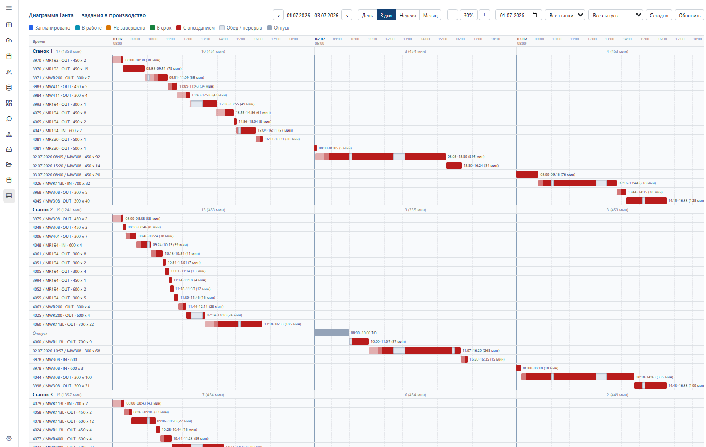
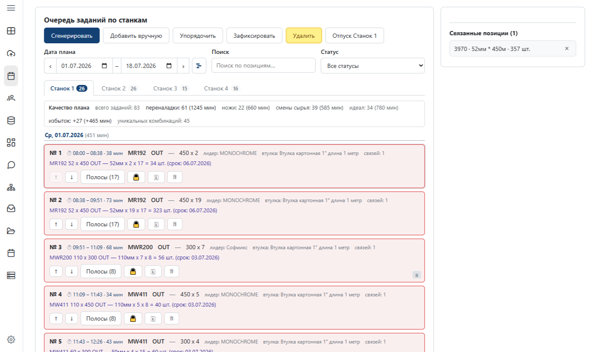
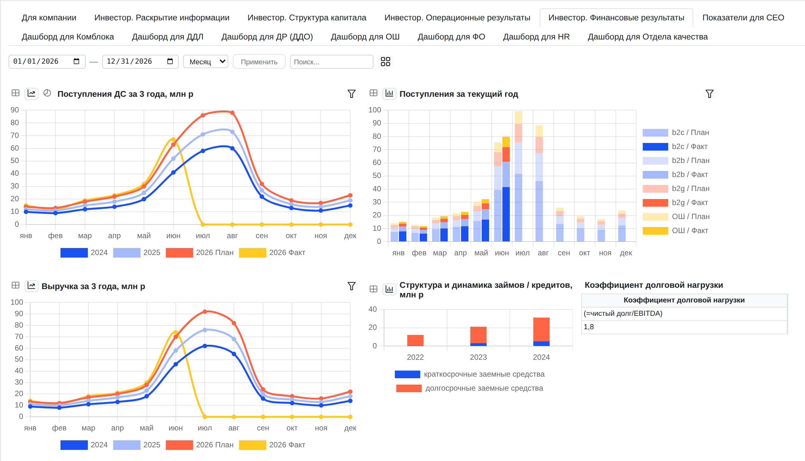
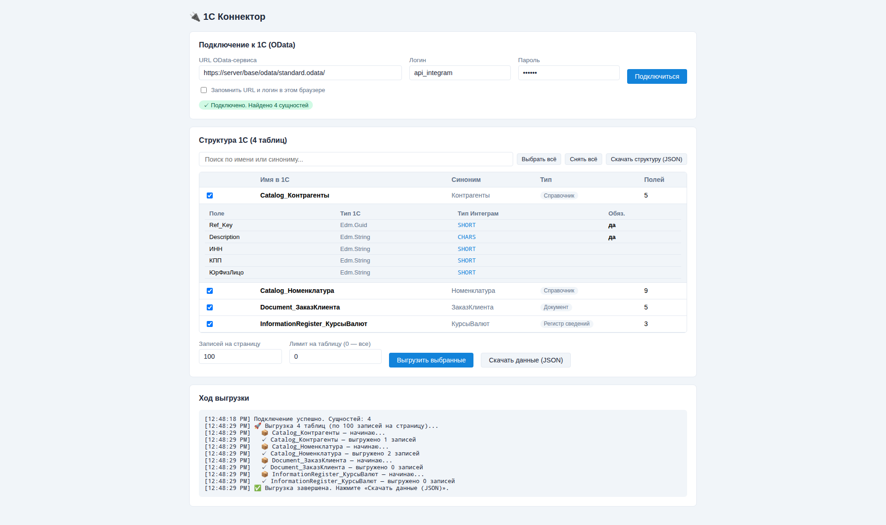
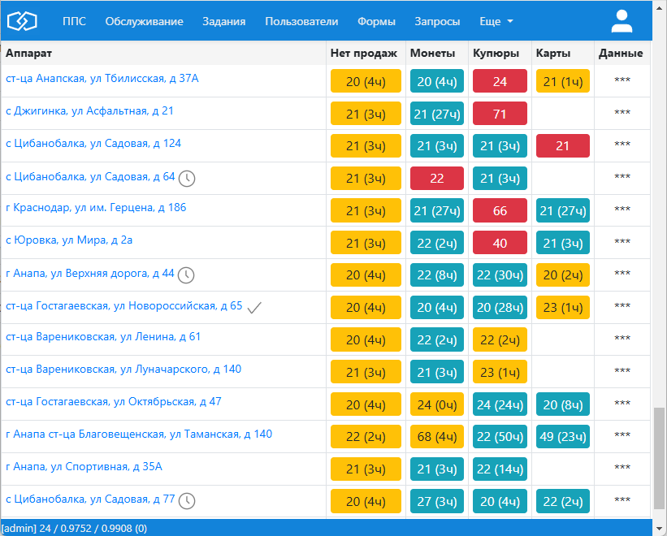
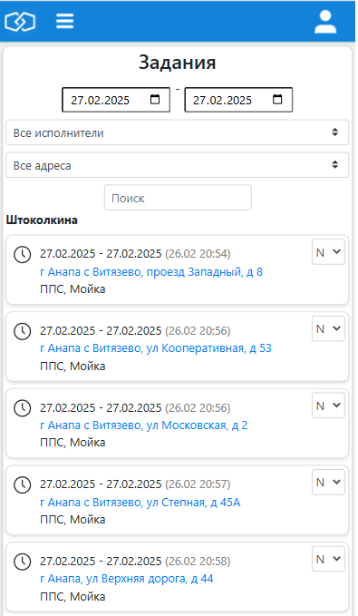
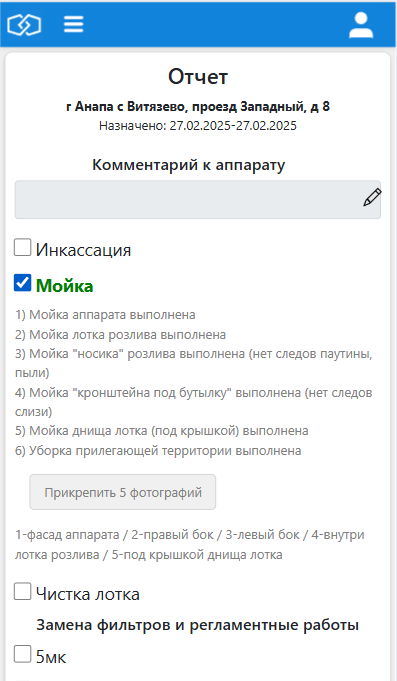
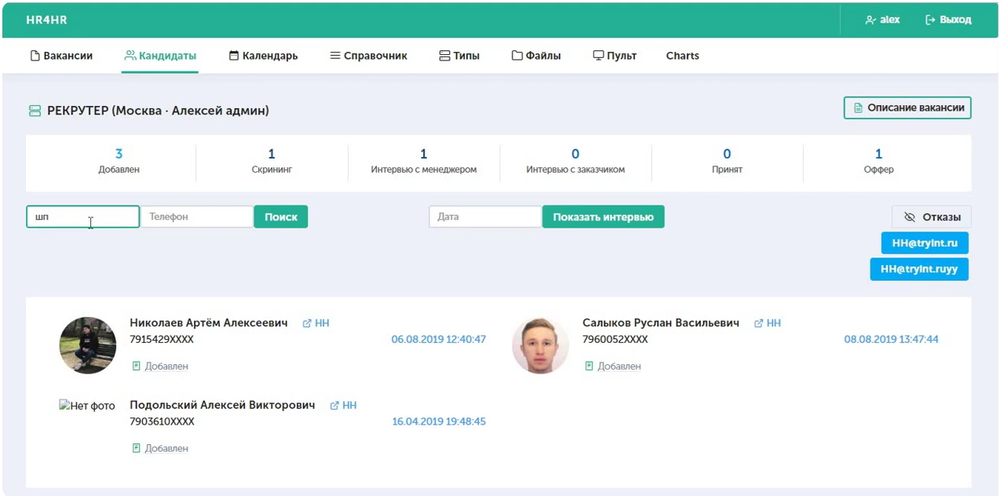
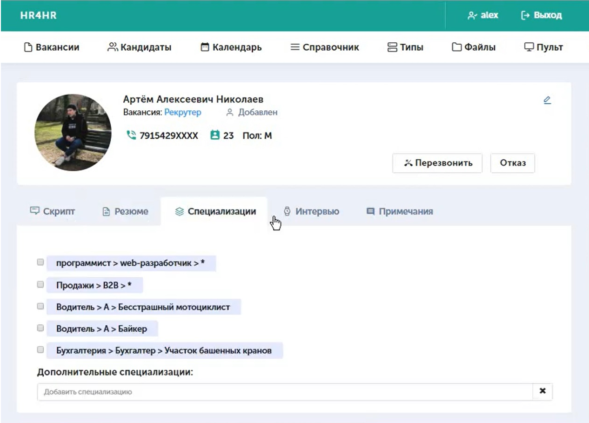
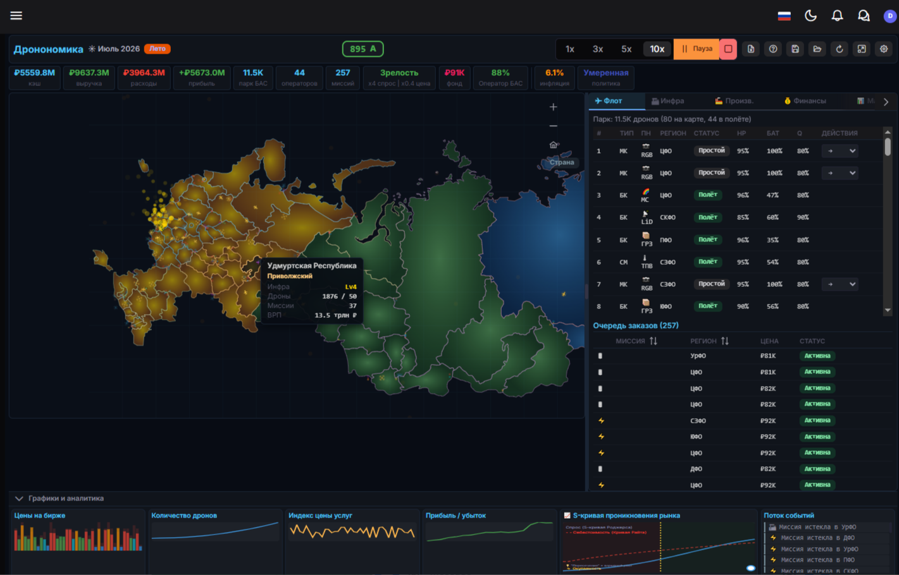

# План презентации «Интеграм» — для партнёра-реселлера

> **Аудитория:** партнёр, который будет продавать Интеграм своим крупным заказчикам.
> Его команда (технари + бизнес) смотрит презентацию и принимает решение — брать продукт в портфель или нет.
> **Задача презентации:** доказать, что (1) технология реально уникальна и защищена, (2) она открывает
> проекты, которые конкуренты не берут, (3) на этом партнёр хорошо зарабатывает, (4) за этим стоят
> цифры и трекшн.
> **Два захода для партнёра (сквозная линия презентации):** *замена Excel* (второстепенные проекты и
> приложения-сателлиты — заход в корпорации) и *замена ключевой системы* (производство, планирование,
> CRM, ERP — заход в МСБ). См. слайд 4.
> **Тон:** не «инвесторский питч», а «due diligence продукта» — проверяемые факты, ссылки, цифры.
> **Объём:** 24 основных слайда + приложение. Ниже для каждого: цель, заголовок-мысль, контент,
> визуал, пруф/источник.

---

## Секция A. Что это и чем отличается (фундамент доверия)

### Слайд 1 — Титул
- **Цель:** за 5 секунд задать рамку «это не ещё один конструктор — это платформа на запатентованном ядре».
- **Заголовок:** ИНТЕГРАМ — low-code платформа на запатентованном ядре данных.
- **Подзаголовок (партнёрская рамка):** «Продукт, который вы продаёте своим заказчикам там, где Excel уже не тянет, а заказная разработка слишком дорога».
- **Плашки-регалии:** Реестр российского ПО Минцифры №30872 · Патенты РФ + US · Победитель Slider-акселератор и финалист SberUp · Продукт недели #1 и #3 Product Radar.
- **Визуал:** логотип, чистый титул.

### Слайд 2 — Что это (суть за один экран)
- **Цель:** одним движением объяснить, что делает продукт.
- **Заголовок:** «Живое ТЗ» — слово клиента сразу становится рабочим приложением: не нужно вычитывать спецификации, всё проверяется вживую и документируется по ходу.
- **Контент:** От Excel-хаоса до систем корпоративного уровня — без строки кода и без чека заказной разработки. «Это как MS Excel и Access, но без ограничений по объёму, скорости, безопасности и интеграциям». Даёт: контроль работы людей, автоматизацию вычислений, защиту данных (ролевая модель), не тормозит на любых объёмах.
- **Визуал:** триптих-стрелка «таблица-хаос → структурированные таблицы → рабочий интерфейс системы».
- **Пруф:** скриншоты боевых интерфейсов.

### Слайд 3 — Чем отличается: ядро (квинтетная модель + патенты)
- **Цель:** показать, что отличие — на уровне архитектуры данных, а не «набор фич». Это то, что нельзя скопировать за квартал.
- **Заголовок:** В основе — квинтетная модель данных (QDM). Не реляционка, не голый EAV.
- **Контент:**
  - Квинтет — атомарная единица: `идентификатор · тип · значение · родитель · порядок`. Одна таблица вместо сотен; метаданные встроены в сами данные.
  - Гибкость EAV **без** его болезни: выборка идёт по индексу (B-деревья по id/типу/родителю), а не сканом → скорость **не падает** с ростом объёма.
  - Предельная унификация данных объединяет в себе преимущества РСУБД, NoSQL и колоночных БД; масштабируется распределением по префиксам ID.
  - Ядро проверено на нагрузочных тестах такого масштаба, массовое коммерческое применение — в фокусе следующего этапа.
  - **Защита:** патенты **RU 2650032 C1** и **US 11138174 B2** (одна семья, приоритет 2017, US действует до 2038), защищен подход QDM, само ядро — открыто.
- **Ключевая мысль-мостик:** «Конкуренты строят конструкторы поверх обычной реляционки/EAV и упираются в потолок по объёму и логике. Мы — нет. Отсюда — целый ряд вещей, которые конструктором в принципе не делаются (примеры — далее)».
- **Визуал:** схема квинтета + фото патентных грамот.
- **Пруф/источник:** статья Алексея Семёнова в блоге Neoflex про квинтет — habr.com/ru/companies/neoflex/articles/433058/

### Слайд 4 — Два направления: замена Excel и замена ключевой системы
- **Цель:** дать партнёру карту, КАК заходить в сделку в зависимости от сегмента заказчика. Это сквозная линия всей презентации — кому и что продавать.
- **Заголовок:** Два захода: заменяем Excel — или становимся ключевой системой.
- **Направление 1 — Замена Excel (второстепенные проекты, приложения-сателлиты).** BI, аналитика, планирование, оперативные учётки — всё, что сегодня делают в Excel/Google Sheets вокруг основной системы. **В корпорациях это основной заход:** рядом с ядром (SAP / 1С / собственная система) всегда «зоопарк» Excel-таблиц — их и замещаем, быстро и без риска для core-контура (а локальная установка и замкнутый контур снимают вопросы службы ИБ — см. слайд 19). Короткий цикл сделки, низкий риск.
- **Направление 2 — Замена ключевой системы (в МСБ).** Здесь Интеграм становится основной системой предприятия: **управление производством и его глобальное планирование, CRM, ERP.** МСБ не тянет тяжёлые корпоративные внедрения — мы даём гибкую систему за часы-дни и по чеку в разы ниже. Крупный чек, глубокая интеграция в бизнес.
- **Матрица «сегмент × заход»:**

  | | Крупные корпорации | Малый и средний бизнес (МСБ) |
  |---|---|---|
  | **Замена Excel** (BI, аналитика, планирование, сателлиты) | ✅ основной заход — вокруг ядра всегда зоопарк Excel | ✅ да |
  | **Замена ключевой системы** (производство, глоб. планирование, CRM, ERP) | реже — есть свой контур | ✅ **можем стать core-системой** |

- **Мысль для партнёра:** в корпорацию заходишь «сателлитами» с низким риском и коротким циклом; в МСБ — целой ключевой системой с крупным чеком. **Оба захода — на одном и том же ядре.**
- **Визуал:** две колонки (Excel-замена | ключевая система) + сегментная матрица.

---

## Секция B. Что даёт отличие — примеры возможностей (ядро презентации)

> Раздел показывает НЕ закрытый список, а **несколько ярких примеров из многих** — чтобы команда партнёра
> увидела класс задач, недоступных конструкторам.
> Каждый пример-слайд построен одинаково: **задача → как решает Интеграм (цифры) → «как это делают
> традиционно» (дорого/долго/невозможно конструктором)**.
> Это выполняет прямое требование: *«отметить, что при традиционном решении ресурсов и сложности намного
> больше и вы не найдёте, чтобы это где-то решалось конструктором».*

### Слайд 5 — Что открывает ядро: примеры (их значительно больше)
- **Цель:** показать широту возможностей, не сводя её к закрытому списку из нескольких пунктов.
- **Заголовок:** Ядро открывает то, что конструкторам недоступно. Вот несколько примеров — их у нас гораздо больше.
- **Главные примеры (детально — на следующих слайдах):**
  1. Поиск/фильтр по любому полю на миллиардах записей
  2. Сопоставление номенклатур (matching) без Elasticsearch и разработчиков
  3. Память ИИ-агента: вектор + граф + бизнес-данные в одной БД
  4. Минимальный разрыв с языком бизнеса
- **И это не всё — из той же серии:** рекурсивные вычисления и вычисляемые колонки (LOOKUP/ROLLUP/FORMULA) без кода · шаблонизатор форм · сотни одновременных пользователей · ролевая модель и гранулярные права · история изменений и откат · автоматизации (триггер→условие→действие) · вебхуки и интеграции · импорт батчем (50k за ~30 с) · on-prem установка · производственное планирование (живой пример — сам этот CRM построен на Интеграме).
- **Плашка-рефрен (крупно):** «Почти каждый такой пример традиционно — отдельный проект на недели/месяцы и команда инженеров.».
- **Визуал:** плитки 4 главных примеров + «облако» дополнительных возможностей мелким кеглем, чтобы читалась широта списка.

### Слайд 6 — Пример 1: поиск по любому полю в миллионах/миллиардах данных
- **Заголовок:** Фильтр по любому из десятков полей — на миллиардах записей, без денормализации.
- **Как решает Интеграм (проверенные цифры):**
  - **32 млрд записей / 4,5+ ТБ** в одной модели для нагрузочного тестирования, 703+ млн бизнес-транзакций.
  - Точный поиск по 700 млн записей — **0,77 с**; фильтр по одному из 45 полей — **1,28 с** на **нагруженной** базе (~5000tps).
  - Загрузка **~5000 транзакций/с** (32 ядра), **без деградации** скорости вставки при кратном росте.
- **Традиционно:** предварительная денормализация под каждый запрос, Elasticsearch-кластер, шардинг, команда DBA. «Быстрый фильтр по любому полю на неограниченном объёме» — классически считается нерешаемой задачей для no-code.
- **Контраст для наглядности:** Excel — потолок 1 млн строк, Google Sheets — ~155 тыс. У нас — безлимит.
- **Где заходит:** и замена Excel (тяжёлая аналитика/BI, которую таблицы не держат), и ключевая система (учёт на больших объёмах).
- **Пруф:** habr.com/ru/articles/900308/

### Слайд 7 — Пример 2: сопоставление продукции (matching)
- **Заголовок:** Сопоставить чужой каталог с нашей номенклатурой — за часы, а не недели.
- **Задача:** каталог контрагента (22 тыс. позиций) ↔ собственные номенклатуры (сотни тысяч) при разных названиях одного товара.
- **Как решает Интеграм:** токенизация названий (regex сгенерирован ИИ) → справочник токенов → связь «многие-ко-многим» с оценкой качества. **120–160 сопоставлений/мин, полный каталог за 2–3 часа**, топ-10 кандидатов на позицию; спорные пары дочищает LLM. Всё на no-code конструкторе запросов.
- **Традиционно:** ETL + Elasticsearch/поисковый движок + отдельный проект разработки; дорого и долго. Конструктор такого не умеет.
- **Живой якорь:** уже реализовано и опубликовано; можно показать заказчику как готовый кейс.
- **Пруф:** habr.com/ru/articles/1055368/

### Слайд 8 — Пример 3: память ИИ-агента (VecMory)
- **Заголовок:** Данные разной природы — вектор, граф и бизнес-данные — в одной БД. Это память для ИИ-агента.
- **Почему это важно (рамка партнёру):** обычно вектор, граф причинности и бизнес-данные лежат в **трёх разных хранилищах** (вектор-СУБД + граф-СУБД + реляционка). Их надо синхронизировать и обслуживать. У нас — одна модель.
- **Что даёт:**
  - Граф «симптом → причина → фикс»: агент помнит не факты о пользователе, а **на чём уже спотыкался**.
  - Сбор цепочки причинности — **один серверный вызов ~0,3 с** (против ~33 с клиентского обхода).
  - Сублинейный поиск: **×12** ускорение при N=5 000 (recall@1 = **95%**), **×86** при N=50 000 (recall@1 = **92%**).
  - Память живёт рядом с CRM, работает под теми же правами и отчётами.
- **Традиционно (TCO — про людей, не про серверы):** Pinecone/Qdrant + Neo4j + Postgres = отдельная инфраструктура, пайплайн синхронизации, **+0,1–0,3 FTE DevOps/DBA** (≈250–500 тыс ₽/мес). У нас маржинальная стоимость ≈ 0 сверх уже оплаченной платформы.
- **Пруф:** vecmory/summary_vm.md в github.com/ideav/crm (замеры, сравнение с pgvector/Neo4j).

### Слайд 9 — Пример 4: минимальный разрыв с языком бизнеса
- **Заголовок:** Система говорит на языке бизнеса. Без «Клиент → tbl_cust_main».
- **Проблема:** семантический разрыв «бизнес говорит одно — код называет другое» тормозит внедрение и плодит ошибки.
- **Как решает Интеграм:** сущности называются бизнес-терминами («Проект», «Задача», «Исполнитель»); аналитик описывает предметку словами — система строит базу с этими же терминами и связями.
- **Что даёт:** быстрый онбординг, меньше ошибок интерпретации, запросы формулируются на бизнес-языке. И главный задел на будущее — **ИИ работает с бизнес-логикой напрямую**, без слоя перевода.
- **Традиционно:** аналитик → ТЗ → разработчик → БД с техническими именами; каждый переход теряет смысл и деньги.
- **Пруф:** habr.com/ru/articles/982120/

### Слайд 10 — Вывод по отличию: почему конструктор так не может
- **Цель:** собрать примеры в один тезис-удар и сделать мост к продаже.
- **Заголовок:** Другие конструкторы так не могут — по трём причинам сразу.
- **Контент:** хранить сотни миллионов+ записей · реализовывать сложную логику расчётов без кода · держать десятки/сотни пользователей одновременно.
- **Плашка-удар:** «Это лишь несколько примеров — их гораздо больше. Традиционное решение = кратно больше ресурсов и сложности; конструктором это НЕ решается практически никогда. Значит, вы берёте проекты, от которых отказываются другие».
- **Визуал:** таймлайн «01-02-03».

---

## Секция C. Проблемы, продукт, решения, безопасность, форматы

### Слайд 11 — Проблемы, которые мы решаем
- **Заголовок:** 73% бизнес-задач живут в Excel. Это дорого и опасно.
- **Контент:** слабая дисциплина процессов; потери из-за ручного ввода; дорогие доработки руками программистов; кражи/повреждения данных (в т.ч. ПДн); ограниченность low-code.
- **Якорь-цифра:** McKinsey/BCG/Bain — до **20–30% рабочего времени** уходит на поиск, согласования, рутину.
- **Визуал:** инфографика «73% задач живут в Excel» + иконки рисков (ручной ввод, утечки ПДн, дорогие доработки).

### Слайд 12 — Продукт: как это выглядит в руках
- **Заголовок:** Любой интерфейс — от таблицы-замены Excel до профессиональной вёрстки.
- **Контент:** схематичная вёрстка (быстрый рабочий экран) и профессиональная вёрстка (клиентский UI); адаптив под мобильные; формы, отчёты, файлы, права.
- **Визуал:** три типа UI — замена Excel/Airtable · комплектовка склада · клиентский экран.

### Слайд 13 — Решения: пять реальных проектов на Интеграме (обзор)
- **Цель:** от «как это выглядит» (слайд 12) перейти к «что уже сделано» — показать партнёру боевые внедрённые решения разного класса как доказательство: платформа тянет и сателлиты, и ключевые системы, и уникальные задачи вроде цифрового двойника отрасли. Детально — по слайду на каждый кейс (слайды 14–18).
- **Заголовок:** Не демо, а работающие системы — от планирования производства до цифрового двойника отрасли.
- **Пять референсов (детально — на следующих слайдах):**
  1. **Планирование производства (резка)** — оптимальный план вместо 3 дней ручной работы · ключевая система (слайд 14).
  2. **Единый дэшборд руководителя** — 13 закладок, автосбор и кросс-валидация · замена Excel (слайд 15).
  3. **Мобильное РМ оператора (вендинг воды)** — рутина сведена к нулю · ключевая система (слайд 16).
  4. **Поточный рекрутинг** — 85 тыс. вакансий с HH.ru, набор 200–300 чел/нед · ключевая система (слайд 17).
  5. **Дронономика** — цифровой двойник отрасли на онтологиях · уникальный класс (слайд 18).
- **Мысль для партнёра:** это не «может сделать», а **уже сделано и работает** — конкретные референсы, которые вы показываете своему заказчику. Каждый кейс ложится в один из форматов слайда 20 и в одно из двух направлений слайда 4; вместе они закрывают весь спектр — от Excel-сателлита до ключевой системы и уникального цифрового двойника.
- **Визуал:** 5 карточек-превью (иконка отрасли · ключевая цифра · плашка направления), сгруппированы по двум направлениям; плашка-рефрен «Внедрено и работает».

### Слайд 14 — Кейс 1: Планирование производства (резка)
- **Заголовок:** 3 дня ручного планирования → оптимальный план за один прогон.
- **Было:** планирование и перепланирование 5–7 дней производства занимало **3 рабочих дня** ручного труда мастера.
- **Что сделали:** приложение строит оптимальный план по множеству факторов с их весами — минимизация времени переналадки станков, смены сырья и упорядочивание последовательности операций с учётом физиологии человека и технических особенностей станков и сырья.
- **Эффект:** план собирается за один прогон и перестраивается на лету, стабильно учитывая десятки правил; освобождены 3 рабочих дня цикла.
- **Направление:** «ключевая система» (операционное ядро производства).
- **Пруф/источник:** скриншоты сняты в боевом рабочем месте; заказчик (производственная компания) под NDA, без названия. Проверяемость под due diligence: код рабочего места и **полный алгоритм планирования открыты** в репозитории github.com/ideav/crm — `download/atex/js/production-planning.js` и `docs/atex_planning_tz.md` (переналадка станков, смена сырья, порядок операций, ограничения оборудования).
- **Визуал:** диаграмма Ганта плана и очередь заданий по станкам с панелью «Качество плана» (переналадки · ножи · смены сырья · идеал) — можно наложить одну на другую:
  
  

### Слайд 15 — Кейс 2: Единый дэшборд руководителя
- **Заголовок:** 13 разрозненных отчётов с оперативки → один дэшборд с автосбором и кросс-валидацией.
- **Было:** руководители отделов приносили на оперативку разрозненные материалы разной природы; дублирующий ручной ввод, нет контроля полноты данных.
- **Что сделали:** дэшборд из **13 закладок** — по каждому отделу + инвесторские + сводная. Сбор данных автоматический из **Битрикс24 и Google Sheets**; загрузка из **1С и Excel**; ручной ввод только там, где автоматизация нецелесообразна; кросс-валидация источников и единый ввод.
- **Эффект:** полностью устранён дублирующий ввод, включён автоматический контроль полноты данных.
- **Направление:** «замена Excel» (BI-сателлит вокруг основной системы).
- **Визуал:** дэшборд руководителя из 13 закладок (отделы + инвесторские + сводная) и коннектор-источник (1С):
  
  

### Слайд 16 — Кейс 3: Мобильное рабочее место оператора (вендинг воды)
- **Заголовок:** Обслуживание автоматов с телефона — рутина сведена к нулю.
- **Было:** копирование данных, ручное планирование задач, сбор отчётов и статистики по аппаратам вручную.
- **Что сделали:** мобильное рабочее место для контроля и обслуживания автоматов с водой — задачи, отчёты и статистика аппаратов в одном экране на телефоне.
- **Эффект:** количество излишних рутинных действий сведено к **нулю**.
- **Направление:** «ключевая система» (операционное ядро сервисной компании).
- **Визуал:** контроль парка аппаратов (десктоп) и мобильные экраны оператора — задания и отчёт об обслуживании:
  
  
  

### Слайд 17 — Кейс 4: Поточный рекрутинг
- **Заголовок:** Ключевая система найма — разработана за месяц, 200–300 человек в неделю без лишних кликов.
- **Было:** сложнейшая схема данных, этапов найма и событий; нужна 100% кастомизация под поток.
- **Что сделали:** предельная унификация → разработка за **1 месяц**. Аналитик правит логику и схему данных и тут же тестирует онлайн — цикл разработки ужимается до минут.
- **Эффект:** через месяц **35 человек** работали в системе одновременно, обработано **85 тыс. вакансий** с HH.ru; поточный набор **200–300 человек в неделю без единого лишнего клика**.
- **Направление:** «ключевая система» (найм как ядро бизнеса стартапа).
- **Визуал:** воронка кандидатов с этапами найма и связкой с HH.ru + карточка кандидата:
  
  

### Слайд 18 — Кейс 5: Дронономика — цифровой двойник отрасли
- **Заголовок:** Онтологии беспилотной отрасли → живой цифровой двойник с динамическим расчётом.
- **Задача:** смоделировать целую отрасль — участников, федеральное управление, экономику и производство — как единую отзывчивую модель.
- **Что сделали:** в Интеграм загружены онтологии беспилотной отрасли, федеральной структуры управления, экономических и производственных составляющих → точный и отзывчивый к изменениям **цифровой двойник отрасли**.
- **Эффект:** моделирование взаимодействия всех участников экосистемы с **динамическим расчётом параметров** — экономика, рейтинги, события, метрики.
- **Направление:** уникальный класс задач (онтологии + граф в одной модели), недоступный конструкторам — прямой мост к ядру (слайд 3) и памяти ИИ-агента (слайд 8).
- **Визуал:** 

### Слайд 19 — Безопасность, замкнутый контур и отказоустойчивость
- **Цель:** снять главный стоп-фактор крупного заказчика — «а это безопасно и не упадёт?». Именно это делает продукт продаваемым в корпорации, госсектор и КИИ; сильный аргумент для Направления 1 (замена Excel рядом с корпоративным ядром).
- **Заголовок:** Разворачивается у вас, работает в замкнутом контуре, переживает сбои.
- **Развёртывание и контроль над данными:**
  - Три режима: **SaaS**, **On-premise** (docker-контейнер на вашем сервере), гибрид.
  - **Замкнутый контур:** on-prem работает **полностью изолированно от интернета** (air-gap) — данные не покидают периметр заказчика.
  - Данные — в **обычной реляционной СУБД**, а не в закрытом движке: нет вендор-лока, выгрузка в Excel или реляционную БД со всеми связями в любой момент.
- **Безопасность данных:**
  - TLS-шифрование каналов + шифрование хранилища (на уровне СУБД / облака / диска).
  - **Ролевая модель на стороне сервера:** доступ по ролям и маскам — неавторизованному пользователю поля просто не отправляются.
  - Корпоративная аутентификация: **JWT, LDAP/AD, SSO**.
- **Отказоустойчивость:**
  - Резервное копирование + **георезервирование между ЦОД**, потоковая репликация.
  - **Восстановление на точку времени (PITR)** на уровне БД.
  - **RPO/RTO под требования заказчика** (фиксируется в SLA/договоре).
- **Соответствие:** реестр российского ПО Минцифры №30872; размещение в аттестованном облаке под **152-ФЗ и КИИ**; применимо к закупкам по **223-ФЗ / 44-ФЗ**.
- **Мысль для партнёра:** это снимает возражения службы ИБ крупного заказчика и открывает госсектор/КИИ — сегменты, куда облачные коробки (например, AmoCRM) не заходят вовсе.
- **Пруф/источник:** blog.ideav.ru/posts/bezopasnost-i-otkazoustoichivost-dlya-krupnogo-biznesa/

### Слайд 20 — Форматы решения (что продавать и по какому чеку)
- **Цель:** показать партнёру ассортимент готовых типовых проектов, привязать их к двум направлениям и дать порядок чеков.
- **Заголовок:** Готовые форматы — от Excel-сателлитов до ключевых систем.
- **Направление «замена Excel» (сателлиты, короткий цикл):**
  - Тип 1 — учёт договоров, платежей, рабочего времени → **чек до 150 000 ₽**.
  - BI/аналитика/планирование поверх выгрузок из основной системы.
- **Направление «ключевая система» (МСБ core, средний чек):**
  - Тип 2 — контроль и обслуживание аппаратов (вендинг воды) — операционное ядро сервисной компании → **чек от 150 000 ₽**.
  - Тип 3 — рекрутинговый стартап, поточный найм 200–500 чел. — ключевая система бизнеса → **чек от 500 000 ₽**.
  - Управление производством и глобальное планирование, CRM, ERP (живой пример — сам этот CRM на Интеграме).
- **Направление «ключевая система» (корпорации, крупный чек):**
  - Тип 4 — ИТ-сателлиты систем: локальные трекеры, реестры, BI, регулярные опросы → **чек от 5 млн ₽**.
- **Мысль:** это шаблоны, которые адепт/партнёр тиражирует; чек масштабируется со сложностью и с переходом от «сателлита» к «ключевой системе».
- **Визуал:** 4 скриншота-кейса, сгруппированы по двум направлениям + крупные плашки чеков.

---

## Секция D. Конкуренты, монетизация, финмодель

### Слайд 21 — Конкуренты: матрица позиционирования
- **Цель:** показать, что мы конкурируем по всему спектру — и в нише «надёжные гибкие проекты» часто единственный выбор. Это ключевой слайд для решения партнёра.
- **Заголовок:** Мы конкурируем снизу доверху — от Excel до заказной разработки.
- **Матрица (строки — критерии, колонки — сегменты конкурентов):**

  | Критерий | Excel / Google Sheets | Airtable / Coda / Notion | Bitrix24 / 1С / ELMA | Заказная разработка | **Интеграм** |
  |---|---|---|---|---|---|
  | Предел по записям | 1 млн / 155 тыс | сотни тыс | зависит | безлимит | **безлимит (32 млрд проверено)** |
  | Гибкость логики | формулы | ограниченная | шаблонная | любая | **любая, no-code** |
  | Сложная логика без кода | нет | ограниченно | ограниченно | только кодом | **есть** |
  | Безопасность / ролевая модель | нет | базовая | есть | есть | **есть (на сервере, по ролям и маскам)** |
  | Локальная установка / замкнутый контур | локально | нет | частично | да | **on-prem + air-gap** |
  | Скорость внедрения | часы | дни | недели | месяцы | **часы–дни** |
  | Стоимость | почти бесплатно | низкая | средняя | от сотен тыс | **десятки тыс** |
  | Импортозамещение / реестр РФ | — | нет | часть | — | **реестр Минцифры №30872** |

- **Плашка:** «Мы даём свободу и гибкость Excel без его ограничений. Почти каждый месяц появляются новые no-code сервисы (МТС Табс, РТ Акола, VK Доска…) — но упираются в потолок объёма и логики».
- **Визуал:** матрица + лента логотипов конкурентов, расширенная таблица.

### Слайд 22 — Модель монетизации: где здесь партнёр и как он зарабатывает
- **Цель:** явно показать место партнёра в схеме и на чём именно он зарабатывает — это главный вопрос его команды.
- **Заголовок:** Партнёрская модель — как у 1С, Тильды, AmoCRM, Bubble. Партнёр даёт канал и одобряет сделки; внедряют и держат поддержку адепты — доход без операционной нагрузки.
- **Кто есть кто в схеме (роль → что делает → на чём зарабатывает):**

  | Роль | Что делает | На чём зарабатывает |
  |---|---|---|
  | **Платформа (Интеграм)** | развивает продукт, обучает адептов, выдаёт лицензии | подписка, лицензия, 20–50% роялти с тиражных решений |
  | **Партнёр (вы)** | инициирует и одобряет сделки, приводит своих заказчиков и бренд; **внедрением и поддержкой не занимается** | **процент с каждой оплаты привлечённого клиента (40/20/15%, см. ниже) — без операционной нагрузки** |
  | **Адепт** | делает разработку: собирает решение на Интеграме, внедряет, ведёт поддержку и **отвечает за результат** перед заказчиком (в штате партнёра или на подряде) | оплата работы — внутри чека проекта |
  | **Заказчик** | конечный клиент партнёра | платит: за проект и поддержку, платформе — за подписку |

- **Что значит «партнёр зарабатывает на проектах заказчика»:**
  - Партнёр **инициирует и одобряет** сделку и отдаёт её адепту — тот собирает решение на Интеграме (чек от 150 тыс до 5 млн ₽, слайд 20) и ведёт поддержку. Платформе идёт только плата за инструмент (подписка **от 1 950 ₽/мес** или лицензия **590 тыс ₽/год**) — это стоимость платформы, **а не комиссия с проекта**. Партнёр получает **свою долю, не занимаясь реализацией**.
  - **Пример:** ключевая система для МСБ, чек 500 тыс ₽. Реализацию и поддержку ведёт адепт; партнёр приводит заказчика, одобряет сделку и берёт долю — разово с проекта и дальше с рекуррентной поддержки/доработок. Один заказчик = длинный хвост дохода без ручной работы.
- **Ставки вознаграждения партнёра — % от суммы оплаты каждого привлечённого клиента (зависит от типа продажи, п. 3.1 партнёрского договора):**

  | Тип продажи | Вознаграждение партнёра |
  |---|---|
  | Локальная лицензия Интеграм | **40 %** |
  | Проект автоматизации | **20 %** |
  | SaaS-платежи / услуги поддержки | **15 %** |

  Начисляется с каждого поступившего платежа привлечённого клиента. Локальная лицензия — самая маржинальная для партнёра сделка; SaaS и поддержка дают меньший процент, но **рекуррентный** (длинный хвост).
- **Два потока дохода партнёра:** (1) разовая доля с проектов; (2) рекуррент с поддержки, доработок, абонплаты и лицензий. Масштаб — обученные адепты ведут больше заказчиков параллельно, а партнёр только наращивает канал; тиражное готовое решение продаётся многим. Два направления (слайд 4) = два потока сделок: сателлиты в корпорациях + крупные ключевые системы в МСБ.
- **Схема-стрелка:** Платформа обучает адептов → Партнёр приводит заказчика и одобряет сделку → Адепт внедряет, поддерживает и отвечает за результат → Заказчик платит за проект и поддержку, платформе — за подписку; **партнёр берёт свою долю, не работая руками**.
- **Визуал:** схема ролей со стрелками денежных потоков (кто кому платит) + таблица «кто на чём зарабатывает».

### Слайд 23 — Финансовая модель и трекшн
- **Цель:** показать, что продукт уже работает и рос (история 2022–2024), но сейчас — осознанная стратегия: не гнать выручку, а оттачивать инструмент и строить стратегические партнёрства и экосистему.
- **Заголовок:** 2025–26 — фокус на инструменте и стратегическом партнёрстве, а не на гонке за выручкой.
- **Трекшн — история:** выручка 2022 → 2023 → 2024 = **0,2 → 0,7 → 3,1 млн ₽** (×4–5 в год); 70 активных клиентов РФ/СНГ; 5 лицензий продано; 5 партнёров + 7 адептов зарабатывают; +300 адептов прошли базовое обучение и готовы получать заказы; финалист SberUp; Продукт недели #1 Product Radar.
- **Стратегический фокус 2025–26 (где мы сейчас):**
  - Не продажи, а **оттачивание инструмента** и **стратегическое партнёрство**.
  - **Партнёрская тяга:** **5 активных партнёров** уже зарабатывают с нами; **ещё 10** получили материалы и знакомят своих заказчиков — виден живой интерес и считывание нашего УТП.
  - КП поданы в **ВТБ, Газпром нефть (ГПН)** и другим крупным контрагентам.
  - Растим **адептов** и делаем **образцово-показательные (референс) проекты** — фундамент будущего сообщества и экосистемы.
  - **Ноябрь 2025 — в Реестре ПО Минцифры (№30872).**
  - Готовим бесшовное внедрение в инфраструктуру типового заказчика РФ: **открытый стек, ИИ-интеграция, on-prem**.
- **Рынок:** TAM **4,5 трлн ₽** ($44,5B) · SAM **1,8 трлн ₽** ($18B) · SOM **4 млрд ₽** ($40M); CAGR **19,2%**; мировой low-code → **$77 млрд к 2030** (Gartner: 65% приложений — на low-code уже к 2024). У нас нет отдела продаж — и не будет: команда сфокусирована на инструменте, а не на воронке. Даже так к нам приходят и платят. Партнёр — это то звено, которого не хватает, чтобы органический спрос стал системным.
- **Юнит-экономика для партнёра:** подписка (рекуррент) + чек проекта 150–500 тыс ₽ + доля с готовых решений; окупаемость обучения адепта — на первом-втором проекте.
- **Визуал:** график выручки по месяцам (история) + TAM/SAM/SOM-круги + таймлайн вех 2025–26 (КП ВТБ/ГПН · реестр Минцифры ноя-2025 · on-prem/ИИ) + воронка партнёров (5 активных / 10 в пайплайне).

### Слайд 24 — Команда, пруфы, оффер партнёру
- **Заголовок:** Опытная команда, проверяемая технология, готовы дать доступ.
- **Команда:** CEO Алексей Семёнов (разработчик ядра; Citi, MTS, Neoflex, ВТБ, Сбер), CTO Александр Орехов (highload, 15 лет), аналитики Артамонов Ким и Денис Гаврилов; **+300 адептов**.
- **Пруфы (проверяемость — главный аргумент для due diligence):** патенты (Google Patents RU/US), боевой репозиторий github.com/ideav/crm (3700+ тикетов), публикации на Хабре, реестр Минцифры, SberUp.
- **Оффер партнёру (что вы получаете):**
  - Продукт в портфель **без затрат на разработку** — на готовом запатентованном ядре.
  - Обучение и сертификация ваших адептов; внедряют и держат поддержку они — вы **даёте канал и одобряете сделки** (см. слайд 22).
  - Готовые форматы решений и референс-проекты для быстрого старта (слайд 20).
  - Партнёрские условия: **доля с проектов + рекуррент с подписок/поддержки**, без операционной нагрузки.
  - Маркетинговая и техническая поддержка платформы; доступ к демо и боевым репозиториям.
  - Гибкие модели сотрудничества: реселлер, внедренческий / стратегический / эксклюзивный партнёр.
- **Next steps (что сделать сейчас):**
  1. Демо + доступ к боевым проектам и репозиториям.
  2. Пилот на одном вашем заказчике.
  3. Обучение первых адептов.
  4. Партнёрское соглашение.
- **Контакты:**
  - Контактное лицо: **Алексей Семёнов, CEO**
  - Telegram: **@qdmadept** · E-mail: **abc@integram.io** · Тел.: **+7 (995) 506-01-67**
  - Сайт: **ideav.ru** · Документация: **help.integram.io**
- **Финальная плашка:** «Избавим бизнес от рутины и защитим данные. Tetra Pak в сфере IT».

---

## Приложение (по запросу заказчика/партнёра)
- Технические замеры VecMory (сравнение с pgvector/Neo4j, TCO-таблица).
- Разбор кейсов слайда 20 подробнее (скриншоты, ТЗ, чек).
- Безопасность и отказоустойчивость — детально (схемы развёртывания SaaS/on-prem/air-gap, RPO/RTO, 152-ФЗ/КИИ): blog.ideav.ru/posts/bezopasnost-i-otkazoustoichivost-dlya-krupnogo-biznesa/
- Патентные документы, выписка из реестра Минцифры.
- Прайс и партнёрский договор.
