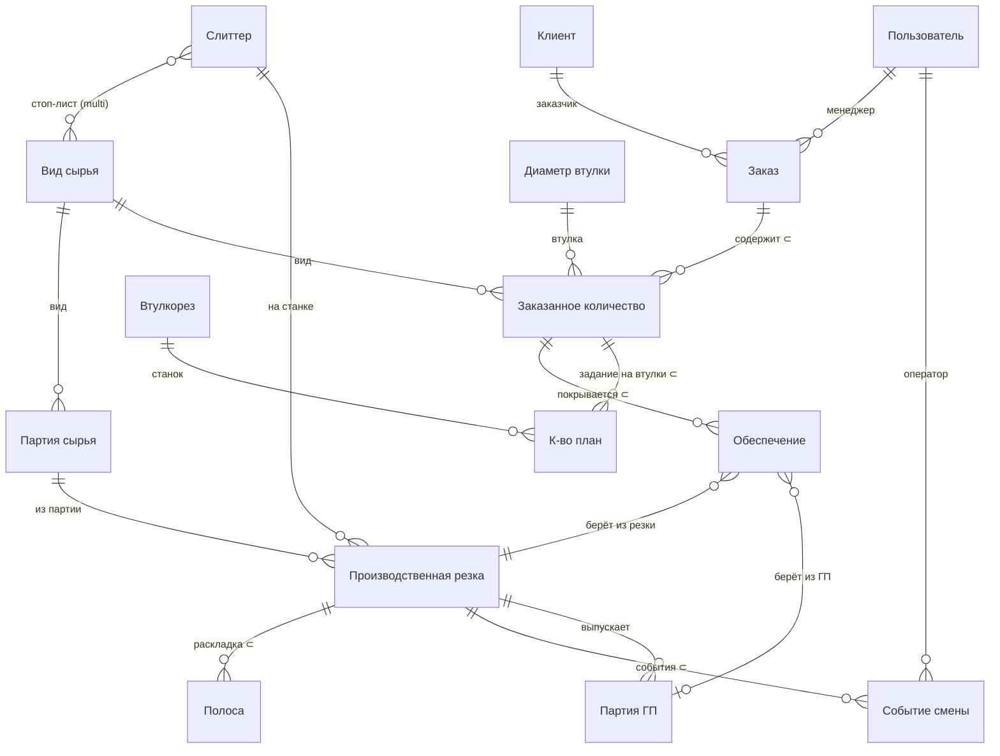
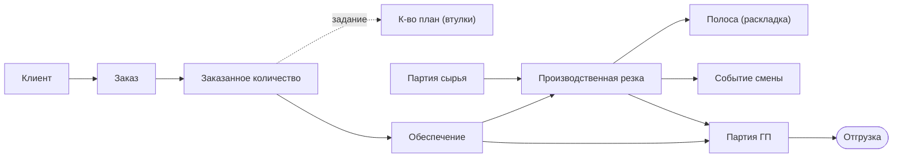

# Схема данных atex и взаимосвязи сущностей (актуальная)

**Проект:** ideav/atex — автоматизация производства термопринтерных рулонов на платформе
[Integram](https://ideav.ru).
**Источник схемы:** [`docs/atex_metadata_all.json`](atex_metadata_all.json) — полная выгрузка
метаданных боевой базы `ateh`, откорректированная аналитиком (issue
[#3163](https://github.com/ideav/crm/issues/3163), вложение `metadata_all (7).json`).
**Связанные документы:** карта рабочих мест — [`atex_workplaces.md`](atex_workplaces.md);
правила проектирования структур — [`StructureRules.md`](StructureRules.md);
сквозной сценарий — [`atex_full_cycle_test_scenario.md`](atex_full_cycle_test_scenario.md).

> Этот документ описывает **что теперь происходит** по откорректированной схеме: какие
> сущности есть, какими полями они описаны, как они связаны и как данные движутся по
> производственному циклу. Раздел [«Что изменилось»](#9-что-изменилось-относительно-прежней-схемы)
> фиксирует отличия от прежней схемы.

---

## 1. Как читать метаданные Integram

В Integram каждая «таблица» — это **объект-тип** с набором **реквизитов** (`reqs`, колонок).
В выгрузке у объекта есть `id` (числовой идентификатор таблицы), `val` (имя),
`type` (тип **главного значения** — первой колонки) и список `reqs`. У каждого реквизита —
`val` (имя колонки), `type` (тип данных), а для ссылок — `ref`/`ref_id` (таблица, на которую
ссылаемся) и `attrs` (доп. атрибуты: `alias`, `multi`/`:MULTI:`, `default` и т. п.).

Коды типов (см. [`StructureRules.md`](StructureRules.md)):

| Код | Тип | Значение |
|-----|-----|----------|
| 3 | SHORT | Короткая строка или **ссылка** на другую таблицу (когда задан `ref`) |
| 4 | DATETIME | Дата и время |
| 6 | PWD | Пароль (маскируется) |
| 8 | CHARS | Длинная строка (email, URL) |
| 9 | DATE | Дата |
| 10 | FILE | Файл |
| 11 | BOOLEAN | Да/Нет |
| 12 | MEMO | Многострочный текст |
| 13 | NUMBER | Целое число |
| 14 | SIGNED | Число с десятичной частью |
| 16 | ARRAY | Массив (служебные структуры запросов) |

**Подчинённые таблицы** (`⊂`, master-detail) в Integram задаются реквизитом-массивом на
родителе: значение реквизита `type` совпадает с типом главного значения дочерней таблицы, а
`orig` указывает на её `id`. Например, у «Заказа» реквизит «Заказанное количество» (`orig=1076`)
означает, что «Заказанное количество» — подчинённая таблица «Заказа». **Ссылки** (`ref`) — это обычные
колонки, хранящие главное значение другой таблицы (см. [`StructureRules.md`](StructureRules.md), §«Создание ссылок»).

> ID таблиц и реквизитов зависят от сборки базы. Рабочие места **не хардкодят** их, а резолвят
> из `metadata` по имени (`val`) и `alias`. Идентификаторы ниже даны для текущей боевой `ateh`
> и приведены как ориентир.

---

## 2. Карта сущностей

Доменные сущности atex делятся на **справочники** (относительно статичные данные),
**документы** (заказы и их жизненный цикл) и **производственные записи** (резки, партии, события).

| id | Сущность | Главное значение | Роль в домене |
|----|----------|------------------|---------------|
| 1069 | Вид сырья | SHORT (название) | Справочник материалов (джамбо) |
| 1070 | Слиттер | SHORT (название) | Справочник станков-слиттеров + стоп-лист сырья |
| 1071 | Втулкорез | SHORT (название) | Справочник станков-втулкорезов |
| 8188 | Диаметр втулки | SHORT (значение) | Справочник диаметров втулок |
| 1074 | Партия сырья | DATETIME (дата+время прихода, unix-штамп) | Приходная партия джамбо, остатки (FIFO); гл. значение = штамп, не номер |
| 415 | Клиент | SHORT (название) | Справочник клиентов (+ логин для портала) |
| 422 | Тег | SHORT | Теги клиентов |
| 1075 | Заказ | SHORT (номер) | Документ-заказ |
| 1076 | Заказанное количество | NUMBER | Строка заказа (что и сколько резать) |
| 1080 | К-во план | NUMBER | Задание на втулки (по позиции) |
| 1077 | Обеспечение | NUMBER | Привязка позиции к резке/ГП (покрытие потребности) |
| 1078 | Производственная резка | NUMBER (номер) | Производственная операция резки джамбо |
| 1073 | Полоса | SHORT | Раскладка ножей под резкой (динамическая) |
| 1082 | Событие смены | DATETIME | Лог событий оператора у станка |
| 1081 | Партия ГП | DATETIME (дата прихода) | Партия готовой продукции |
| 1079 | Расход сырья | NUMBER | Списание сырья (без полей — см. §9) |
| 67113 | Максимальный запас | NUMBER (макс. запас) | Номенклатуры ГП, целесообразные к хранению (#3391, см. §6.6) |

Системные/общие таблицы Integram, присутствующие в любой базе и не специфичные для atex:
**Пользователь** (18), **Роль** (42), **Запрос/Колонки запроса/FROM** (22/28/44 — слой отчётов
`report/`), **Форма/Панель/Поле/Кнопка/Меню** (137/138/144/150/151 — конструктор UI),
**Настройка** (269), **Карта** (440), **Задача** (446) / **Статус задачи** (448). Ниже подробно
описаны только доменные сущности atex.

---

## 3. ER-диаграмма связей

Условные обозначения: `⊂` — подчинённая таблица (master-detail); `}o--o{` — связь
многие-ко-многим (мультиссылка); `||--o{` — обычная ссылка (один-ко-многим).

---

## 4. Справочники

### 4.1 Вид сырья (1069)

Материал-джамбо (широкий рулон), из которого нарезают полосы.

| Реквизит | Тип | Примечание |
|----------|-----|------------|
| **(имя)** | SHORT | Главное значение — короткое имя вида сырья |
| Полное название | SHORT | Развёрнутое наименование |
| Ширина, мм | SIGNED | **Ширина джамбо** — вход для раскроя |
| Длина рулона, м | NUMBER | Дефолтная длина при оприходовании партии |
| Примечания | MEMO | |
| Допуск, мм | SIGNED | Допустимый остаток при раскладке |

### 4.2 Слиттер (1070)

Станок продольной резки.

| Реквизит | Тип | Примечание |
|----------|-----|------------|
| **(имя)** | SHORT | Название станка |
| Статус | SHORT | Состояние станка |
| Примечания | MEMO | |
| Вид сырья | SHORT → **Вид сырья** | **Мультиссылка**, `alias` «Стоп-лист сырья»: какие виды сырья этому станку резать **нельзя** |

«Стоп-лист сырья» — данные, а не код: при планировании резки рабочее место сверяет вид сырья
партии со стоп-листом станка и блокирует недопустимую комбинацию.

### 4.3 Втулкорез (1071)

Станок резки втулок.

| Реквизит | Тип | Примечание |
|----------|-----|------------|
| **(имя)** | SHORT | Название станка |
| Статус | SHORT | |
| Диаметр min, мм | NUMBER | Нижняя граница диапазона диаметров |
| Диаметр max, мм | NUMBER | Верхняя граница диапазона диаметров |

### 4.4 Диаметр втулки (8188)

Справочник стандартных диаметров втулок; на него ссылается «Заказанное количество».

### 4.5 Партия сырья (1074)

Приходная партия джамбо на складе сырья; ведёт остатки для FIFO-списания.

⚠️ **Главное значение «Партии сырья» — это DATETIME (дата+время прихода), а НЕ
номер/штрих-код.** Хранится unix-штампом в **секундах**; служит ключом FIFO.
В отчётах (`material_batches`) приходит как поле `batch_no` числом-штампом
(напр. `1781038800`) — его НАДО форматировать как дату-время «ДД.ММ.ГГГГ ЧЧ:ММ»
(хелпер `AtexRefSearch.formatDateTime`), иначе путается с номером. Отдельной
колонки «Дата прихода» нет — дата прихода и есть главное значение.

| Реквизит | Тип | Примечание |
|----------|-----|------------|
| **(дата+время прихода)** | DATETIME | Главное значение = unix-штамп (сек), ключ FIFO; в отчётах `batch_no` |
| Вид сырья | SHORT → **Вид сырья** | Какой материал в партии |
| Получено, м² | SIGNED | Площадь при приёмке |
| Остаток, м² | SIGNED | Текущий остаток по площади |
| Длина, м | SIGNED | Длина рулона (дефолт из «Вид сырья.Длина рулона, м») |
| Остаток, м | SIGNED | Текущий остаток по погонажу |
| Штрих-код | SHORT | Для barcode-reader |

### 4.6 Клиент (415) и Тег (422)

| Реквизит (Клиент) | Тип | Примечание |
|-------------------|-----|------------|
| **(название)** | SHORT | Главное значение |
| Телефон | SHORT | |
| Email | SHORT | |
| Описание | MEMO | |
| Статус | SHORT → (общий справочник статусов) | |
| Тег | SHORT → **Тег**, `:MULTI:` | Мультиссылка на теги |
| Логин | SHORT | Сопоставление с пользователем для клиентского портала |
| Пароль | PWD | |

---

## 5. Заказ и его строки

### 5.1 Заказ (1075)

Документ-заказ; главное значение — номер.

| Реквизит | Тип | Примечание |
|----------|-----|------------|
| **(номер)** | SHORT | Главное значение |
| Клиент | SHORT → **Клиент** | Заказчик |
| Пользователь | SHORT → **Пользователь**, `alias` «Менеджер» | Кто ведёт заказ |
| Дата создания | DATE | |
| Дата согласования | DATE | Заполняется при согласовании заказа |
| Статус | SHORT | Состояние заказа |
| Лидер | SHORT | |
| Примечания | MEMO | |
| **Заказанное количество** | NUMBER (`orig=1076`) | **Подчинённая таблица** строк заказа |
| Срок изготовления | DATE | Желаемый срок; участвует в окне объединения позиций при планировании |

### 5.2 Заказанное количество (1076) ⊂ Заказ

Строка заказа: какой материал, какой ширины и сколько нарезать.

| Реквизит | Тип | Примечание |
|----------|-----|------------|
| **(номер)** | NUMBER | Главное значение строки |
| Кол-во | NUMBER | Заказанное количество рулонов |
| Вид сырья | SHORT → **Вид сырья** | Материал позиции |
| Ширина, мм | SIGNED | Требуемая ширина полосы |
| Длина, м | SIGNED | Требуемая длина |
| Статус | SHORT | Состояние позиции |
| **Обеспечение** | NUMBER (`orig=1077`) | **Подчинённая таблица** покрытия позиции |
| Диаметр втулки | SHORT → **Диаметр втулки** | Втулка под рулон |
| Тип намотки | SHORT | `IN`/`OUT` (направление намотки) |
| Дата согласования | DATE | |
| Срок изготовления | DATE | Показ; ключ объединения позиций одного сырья |
| **К-во план** | NUMBER (`orig=1080`) | **Подчинённая таблица** «Задание на втулки» |

### 5.3 К-во план (1080) ⊂ Заказанное количество — «Задание на втулки»

Задание для пульта втулкореза; привязано к позиции заказа. Таблица резолвится по имени и по
`alias` «Задание на втулки» (см. [#3159](https://github.com/ideav/crm/issues/3159),
[#3140](https://github.com/ideav/crm/issues/3140)). Главное значение (первая колонка «К-во план»)
— плановое количество втулок.

| Реквизит | Тип | Примечание |
|----------|-----|------------|
| **К-во план** | NUMBER | Плановое количество втулок |
| Втулкорез | SHORT → **Втулкорез** | Выбранный станок |
| Диаметр, мм | NUMBER | Диаметр втулки задания |
| Кол-во факт | NUMBER | Фактически нарезано |
| Статус | SHORT | Ожидает → В работе → Готово |

---

## 6. Производственный контур

### 6.1 Обеспечение (1077) ⊂ Заказанное количество

Связующее звено: показывает, **чем покрывается** потребность позиции — какой производственной
резкой и какой партией готовой продукции. Реализует связь «многие-ко-многим» между позициями
и резками (одна резка обеспечивает несколько позиций; одна позиция может покрываться несколькими
обеспечениями).

| Реквизит | Тип | Примечание |
|----------|-----|------------|
| **(номер)** | NUMBER | Главное значение |
| Метраж, м | SIGNED | Сколько метров покрывает это обеспечение |
| Статус | SHORT | |
| Производственная резка | NUMBER → **Производственная резка** | Из какой резки берётся продукция |
| Партия ГП | DATETIME → **Партия ГП** | Из какой партии готовой продукции списывается |

### 6.2 Производственная резка (1078)

Производственная операция: раскрой одной партии джамбо на слиттере. Главное значение — номер
(автоинкремент, `unique`).

| Реквизит | Тип | Примечание |
|----------|-----|------------|
| **(номер)** | NUMBER | Автонумер резки |
| Слиттер | SHORT → **Слиттер** | Станок |
| Дата план | DATE | Плановая дата резки (фильтр очереди) |
| Статус | SHORT | Запланирована → Наладка → В работе → Завершён |
| Счётчик нач. | NUMBER | Показание счётчика на старте |
| Счётчик кон. | NUMBER | Показание счётчика на финише |
| Погонаж факт, м | SIGNED | Фактический погонаж (= кон. − нач.) |
| Брак, м² | SIGNED | Брак по площади (= Брак,м × ширина/1000) |
| Примечания | MEMO | |
| Брак, м | SIGNED | Брак по погонажу (ввод оператора) |
| Фото брака | FILE | Снимок брака |
| Очередность | NUMBER | Порядок резки в очереди станка |
| Партия сырья | SHORT → **Партия сырья** | Откуда берётся джамбо (вид и ширина — авто из партии) |
| **Полоса** | SHORT (`orig=1073`) | **Подчинённая таблица** — раскладка ножей |
| **Событие смены** | DATETIME (`orig=1082`) | **Подчинённая таблица** — лог событий |

### 6.3 Полоса (1073) ⊂ Производственная резка

Динамическая раскладка ножей под конкретной резкой (фиксированных «Типов резки» больше нет —
см. §9). Каждая полоса — это ширина и количество, нарезаемые из джамбо.

| Реквизит | Тип | Примечание |
|----------|-----|------------|
| **(имя)** | SHORT | Главное значение |
| Ширина, мм | SIGNED | Ширина полосы (`alias` «Ширина, мм») |
| Количество | NUMBER | Сколько полос этой ширины (`alias` «Количество») |
| Назначение | SHORT | «Заказ» (под позицию), «Склад» (добор ходовыми, целесообразный к хранению) или «Отходы» (излишек, чью номенклатуру нет смысла хранить — см. §6.6) |

### 6.4 Событие смены (1082) ⊂ Производственная резка

Лог действий оператора у станка; главное значение — отметка времени.

| Реквизит | Тип | Примечание |
|----------|-----|------------|
| **(дата-время)** | DATETIME | Когда произошло событие |
| Тип события | SHORT | Категория события |
| Пользователь | SHORT → **Пользователь**, `alias` «Оператор» | Кто оператор |
| Значение | NUMBER | Числовое значение события |
| Примечания | MEMO | |

### 6.5 Партия ГП (1081)

Партия готовой продукции, выпущенная из завершённой резки. Главное значение — «Дата прихода»
(DATETIME), которое сервер проставляет сам и которое служит ключом FIFO при отгрузке.

| Реквизит | Тип | Примечание |
|----------|-----|------------|
| **(дата прихода)** | DATETIME | Главное значение, ключ FIFO |
| Производственная резка | NUMBER → **Производственная резка** | Из какой резки выпущена |
| Ширина, мм | SIGNED | Ширина рулонов партии |
| Кол-во рулонов | NUMBER | |
| Метраж, м | SIGNED | |
| Адрес хранения | SHORT | Место на складе ГП |
| Статус | SHORT | Есть → Зарезервирован → Отгружен |

### 6.6 Максимальный запас (67113) — #3391

Справочник номенклатур «Партии ГП», которые **целесообразно нарезать впрок** (на склад).
Каждая запись — комбинация параметров готовой продукции и максимально допустимый запас
по ней. Правило из задачи #3391: **всё, чего нет в этом списке, не нарезается для хранения —
излишек идёт в «Отходы»** (а не в «Склад»). В метаданных-доке (`atex_metadata.json`) таблица
представлена каноническим id `115`.

| Реквизит | Тип | Примечание |
|----------|-----|------------|
| **(имя)** | NUMBER | Главное значение — максимально допустимый запас (кол-во) |
| Вид сырья | SHORT → **Вид сырья** | Материал номенклатуры |
| Ширина, мм | SIGNED | Ширина рулона |
| Длина, м | SIGNED | Длина намотки |
| Тип намотки | SHORT | «OUT» / «IN» и т. п. |
| Диаметр втулки | SHORT → **Диаметр втулки** | Необязательное доуточнение |
| Лидер | SHORT | Необязательное доуточнение |
| Примечание | MEMO | |

**Как используется в планировании.** Номенклатура излишка сопоставляется по ключу
`Вид сырья + Ширина + Длина + Тип намотки` (втулка/лидер доуточняют, только если заданы у
обеих сторон, — в доборе планирования они обычно неизвестны). Если совпадение есть — полоса
получает назначение «Склад», иначе «Отходы». Тот же фильтр применяется к подсказкам ходовых
ширин и к авто-добору джамбо: предлагаются только ширины, целесообразные к хранению.
Если таблица отсутствует или пуста — фича выключена, поведение прежнее (всё «стокабельно»).

---

## 7. Как данные движутся по циклу

«Что теперь происходит» — производственный путь от заказа до отгрузки:

1. **Менеджер создаёт заказ** (`Заказ`) на клиента и добавляет **позиции** (`Заказанное количество` ⊂
   `Заказ`): вид сырья, ширина, длина, количество, диаметр втулки, тип намотки, **срок
   изготовления**. При согласовании проставляется «Дата согласования».
2. **Кладовщик оприходует сырьё** (`Партия сырья`) со ссылкой на «Вид сырья»; «Остаток, м²» и
   «Остаток, м» ведут наличие для FIFO.
3. **Диспетчер планирует производство.** Для **необеспеченных** позиций (без «Обеспечения»)
   создаются `Производственная резка` с **динамической раскладкой `Полоса`**: ширины позиций
   одного сырья пакуются в ширину джамбо (из «Партия сырья → Вид сырья → Ширина, мм»), остаток
   добирается ходовыми. Позиции одного сырья объединяются в окне «Срок изготовления ± 3 дня».
   Станок подбирается с учётом **стоп-листа сырья**, партия — по FIFO. Создаются `Обеспечение`,
   связывающие позиции с резкой. Очередь резок упорядочивается через «Очередность».
4. **Оператор слиттера** ведёт резку: меняет «Статус», вводит счётчики (нач./кон.) → «Погонаж
   факт, м», «Брак, м»/«Брак, м²», фото брака; списывает остаток партии сырья; пишет «Событие
   смены».
5. **Оператор втулкореза** по «К-во план» (Задание на втулки ⊂ позиция) выбирает «Втулкорез»,
   вводит «Кол-во факт», ведёт статус.
6. **Кладовщик ГП** из завершённой резки оприходует `Партия ГП` (ширина, кол-во рулонов, метраж,
   адрес), ведёт статус (Есть → Зарезервирован → Отгружен) и привязывает партию к `Обеспечение`
   позиций по FIFO.
7. **Руководитель** смотрит дашборды (только чтение): путь продукции по этапам
   Заказ → Позиция → Обеспечение → Резка → Партия ГП.

---

## 8. Сводка ключевых связей

| Откуда | Поле/подчинение | Куда | Кардинальность |
|--------|------------------|------|----------------|
| Заказ | Клиент (ссылка) | Клиент | N:1 |
| Заказ | Менеджер (ссылка) | Пользователь | N:1 |
| Заказ | Заказанное количество ⊂ | Заказанное количество | 1:N |
| Заказанное количество | Вид сырья (ссылка) | Вид сырья | N:1 |
| Заказанное количество | Диаметр втулки (ссылка) | Диаметр втулки | N:1 |
| Заказанное количество | Обеспечение ⊂ | Обеспечение | 1:N |
| Заказанное количество | К-во план ⊂ | К-во план (втулки) | 1:N |
| К-во план | Втулкорез (ссылка) | Втулкорез | N:1 |
| Обеспечение | Производственная резка (ссылка) | Производственная резка | N:1 |
| Обеспечение | Партия ГП (ссылка) | Партия ГП | N:1 |
| Производственная резка | Слиттер (ссылка) | Слиттер | N:1 |
| Производственная резка | Партия сырья (ссылка) | Партия сырья | N:1 |
| Производственная резка | Полоса ⊂ | Полоса | 1:N |
| Производственная резка | Событие смены ⊂ | Событие смены | 1:N |
| Событие смены | Оператор (ссылка) | Пользователь | N:1 |
| Партия ГП | Производственная резка (ссылка) | Производственная резка | N:1 |
| Партия сырья | Вид сырья (ссылка) | Вид сырья | N:1 |
| Слиттер | Стоп-лист сырья (мультиссылка) | Вид сырья | N:M |
| Клиент | Тег (мультиссылка) | Тег | N:M |

«Позиция ↔ Резка» — это **многие-ко-многим** через подчинённое «Обеспечение»: одна резка
покрывает несколько позиций, одна позиция может обеспечиваться несколькими резками/партиями ГП.

---

## 9. Что изменилось относительно прежней схемы

Откорректированная аналитиком схема закрепляет результаты эпика «Упразднение Типа резки»
(см. [`docs/superpowers/specs/2026-06-02-abolish-cuttype-F2-schema-design.md`](superpowers/specs/2026-06-02-abolish-cuttype-F2-schema-design.md))
и привязки заданий на втулки к позициям:

- **Таблица «Тип резки» удалена** целиком. Ссылки «Тип резки» убраны из **Заказанного количества** и
  **Производственной резки**. Раскладка ножей теперь **динамическая**: считается при
  планировании и хранится подчинёнными **«Полосами»** под конкретной резкой.
- **«Полоса» переподчинена** от «Типа резки» к **«Производственной резке»** (`Полоса` ⊂ `Резка`).
  Поля полосы — Ширина, мм / Количество / Назначение — сохранены.
- **«Событие смены» теперь подчинено «Производственной резке»** (раньше ссылалось на резку
  отдельным полем «Производственная резка»; в новой схеме этого поля у «События смены» нет —
  связь выражена подчинением).
- **«Задание на втулки» переподчинено** к **Заказанному количеству**: в схеме это таблица **«К-во план»**
  (1080) ⊂ `Заказанное количество` (`alias` «Задание на втулки»); резолвится по имени и по `alias`
  ([#3159](https://github.com/ideav/crm/issues/3159), [#3140](https://github.com/ideav/crm/issues/3140)).
- **Добавлены даты:** «Срок изготовления» у **Заказа** и **Позиции** (окно объединения позиций
  при планировании), «Дата согласования» у **Позиции**.
- **Ширина входа резки — авто** из «Партия сырья → Вид сырья → Ширина, мм»; отдельного поля
  «Ширина входа» у резки нет. У «Вида сырья» добавлен «Допуск, мм».
- **«Расход сырья» (1079)** присутствует как таблица, но **без реквизитов** и не подчинена
  резке в текущей выгрузке — списание сырья ведётся через остатки «Партии сырья» (FIFO),
  см. [`docs/superpowers/specs/2026-06-04-rashod-fifo-design.md`](superpowers/specs/2026-06-04-rashod-fifo-design.md).

> Прежний упрощённый снимок схемы — [`docs/atex_metadata.json`](atex_metadata.json) — оставлен
> для истории; **актуальный источник** — [`docs/atex_metadata_all.json`](atex_metadata_all.json).
