# Live-проверка Atex по ролям для #3002 (31.05.2026)

Проверка выполнена на live-базе `https://ideav.ru/ateh/` 31.05.2026 (UTC).
Скриншоты сняты Playwright из локальных шаблонов и JS текущей ветки с
проксированием API-запросов в live `/ateh/`, потому что исправленные ассеты этой
ветки ещё не развернуты на сервере.

## Что было исправлено

До исправления рабочие места запрашивали метаданные как `metadata?JSON`. На live
этот запрос мог оставаться в ожидании, из-за чего страницы оставались в состоянии
`Загрузка данных...`. Маршрут `metadata` в `index.php` всегда отдаёт JSON, поэтому
все рабочие места Atex теперь используют `metadata` без параметра `JSON`.

Дашборды дополнительно запрашивали счётчики как `?_count=`, что на live отдаёт
HTML-страницу вместо JSON. Счётчики переведены на `?_count=&JSON=1`.

## Подготовка live-базы

Для проверки настроены тестовые пользователи по ролям: администратор `1201`,
руководитель `1625`, менеджер `1630`, диспетчер `1635`, оператор `1640` и клиент
`1645`. Пароли и токены назначены на live, но их значения не публикуются в
репозитории; локальный Playwright-харнесс принимает их через переменные
окружения.

Также выровнены права ролей, необходимые для полного прохода:

- диспетчер получил запись в таблицу `Обеспечение`;
- оператор получил запись в `Партия сырья`, `Партия ГП` и `Обеспечение`;
- клиентский портал привязан к клиенту `1936`, чтобы роль клиента читала только
  свои заказы и позиции.

## Контрольный набор данных

Сценарий помечен строкой `АТХ-3002-2026-05-31`.

| Объект | ID | Значение |
|---|---:|---|
| Клиент | 1936 | `ООО Ромашка-Термолента #3002` |
| Партия сырья | 1946 | `RM-АТХ-3002-2026-05-31`, вид сырья `1237:MWR118` |
| Тип резки | 1951 | `TT-АТХ-3002-2026-05-31 57x10+40x8` |
| Полосы | 1958, 1962 | 57 мм x 10 и 40 мм x 8 |
| Заказ | 1966 | заказ клиента, финальный статус `Выполнен` |
| Позиция заказа | 1974 | финальный статус `Отгружена` |
| Производственная резка | 1982 | резка N4, статус `Завершён` |
| Обеспечение | 1993 | статус `Выполнено`, партия ГП `2012` |
| Расход сырья | 1997 | списано `1200.00` с партии `1946` |
| Событие смены | 2000 | `Завершение`, оператор `1640` |
| Задание на втулки | 2006 | втулкорез `1293:Втулкорез 3`, статус `Готово` |
| Партия ГП | 2012 | 10 рулонов, `1200.00` м, адрес `A-3002-01`, статус `Отгружен` |

## До исправления

Базовый симптом #3002: рабочее место открывается, но остаётся на загрузке из-за
зависшего запроса метаданных.

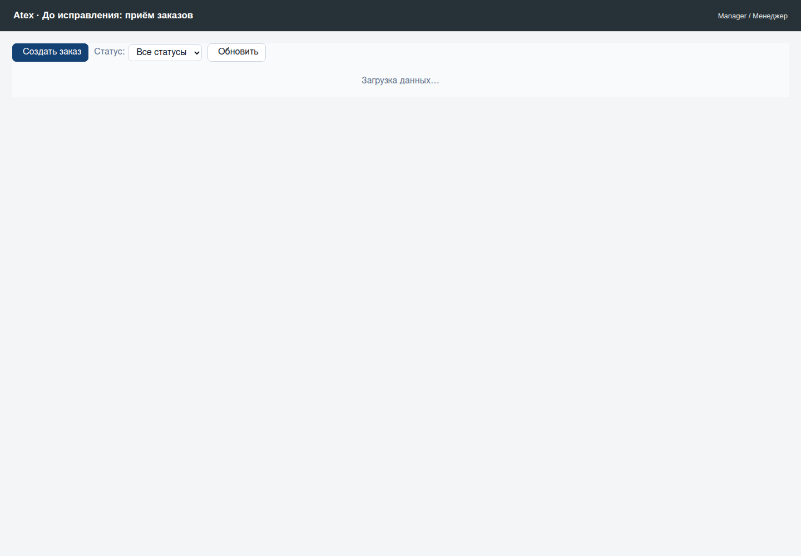

## Менеджер

Менеджер видит заказ `1966`, клиента `ООО Ромашка-Термолента #3002`, позицию
`1974`, выбранный тип резки и финальные статусы заказа/позиции.

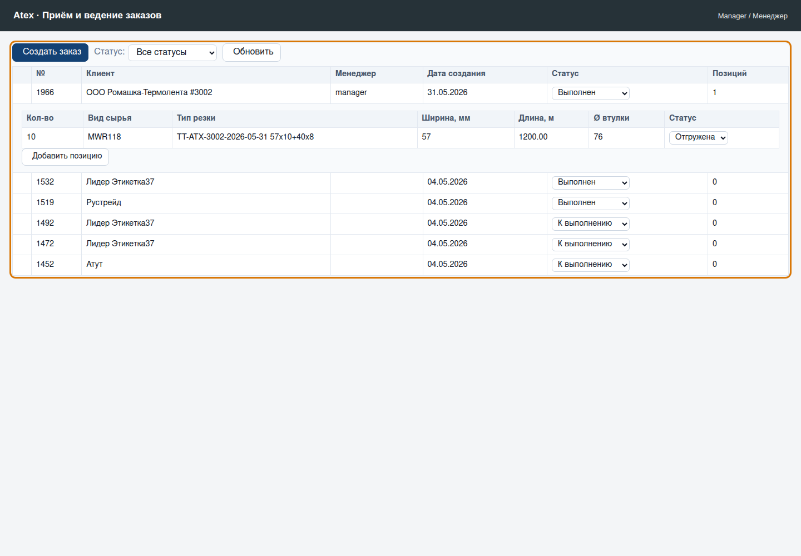

## Диспетчер

Калькулятор типов резки загружает тип `1951`, вид сырья, полосы `1958`/`1962`,
считает ножи и остаток.

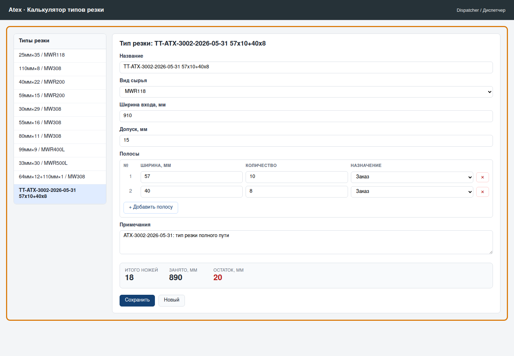

Планирование производства показывает резку `1982`, слиттер, исходную партию
сырья и обеспечение позиции заказа.

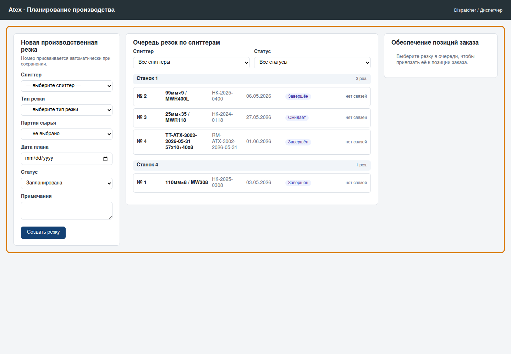

## Оператор и кладовщик

Кладовщик проверяет приёмку сырья: партия `1946` создана с остатком после
списания.

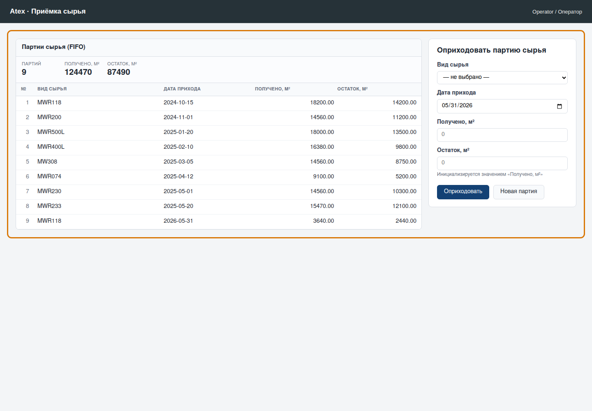

Оператор открывает карту раскроя по резке `1982`: видны ширина входа, полосы и
остаток.

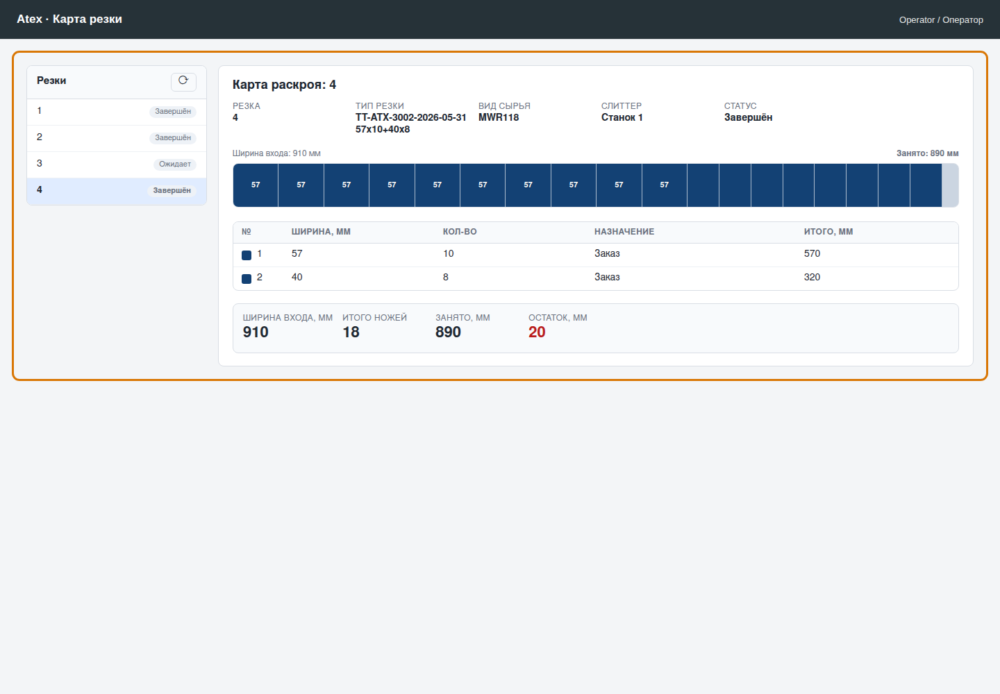

Пульт слиттера показывает полный факт выполнения: статус `Завершён`, счётчики
`1000`/`2200`, погонаж `1200.00`, брак `12.00`, расход сырья и событие смены.

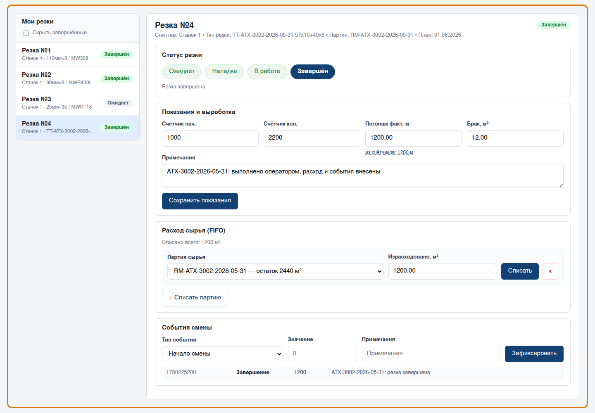

Пульт втулкореза показывает задание `2006` со статусом `Готово` и фактом `10`.

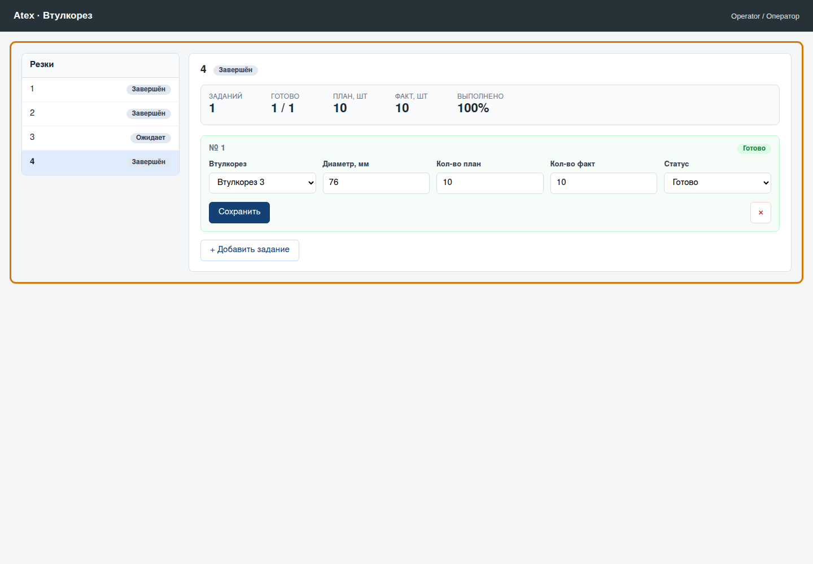

Склад готовой продукции показывает партию `2012`, связь с резкой `1982`, адрес
хранения и статус отгрузки.

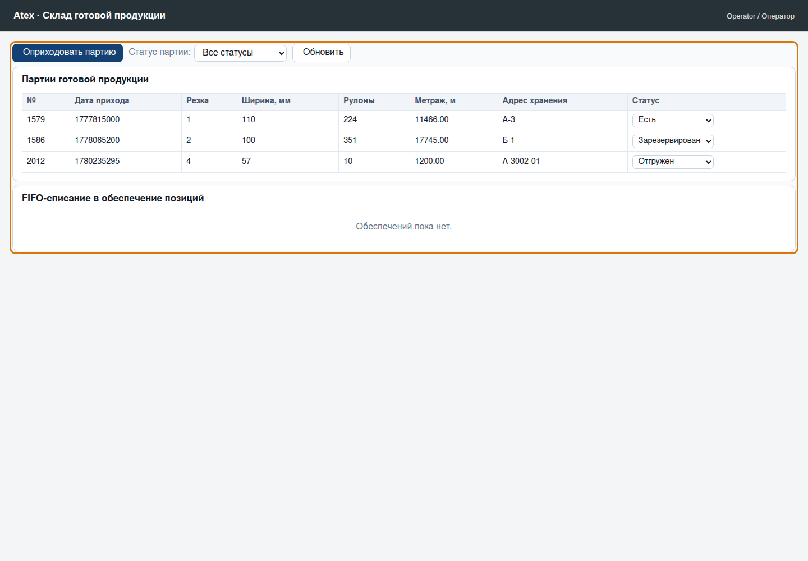

## Руководитель

Руководитель видит дашборды по заказам, резкам, партиям ГП и сырью. Счётчики
загружаются через `?_count=&JSON=1`, поэтому карточки получают JSON даже на live.

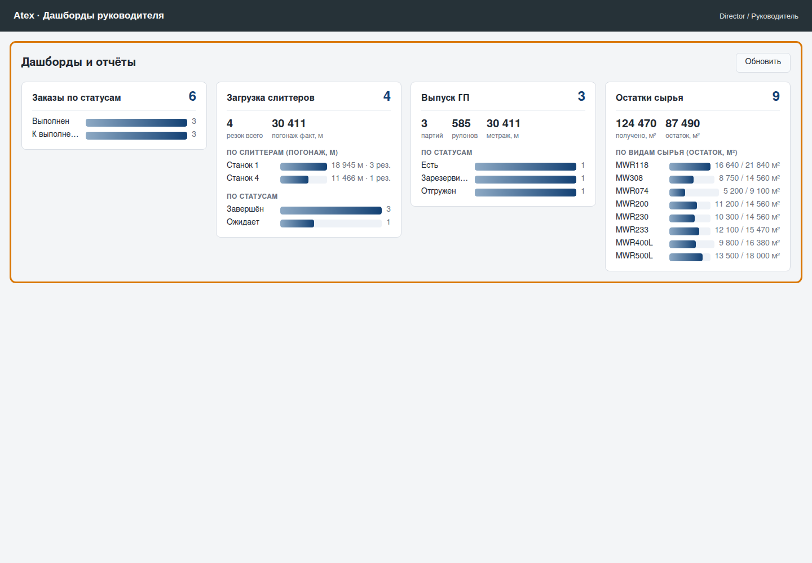

## Клиент

Клиентский портал показывает только свой заказ `1966` и позицию `1974` со
статусом отгрузки.

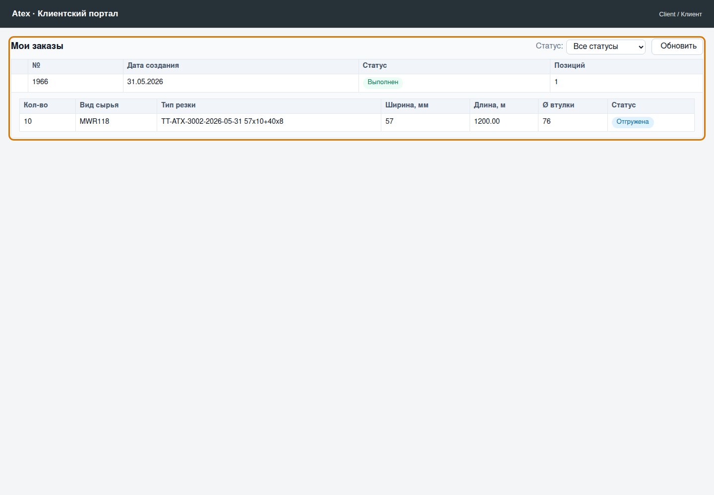

## Как повторить проверку локально

Скриншоты переснимает харнесс
`experiments/capture-issue-3002-screenshots.js`. Он требует установленные
значения `ATEX_MANAGER_TOKEN`, `ATEX_DISPATCHER_TOKEN`, `ATEX_OPERATOR_TOKEN`,
`ATEX_DIRECTOR_TOKEN` и `ATEX_CLIENT_TOKEN`; значения токенов берутся из live
настроек и не коммитятся.

```bash
NODE_PATH=/path/to/node_modules \
ATEX_MANAGER_TOKEN=... \
ATEX_DISPATCHER_TOKEN=... \
ATEX_OPERATOR_TOKEN=... \
ATEX_DIRECTOR_TOKEN=... \
ATEX_CLIENT_TOKEN=... \
node experiments/capture-issue-3002-screenshots.js
```

Автоматические регрессии:

- `node experiments/test-issue-3002-atex-live-transport.js`
- `node experiments/test-issue-3002-atex-live-walkthrough-doc.js`
