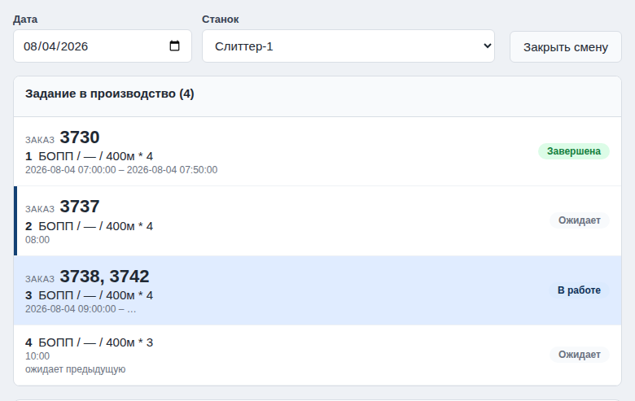
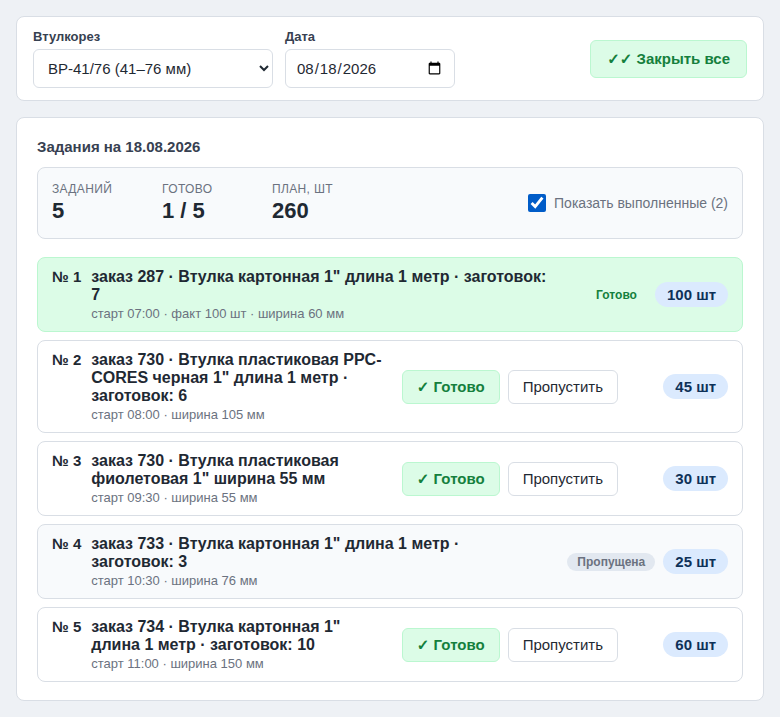
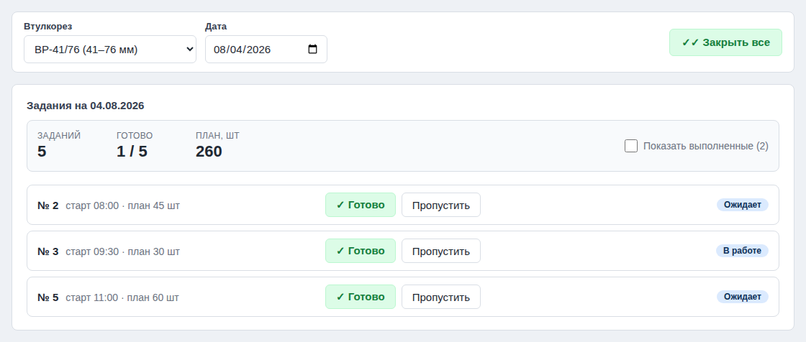
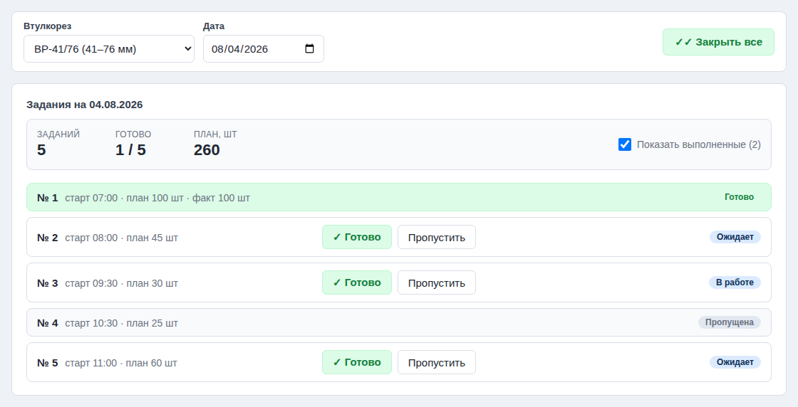
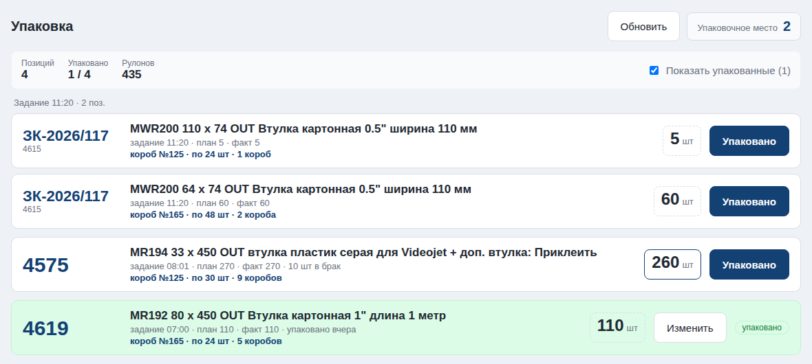
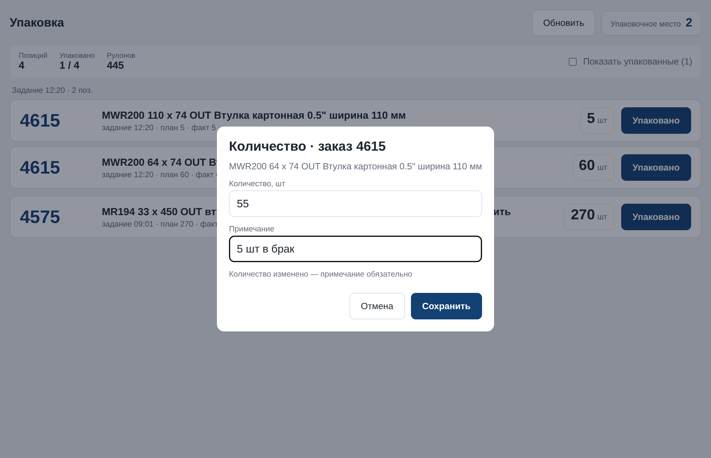

# Рабочие места atex — декомпозиция на тикеты

**Проект:** ideav/atex (автоматизация производства термопринтерных рулонов)
**Платформа:** Integram (ideav.ru)
**Источник схемы:** [`docs/atex_data_schema.md`](atex_data_schema.md) (актуальная схема и
взаимосвязи сущностей, #3163) на основе [`docs/atex_metadata_all.json`](atex_metadata_all.json);
прежний снимок — [`docs/atex_metadata.json`](atex_metadata.json) +
[дизайн-спека atex](https://github.com/ideav/atex/blob/main/docs/superpowers/specs/2026-05-26-atex-schema-setup-design.md)
**Родительская задача:** [#2903](https://github.com/ideav/crm/issues/2903) —
«Подключи рабочие места по API — создай отдельные тикеты на каждое».
**Какая версия рабочих мест актуальная и как их объединить:**
[`docs/atex_workplaces_consolidation.md`](atex_workplaces_consolidation.md) (#2970).
**Полный сценарий проверки рабочих мест:** [`docs/atex_full_cycle_test_scenario.md`](atex_full_cycle_test_scenario.md)
(#2978).
**Live-проверка по ролям для Atex:** [`docs/atex_live_full_cycle_ateh_2026-05-31.md`](atex_live_full_cycle_ateh_2026-05-31.md)
(#3002).
**Сценарий ввода данных по ролям для Atex:** [`docs/atex_role_input_walkthrough_3027.md`](atex_role_input_walkthrough_3027.md)
(#3027).
**Инструкция для человека-тестировщика Atex:** [`docs/atex_human_tester_instruction_3029.md`](atex_human_tester_instruction_3029.md)
(#3029).
**Минимальный сквозной пример для первого прохода:** [`docs/integram-minimal-full-cycle-project.md`](integram-minimal-full-cycle-project.md)
(#2986).

---

## 0. Зачем этот документ

Issue #2903 ставит задачу **подключить рабочие места atex по API** и завести
**отдельный тикет на каждое рабочее место**. Этот документ — карта декомпозиции:
он перечисляет все рабочие места, привязывает каждое к роли и таблицам схемы и
фиксирует, какими API-вызовами рабочее место читает и пишет данные. Каждый пункт
ниже превращён в отдельную GitHub-задачу (ссылки в таблице раздела 2).

**Рабочее место** (по [`integram-app-workflow.md`](integram-app-workflow.md) и
[`WORKSPACE_DEVELOPMENT_GUIDE.md`](WORKSPACE_DEVELOPMENT_GUIDE.md)) — это
HTML/JS-шаблон в `templates/atex/`, который сервер встраивает в `main.html` и
который работает с базой по API.

### 0.1 «Для начала обращайся напрямую к таблицам командами `_m_*`»

Прямое указание из #2903. Полный процесс ([`integram-app-workflow.md`](integram-app-workflow.md),
вступление) состоит из этапов:

1. Уточнение требований
2. Структура данных + тестовые данные — **сделано** (#2901 → схема, #2902)
3. Пользователи и роли — **готово** (#2904); пункты меню — **готово** (#2992)
4. **Запросы (`report/`) для защиты слоя данных** — *отложено*
5. **Рабочие места, работающие с базой по API** ← *этот этап*

Указание означает: на этом этапе рабочие места обращаются к данным **напрямую**:

- **запись** — `POST /{db}/_m_new/{tableId}`, `_m_set/{objId}`, `_m_del/{objId}`
  (значения по ключам `t{reqId}`, см.
  [3.2](integram-app-workflow.md#32-последовательность-api-вызовов));
- **чтение** — `GET /{db}/object/{typeId}/?JSON_KV` с фильтрами `F_U`/`F_I`
  (см. [3.5](integram-app-workflow.md#35-чтение-существующих-записей-и-метаданных)).

Слой запросов (`report/`) как защита данных — **следующий этап** и в объём
тикетов рабочих мест не входит: сначала рабочие места работают через `_m_*`, а
перевод чтений на защищённые `report/` делается отдельно, когда роли и права
будут готовы.

> ID таблиц и реквизитов (`t{reqId}`) зависят от конкретной сборки базы —
> их берут из `GET /{db}/metadata`, а не хардкодят. В тикетах таблицы
> названы по схеме; конкретные id рабочее место получает при разработке.

---

## 1. Бизнес-путь и роли

Путь заказа (из спеки): **Менеджер** создаёт заказ → **Диспетчер** проектирует
типы резки и планирует производство → **Оператор** выполняет резки и отмечает
прогресс → готовая продукция на склад (**Кладовщик**) или отгрузка **Клиенту**;
**Руководитель** смотрит дашборды.

| Роль | Рабочие места |
|---|---|
| Менеджер | Приём и ведение заказов |
| Диспетчер | Планирование производства |
| Оператор | Пульт слиттера; Пульт втулкореза; Карта раскроя |
| Кладовщик | Движение сырья; Склад готовой продукции |
| Руководитель | Дашборды и отчёты |
| Клиент | Клиентский портал (следующая фаза) |
| Администратор | Справочники — штатным UI Интеграма + скриптом начальных данных (отдельное рабочее место не требуется) |

---

## 2. Рабочие места (тикеты)

| # | Рабочее место | Роль | Ключевые таблицы | Тикет |
|---|---|---|---|---|
| 1 | Приём и ведение заказов | Менеджер | Заказ, Заказанное количество, Клиент, Вид сырья | [#2911](https://github.com/ideav/crm/issues/2911) |
| 2 | ~~Калькулятор типов резки~~ **(упразднён, эпик #52)** | — | — | [#2912](https://github.com/ideav/crm/issues/2912) |
| 2б | ~~Расчёт резки~~ **(упразднён, эпик #52)** | — | — | [#52](https://github.com/ideav/atex/issues/52) |
| 3 | Планирование производства | Диспетчер | Производственная резка, Полоса, Обеспечение, Заказанное количество, Слиттер, Партия сырья, Максимальный запас | [#2913](https://github.com/ideav/crm/issues/2913) |
| 4 | Движение сырья | Кладовщик, Диспетчер | Партия сырья, Вид сырья, Диаметр втулки, Склад, Движение сырья | [#4655](https://github.com/ideav/crm/issues/4655) |
| 5 | Пульт слиттера | Оператор | Производственная резка, Расход сырья, Событие смены, Партия сырья | [#2915](https://github.com/ideav/crm/issues/2915) |
| 6 | Пульт втулкореза | Оператор | Задание на втулки, Втулкорез, Заказанное количество | [#2916](https://github.com/ideav/crm/issues/2916) |
| 7 | Карта раскроя | Оператор | Производственная резка, Полоса | [#2917](https://github.com/ideav/crm/issues/2917) |
| 8 | Склад готовой продукции | Кладовщик | Партия ГП, Обеспечение, Производственная резка | [#2918](https://github.com/ideav/crm/issues/2918) |
| 9 | Дашборды и отчёты | Руководитель | (чтение) Заказ, Заказанное количество, Обеспечение, Производственная резка, Партия ГП, Партия сырья | [#2919](https://github.com/ideav/crm/issues/2919) |
| 10 | Клиентский портал | Клиент | Заказ, Заказанное количество (только свои) | [#2920](https://github.com/ideav/crm/issues/2920) |
| 11 | Выгрузка/Загрузка заказов и заданий | Администратор | Заказ, Заказанное количество; Задание в производство, Партия ГП, Полоса, Обеспечение, Задача на втулки | [#4308](https://github.com/ideav/crm/issues/4308) |
| 12 | Упаковка | Упаковщик | Партия ГП, Задание в производство, Событие смены, Упаковочное место | [#4658](https://github.com/ideav/crm/issues/4658) |

**11. Выгрузка/Загрузка заказов и заданий (#4308).** Утилита экспорта/импорта СО ВСЕМИ подчинёнными
таблицами. URL `/atex/export`; шаблон `templates/atex/export.html`, логика `download/atex/js/export.js`,
стили `download/atex/css/export.css`. «Выгрузить» по галкам (заказы и/или задания) читает граф
(родитель→потомок через `object/…?JSON_OBJ&F_U=`, подтабличные роллап-колонки пропускаются) и скачивает
`{дата-время}[_заказы][_задания].json`. «Загрузить» проверяет целостность файла (самодостаточность ссылок,
счётчики) и по подтверждении МАССОВО удаляет таблицы деревьев файла (в порядке зависимостей) и пересоздаёт
записи, пересвязывая ссылки по карте `old→new id`. Id таблиц/реквизитов резолвятся из `/metadata`.
Регистрация пункта меню и роль — как у прочих рабочих мест (запись «Рабочее место» + грант, #2992).

---

## 3. Описание рабочих мест

Для каждого рабочего места: роль, экраны/действия, таблицы (⊂ — подчинённая),
API-операции и критерии приёмки.

### 3.1 Приём и ведение заказов (Менеджер)

- **Действия:** создать заказ, добавить позиции, выбрать клиента/вид сырья,
  задать «Срок изготовления», менять статусы заказа и позиций, список заказов с фильтром по статусу.
- **Таблицы:** `Заказ`; `Заказанное количество` ⊂ Заказ; ссылки на `Клиент`,
  `Вид сырья`; `Менеджер` → `Пользователь` (текущий пользователь). (Тип резки упразднён, эпик #52.)
- **API:** `_m_new/{Заказ}` (`t{Заказ}` = номер, `t{reqКлиент}` = id клиента…);
  позиции — `_m_new/{Заказанное количество}` с `up={orderRecordId}`; правки —
  `_m_set/{objId}`; чтение — `object/{Заказ}/?JSON_KV`, позиции —
  `object/{Заказанное количество}/?F_U={orderId}`.
- **Приёмка:** менеджер создаёт заказ с ≥1 позицией; позиция корректно
  привязана к заказу (`up`); статусы меняются; список отражает изменения.
- **Реализация:** шаблон `templates/atex/orders.html`, логика
  `download/atex/js/orders.js`, стили `download/atex/css/orders.css`. Реквизиты
  и id таблиц резолвятся из `metadata` по имени, поэтому код переживает
  пересборку базы. Тест:
  `experiments/test-issue-2911-atex-orders.js`.
- **~~Фильтр «Тип резки» в форме позиции~~ (подзадача C) — УПРАЗДНЁН** (#3089, эпик
  «упразднение Типа резки»): позиция больше не выбирает тип резки (Типов резки нет);
  раскладка считается динамически при планировании (см. 3.3). `matchCutTypes`/фильтр удалены.
- **«Срок изготовления» у заказа и позиции** (эпик #52, F4): поле-дата на Заказе
  (редактируется в форме создания) и Позиции (только показ). Используется движком
  генерации резок для объединения позиций одного сырья в окне «срок ± 3 дня»
  (`dueKey`, ядро `cut-layout`). Колонки `order_due_date`/`position_due_date` в отчёте
  `orders_list`; реквизит резолвится по имени «Срок изготовления».
- **«Тип намотки» у позиции заказа** (исх. #52, подзадача D1): строковое поле
  с фиксированным перечнем значений `IN` / `OUT` (пустое = не задано). В форме
  позиции отображается как `<select>` с тремя опциями. При сохранении значение
  нормализуется чистой функцией `normalizeWinding` (trim + toUpperCase;
  посторонние строки → `''`); доступные значения — константа `WINDING_VALUES`.
  Оба символа экспортируются через `window.AtexOrdersTesting`. Поле является
  фундаментом для движка планирования (подзадачи D2/D3, эпик #52): направление
  намотки учитывается при расстановке резок по очереди. Тест:
  `experiments/test-issue-52D-winding.js`.

### 3.2 ~~Калькулятор типов резки~~ — УПРАЗДНЁН (эпик #52)

Фиксированные «Типы резки» упразднены: раскладку ножей («Полосы») теперь считают
**динамически** при планировании (ядро `cut-layout.js`, F1) и хранят **под
Производственной резкой**. Рабочее место `cut-calc` (js/css/template) и пункт меню
удалены; редактор полос встроен в «Планирование производства» (см. 3.3). Чистые
формулы итогов перенесены в `production-planning.js`
(`stripsUsedWidth/stripsTotalKnives/stripsRemainder`).

### 3.3 Планирование производства (Диспетчер)

- **Действия:** создать производственную резку (слиттер, партия сырья,
  дата плана), очередь резок по слиттерам, привязать резку к позициям
  заказа через «Обеспечение». Раскладка полос задаётся в редакторе полос
  резки динамически (см. ниже); справочник «Тип резки» упразднён.
- **Типоразмер упаковки (#4665):** каждая создаваемая «Партия ГП» получает ссылку
  «Типоразмер» — короб и норму укладки. Подбор (`download/atex/js/packaging-size.js`,
  справочник — отчёт `pack_sizes`): ширина берётся у полосы, длина намотки и признак фольги
  у задания, доп. втулка — у обеспечиваемой позиции той же ширины (у роликов с доп. втулкой
  своя норма). Полоса не в заказ (добор ходовыми) считается без доп. втулки. Ничего не
  подошло — поле не пишется. В подсказке (`title`) строки полосы `.atex-pp-strip-row` —
  «31-40 Х 330/450 — №125 · 36 шт в коробе (3 × 12) · 9 коробов» (норма укладки — «рядов ×
  в ряду», коробов — на мотки этой строки); ту же ссылку показывает РМ упаковщика
  (§3.13). Доп. втулка позиции приезжает колонкой `position_add_sleeve` отчёта
  `positions_list`.
- **Таблицы:** `Производственная резка` (Номер — автоинкремент); ссылки на
  `Слиттер`, `Партия сырья`; подчинённые `Полоса` ⊂ `Производственная резка`,
  `Расход сырья` ⊂ `Производственная резка`, `Задание на втулки` ⊂
  `Производственная резка`; `Обеспечение` ⊂ `Заказанное количество` (ссылки →
  `Производственная резка`, → `Партия ГП`).
- **API:** `_m_new/{Производственная резка}` (Номер не задаётся — `unique`
  сам считает); `Обеспечение` — `_m_new/{Обеспечение}` с
  `up={позицияId}` и `t{refРезка}`; чтение очереди —
  `object/{Производственная резка}/?JSON_KV` (фильтр по слиттеру/статусу).
- **Приёмка:** резка создаётся с автонумером; обеспечение связывает позицию
  заказа и резку (M:N через подчинённую таблицу).
- **Реализация:** шаблон `templates/atex/production-planning.html` (URL
  `/atex/production-planning`), логика `download/atex/js/production-planning.js`, стили
  `download/atex/css/production-planning.css`. Id таблиц и реквизитов резолвятся из
  `metadata` по имени, поэтому код переживает пересборку базы: резка —
  `_m_new/{Производственная резка}?up=1` без главного значения (Номер считает
  `unique`), обеспечение — `_m_new/{Обеспечение}?up={позицияId}` со ссылкой
  `t{refРезка}`. Тесты ядра: `experiments/atex-production-planning.test.js`;
  браузерный стенд с моком fetch: `experiments/atex-production-planning.fixture.html`.
- **Автосоздание «Задачи на втулки» при планировании** (#3340): отчёт
  `positions_list` отдаёт по позиции `sleeve_id` (id записи `Диаметр втулки`) и
  `sleeve_ready` (непустое — тип втулок уже нарезан, задание не нужно). Задание
  создаётся (при ручной резке и при генерации) для позиций с непустым `sleeve_id`
  и пустым `sleeve_ready`: `positionSleeveTasksForLayout` → `{positionId, sleeveId,
  qty}` (qty = кол-во рулонов покрытия). Запись `Задача на втулки` (1080,
  up=позиция): главное значение = запланированный старт резки (Unix); «Кол-во» =
  qty; «Втулкорез» = TC-20 (`resolveSleeveCutterId`, резолв по имени); «Партия
  сырья» = FIFO-партия втулок (`pickSleeveBatchId`: из отчёта
  `sleeve_batches_active` берётся самая ранняя активная «в работе» партия с
  совпадающим `Диаметр втулки`). Партии грузятся `loadSleeveBatches`. Чистые
  функции `positionSleeveTasksForLayout`, `pickSleeveBatchId`,
  `rowsToGenPositions` покрыты `experiments/atex-production-planning.test.js`.
  Отчёт `sleeve_batches_active` (queryId 54341) переиспользуется для будущей
  корректировки остатка втулок на запланированные/невыполненные задания.
- **Кнопка «Дэшборд N/M»** (#4774): второй сигнал панели рядом с «Отклонениями». Показывается
  только когда расхождения есть (как «Отклонения»), открывает форму со списком и ничего не
  меняет — исправляют расхождение в своих рабочих местах. Две группы, обе по ОДНОМУ окну:
  видимый диапазон очереди `[С; По]` и плановый день **не позже сегодня** (у будущего задания
  «не упаковано» и «втулки не нарезаны» — норма).
  1. **Сделано ≠ упаковано** (N): Σ «Кол-во факт» (70573) Партий ГП задания против
     Σ «Упаковано шт» (673786). Первое пишет пульт слиттера при завершении, второе — РМ
     «Упаковка» (§3.13). Источник — отчёт `packer` (673812) без фильтра `FR_packer_no`
     (диспетчеру нужны все упаковочные места).
  2. **Втулки не готовы** (M): у позиции задания есть незакрытые «Задачи на втулки» —
     готовность = «Закончено» у ВСЕХ задач позиции либо `sleeve_ready` самой позиции.
     Источник — отчёт `sleeve_tasks` (184151) с колонкой **`position_id`** (#4774): задача
     подчинена позиции, ссылки «задача ↔ задание» в схеме нет (#4631), поэтому готовность
     читается через позиции задания (его «Обеспечения»). Задачи по дате не отбираются:
     плановое время задачи — это старт резки на момент её создания и после переносов плана
     расходится с текущим днём задания.
  Оба отчёта читаются грантом на объект «Запрос» (22) — тем же, которым Диспетчер читает
  `cut_planning`. Отчёт не прочитался или в нём нет нужной колонки → группа не показывается,
  и форма говорит об этом отдельной строкой (пустой список не должен читаться как «всё
  упаковано» / «втулки готовы», #4359/#4536). Чистое ядро — `rowsToPackState`,
  `rowsToSleeveTasks`, `sleeveReadiness`, `dashboardGroups`; тест —
  `experiments/atex-pp-4774-dashboard.test.js`.
- **Плавающий обед в планировании** (#3342): настройки `Настройка` `LUNCH_START`
  (HH:MM) и `LUNCH_DURATION` (минуты) с типом БД (`ATEH`) читаются
  `loadDaySettings`/`resolveWorkingWindow` (→ `lunchStartMin`/`lunchDurationMin`
  рабочего окна). Планировщик (`splitMachineQueue` — пишет время старта в t1078, и
  `buildSchedule` — отображение) встраивает обед раз в день: пауза `LUNCH_DURATION`
  перед первой резкой, стартующей в/после `LUNCH_START` (следующие резки
  сдвигаются). Пока обед не вставлен, доступная ёмкость дня уменьшена на
  `LUNCH_DURATION` (резерв): если резка непрерывно перекрывает обеденное окно и
  паузу встроить не удалось, день планирования заканчивается на `LUNCH_DURATION`
  раньше, остаток проходов — на следующий день. Нет настроек обеда → планирование
  без изменений. Тесты — `experiments/atex-production-planning.test.js`.
- **«Стоп-лист сырья» у слиттера** (исх. #52, подзадача E): таблица `Слиттер`
  содержит поле «Стоп-лист сырья» — мультиссылку на `Вид сырья`; редактируется
  штатным табличным редактором Интеграма. При создании резки (`createCut`)
  рабочее место загружает стоп-листы всех слиттеров (`loadSlittersWithStop`) и
  сверяет «Вид сырья» выбранной партии сырья со стоп-листом выбранного
  слиттера: при совпадении резка блокируется с сообщением об ошибке. Проверка
  реализована чистыми функциями `isMaterialBlocked` и `parseMultiRefIds`
  (`download/atex/js/production-planning.js`), покрытыми тестом
  `experiments/atex-production-planning.test.js`. Ограничение «Фольга в станки 2/3»
  задаётся данными (записями стоп-листа), а не кодом. Порядок «в конец дня» —
  подзадача D.
- **«Очередность» у производственной резки** (исх. #52, подзадача D1):
  числовое поле `Производственная резка.Очередность` задаёт порядок резки
  внутри очереди слиттера. Значение отображается в строке резки (метка
  `Очер.: N`, прочерк при пустом). Очередь каждого слиттера сортируется по
  «Очередности» по возрастанию; резки с пустым значением помещаются в конец
  (стабильная сортировка). Сортировка реализована внутри `groupBySlitter`
  вспомогательной функцией `seqKey` (`download/atex/js/production-planning.js`).
  Данные поступают из отчёта `cut_planning` (колонка `cut_sequence`),
  разворачиваемого `rowsToPlanning`; пустая строка и `null` нормализуются в
  `null`, непустые — в `Number`. Поле является фундаментом для движка
  планирования (подзадачи D2/D3, эпик #52): движок упорядочивания и
  автогенерации очерёдности реализуется в D2/D3. Тест:
  `experiments/atex-production-planning.test.js`.
- **Движок упорядочивания** (исх. #52, подзадача D2): ядро `planning`
  (`download/atex/js/production-planning.js`) содержит чистый движок
  `orderCuts(cuts, options?)`. Вариант по умолчанию
  `PLANNING_STRATEGY_SETUP` строит жадную (nearest-neighbor) цепочку по
  реальным минутам `changeoverCost`: смена сырья/намотки/партии
  (`MATERIAL_WINDING`) и смена ножей/сужение ролика (`KNIFE`). Второй вариант
  `PLANNING_STRATEGY_FATIGUE` берёт ту же setup-базу, но weighted score растёт к
  концу очереди и ставит более сложные резки (много ножей / узкая ширина)
  раньше. Если число ножей ещё неизвестно, оно оценивается как `Wmax / width`
  (`FATIGUE_MACHINE_WIDTH_MM = 1600`). Фольга (`isFoil: true`) упорядочивается
  в конец; вход не мутируется; результат содержит поле `sequence` (1..N). Тест:
  `experiments/atex-production-planning.test.js`.
- **Кнопка «Запланировать»** (исх. #52, подзадача D3a): доступна роли Диспетчер.
  Нажатие вызывает `runPlanning` и показывает inline-выбор: «Мин. переналадок»
  (`PLANNING_STRATEGY_SETUP`) или «Сложные раньше»
  (`PLANNING_STRATEGY_FATIGUE`). `planQueues` (обёртка над `orderCuts`) получает
  плоский массив `[{cutId, slitterId, sequence}]` и сохраняет только
  изменившиеся резки через `_m_set` (по одной, последовательно). После
  сохранения очередь перезагружается (`reload`) и перерисовывается (`render`).
  Входные данные поступают из отчёта `cut_planning`. Генерация резок (D3b) и
  ручная правка очереди (D3c) — отдельные подзадачи эпика #52.
- **Ручная правка очереди** (исх. #52, подзадача D3c): в карточке каждой резки
  внутри очереди станка отображаются кнопки ↑ и ↓; на границах очереди
  соответствующая кнопка задизейблена. Нажатие вызывает чистую функцию
  `moveInQueue(orderedCuts, index, dir)`: та нормализует «Очередность» 1..N,
  меняет резку местами с соседом и возвращает только изменённые пары
  `[{cutId, sequence}]`. Пары сохраняются через общий метод `saveSequences`:
  `_m_set` вызывается только для изменившихся записей, затем очередь
  перезагружается. Дополняет авто-кнопку «Запланировать» (D3a).
- **Кнопка «Сгенерировать резки»** (исх. #52, эпик «упразднение Типа резки», F3):
  доступна Диспетчеру, рядом с «Запланировать». Для позиций заказов **без
  «Обеспечения»** автоматически создаёт Производственные резки с динамической
  раскладкой полос (Типов резки больше нет). После выбора варианта очереди
  (inline-подтверждение, не нативный `confirm`): необеспеченные позиции
  группируются по сырью, типу намотки и длине; для каждого профиля ядро
  **`cut-layout.planLayouts`** (F1) пакует
  ширины заказанных позиций в ширину джамбо (= Вид сырья «Ширина, мм») и добирает
  остаток **ходовыми** (`preferable_widths`, Популярность = `position_qty_sum`,
  фильтры `FR_position_material_id`, `FR_wind_dir`, `FR_wind_length`), объединяя
  позиции в окне «Срок изготовления ± 3 дня». На каждую раскладку последовательно: `_m_new`
  Производственной резки (Статус «Запланирована»; станок не из стоп-листа с
  setup-оценкой `chooseSlitterBySetup`; старейшая партия `pickBatchFIFOForRun`)
  → `_m_new` подчинённых «Партия ГП» (Ширина/Кол-во полос/Кол-во рулонов(спрос)/
  Кол-во план/ID заказа/Метраж; #3433) → `_m_new`
  «Обеспечений» (`positionsCovered` → Партия ГП). Create-запросы идут в порядке
  раскладок, а «Очередность» новых резок назначается выбранным вариантом
  `orderCuts`. Источники: `positions_list`
  (+`position_due_date`, `position_winding`, `position_length`), `preferable_widths`,
  ширина джамбо из «Вид сырья», обеспечения из `cut_planning`.
  По завершении — «Создано N резок, полос P, пропущено K (причины)». Ядро раскладки
  тестируется в `experiments/atex-cut-layout.test.js`.
- **Редактор полос резки** (F3): кнопка «Полосы» на карточке резки в очереди →
  инлайн-панель. Загружает подчинённые «Полосы» резки (по `F_U`), показывает
  сырьё и ширину джамбо (read-only, из партии резки), таблицу полос
  (Ширина/Количество/Назначение, add/remove) со сводкой (итого ножей, занято,
  остаток, бейдж «в допуске») и панель **ходовых** сырья (клик добавляет полосу).
  «Сохранить полосы» — диф `_m_new`/`_m_set`/`_m_del` подчинённых «Полос» резки
  (Тип резки не сохраняется — упразднён). Сводка-хелперы
  `stripsUsedWidth`/`stripsTotalKnives`/`stripsRemainder` — чистые, тест в
  `experiments/atex-production-planning.test.js`. `knifeCount`/`knifeWidths` для
  движка очереди восстанавливаются из отчёта `cut_strips` (`aggregateStrips`).
- **Учёт «Максимального запаса» при доборе** (#3391): излишки джамбо нарезаются
  впрок (на «Склад») только для номенклатур «Партии ГП», которые целесообразно
  хранить, — они перечислены в справочнике **«Максимальный запас»** (table/67113,
  главное значение записи — макс. допустимый запас). Правило: **всё, чего нет в
  списке, не нарезается для хранения — излишек идёт в «Отходы»**. При загрузке РМ
  таблица читается в индекс (`loadMaxStock` → `buildMaxStockIndex`); если таблица
  отсутствует/пуста — фича выключена, поведение прежнее (всё «стокабельно»).
  Чистое ядро (`download/atex/js/production-planning.js`): `maxStockKey` (ключ
  `Вид сырья|Ширина|Длина|Тип намотки`), `parseMaxStockRows`/`buildMaxStockIndex`,
  `maxStockMatches`/`maxStockLimit` (втулка/лидер доуточняют, только если заданы у
  обеих сторон), `isStockableNomenclature`, `stockStripPurpose` (Склад/Отходы),
  `filterStockableWidths` (отсев нецелесообразных ходовых). Три точки интеграции:
  (1) колонка «Назначение» в редакторе полос (необеспеченная полоса → «Склад» или
  «Отходы», бейдж `--waste`); (2) панель ходовых-добора (`renderPreferred`) —
  предлагаются только целесообразные к хранению ширины; (3) авто-добор при
  генерации резок (`generateCuts`/`planLayouts`, аргумент `preferred`). Тесты —
  `experiments/atex-production-planning-3391.test.js`.
- **Количественный лимит «Максимального запаса»** (#3445): #3391 решал *членство*
  (Склад vs Отходы), #3445 добавляет *количественный* лимит — на склад по
  номенклатуре нельзя нарезать больше значения из первой колонки справочника **с
  учётом того, что уже лежит на складе**. При загрузке РМ читается текущий остаток
  ГП (`loadStockBalance`): «Партии ГП» в статусе не «Отгружен», номенклатура — из
  родительской «Производственной резки» (сырьё через `batchMaterialById`, намотка/
  длина — поля резки, ширина — у партии), рулоны — «Кол-во факт» → «Кол-во рулонов» →
  «Кол-во план» (как в `warehouse.js`). Чистое ядро: `buildStockBalanceIndex`,
  `currentStock`, `stockHeadroom` (= `maxStockLimit − остаток`, не отрицателен; `null`,
  если номенклатуры нет в справочнике), `capStockToHeadroom` (capping). Две точки:
  (1) **авто-генерация** — после раскладок планируемые на склад рулоны (добор ходовыми
  + перепроизводство заказных ширин) урезаются по каждой номенклатуре до `headroom`;
  заказное покрытие не трогается, лишнее не нарезается (в окне подтверждения видно
  «Урезано впрок: N рул.»); (2) **ручной редактор полос** — ввод количества и добор
  ходовой блокируются с ошибкой, если остаток + впрок этой резки превысит лимит
  (`stockLimitExceededForCut`). Если таблица пуста/отсутствует — лимит не действует
  (поведение #3391). Тесты — `experiments/atex-production-planning-3445.test.js`.
- **Фильтр видимости очереди** (исх. #52): очередь показывает не весь архив, а
  только актуальные резки. Чистая `isCutVisible(cut, selectedDate)` показывает
  резку, если: (1) статус не «Завершён»; (2) заказ резки согласован — «Дата
  согласования» заказа не пустая (`order_approval_date` из `cut_planning`, путь
  Позиция→Заказ); (3) «Дата план» совпадает с выбранной датой ИЛИ пустая (ещё не
  запланирована, напр. только что сгенерированная). Над очередью — контрол «Дата
  плана» (`<input type=date>`, по умолчанию сегодня); смена даты перефильтровывает
  очередь. Дополняет фильтры по станку и статусу.
- **Ядро динамической раскладки `cut-layout.js`** (исх. #52, подзадача F1 — эпик
  «Упразднение Типа резки»): чистый ES5-UMD-модуль
  `download/atex/js/cut-layout.js` (экспорт `layout` через
  `module.exports`/`window.AtexCutLayout`), считающий раскладку ножей («Полосы»)
  динамически вместо справочника «Тип резки». Все функции чисты (вход не
  мутируют, детерминированы), без DOM/сети; покрыты node-тестами
  `experiments/atex-cut-layout.test.js`. Контракт (для F3):
  - `toNumber(v)` / `round3(v)` — нормировка и округление до 3 знаков (как в B);
  - `dayDiff(aKey, bKey)` — |дни| между двумя ключами ГГГГММДД (нечисло/Infinity →
    `Infinity`), через `Date.UTC`;
  - `dueWindowGroups(positions, windowDays=3)` — объединяет позиции
    `[{id, width, qty, dueKey}]` одного сырья в кластеры по «Сроку изготовления»:
    датированные сортируются по `dueKey` (затем по `id`) и жадно набираются, пока
    `dayDiff ≤ windowDays`; позиции без срока (`Infinity`) — отдельный последний
    кластер;
  - `bestFill(rem, preferred, tolerance)` — DFS-добор остатка ширинами
    `preferred:[{width, popularity}]` (мин. `leftover`, затем макс. `popSum`);
    реплика `bestFill` из `cut-planning.js` (B), но кандидаты несут `popularity`,
    а не `freq`. Возврат `{strips:[{width,qty}], leftover, popSum}`;
  - `composeLayout(jumboWidth, demands, preferred, tolerance)` — раскладка одного
    кластера: (a) агрегирует `demands:[{width,qty,positionId}]` по ширине, ширины
    шире джамбо → `overflow`; (b) базовая укладка по 1 полосе на каждую ширину
    (по убыванию); (c) дозаполнение по спросу (макс. неудовлетворённый `qty`; при
    равенстве — бóльшая ширина, затем меньший id); (d) добор остатка ходовыми
    (`bestFill`) полосами `purpose:'Склад'`; (e) `used`/`remainder`/
    `withinTolerance`. Возврат `{strips:[{width,qty,purpose:'Заказ'|'Склад',
    positionIds:[]}], used, remainder, withinTolerance, overflow:[]}`;
  - `planLayouts(input)` — оркестратор: `input = {jumboWidth, positions,
    preferred, options:{windowDays=3, tolerance}}`; группирует по окну срока,
    `composeLayout` на кластер, при непустом `overflow` с прогрессом — повторная
    раскладка; позиции шире джамбо → `skipped` с reason `'шире джамбо'`. Возврат
    `{layouts:[{positionsCovered, strips, used, remainder, withinTolerance,
    dueKey}], skipped:[{positionId, reason}]}`;
  - `combinationSignature(materialId, strips)` — канонический ключ комбинации
    (сортированный мультинабор `widthxqty`, как в B) для дедупликации/отладки.
  Загрузка данных, создание Полос/Резок, кол-во резок под `qty` (ceil) и UI — F3
  (на этом ядре).

### 3.4 Движение сырья (Кладовщик, Диспетчер)

- **Действия:** три складские операции над сырьём — **приход** на склад,
  **перемещение** со склада на склад, **списание** (брак или отгрузка вовне,
  причина обязательна). Решение #4655.
- **Модель:** запись `Партия сырья` (1074) — карточка остатка: ровно одна на
  пару (объект, склад). Пара уникальна (реквизиты «Вид сырья», «Склад»,
  «Диаметр втулки» помечены `key:true`), поэтому рабочее место не заводит партии
  вручную: приход находит карточку пары и увеличивает остаток, а если карточки
  нет — создаёт её («В работе» = X, чтобы её видел планировщик).
- **Объект передачи** выбирается из ОДНОГО списка: риббоны (справочник
  `Вид сырья`, 1069) и втулки (справочник `Диаметр втулки`, 8188). Тонкости меры
  оператору не показываются — мера следует из самого объекта:

  | Объект | Мера | Реквизит карточки | «Ед.изм.» |
  |---|---|---|---|
  | риббон | м² (и метры) | «Остаток, м²» + досчитанный «Остаток, м» | м2 |
  | втулка с «Ширина втулки, мм» | штуки | «Кол-во» | шт |
  | втулка без ширины | метры | «Кол-во» | Метр |

- **Пересчёт риббона** идёт через «Номинальная ширина» вида сырья (81089) —
  та же арифметика, что на пульте слиттера (#3861): `S(м²) = L(м) × W(мм) / 1000`.
  Оператор вводит количество в любом из двух полей, второе считается сразу. Если
  «Номинальная ширина» у вида сырья не задана, метровое поле выключено, а
  «Остаток, м» карточки не переписывается — пересчитать его нечем, и рабочее
  место говорит об этом подсказкой, а не пишет неверное число.
- **Список остатков** слева: фильтры (тип сырья, склад, поиск по названию и
  штрих-коду), четыре итога по видимым карточкам (карточек, риббоны в м²,
  втулки в штуках, втулки в метрах) и строки «объект — склад — остаток». Итоги
  стоят отдельными плитками в рамках и округлены до целых: разряды тысяч
  пишутся пробелом, и суммы, стоявшие встык одной строкой, читались как одно
  длинное число (#4662). Разделитель разрядов — неразрывный пробел, поэтому
  число не переносится по строкам. Остаток карточки в строке списка — точный,
  до тысячных: по нему оператор сверяет, сколько можно списать.
- **Журнал:** каждая проводка пишется в таблицу `Движение сырья` (670849,
  заводится скриптом `docs/scripts/create_stock_movement_4655.py`): когда,
  операция, объект (ссылка на `Вид сырья` / `Диаметр втулки`), со склада, на
  склад, кол-во, ед.изм., «Было», «Стало», причина, комментарий, пользователь.
  «Было»/«Стало» — остаток той карточки, с которой операция БЕРЁТ (списание,
  перемещение) или в которую КЛАДЁТ (приход). Склады журнал хранит текстом:
  двух ссылок на одну таблицу в записи Интеграма не бывает (docs/kb/schema.md).
  Последние 15 движений показаны под формой.
- **Правила проводки** (все — в одной чистой функции `calc.planMovement`, ею же
  рисуется предпросмотр «было → стало», так что предпросмотр и запись считают
  одну арифметику):
  - количество больше нуля; списание — только с указанием причины;
  - перемещение «на тот же склад» отклоняется;
  - списать или перевезти больше, чем лежит на складе, нельзя: остаток карточки
    в минус не уходит;
  - перемещение сохраняет количество: сколько ушло с источника, столько пришло
    приёмнику.
- **Реализация:** шаблон `templates/atex/intake.html`, логика
  `download/atex/js/intake.js` (чистое ядро `calc` + метаданные-хелперы
  `helpers` + DOM-контроллер), стили `download/atex/css/intake.css`. URL —
  `/atex/intake`. Таблицы и реквизиты резолвятся из `metadata` по имени (и по
  псевдониму `attrs.alias` — колонки журнала названы псевдонимами), поэтому код
  переживает пересборку базы. Список остатков грузится целиком и фильтруется на
  клиенте (в ateh 97 карточек). Тесты: `experiments/atex-intake.test.js`.
- **Данные, которые рабочее место не чинит молча:**
  - карточка втулки, у которой количество лежит в старых реквизитах остатка, а
    «Кол-во» пусто, помечена «не перенесено», операции по ней заблокированы;
    перенос — `docs/scripts/migrate_sleeve_qty_4655.py` (в `ateh` прогнан
    08.08.2026: 33 карточки);
  - карточка, чья «Ед.изм.» расходится с правилом объекта, попадает в
    предупреждение вверху панели (в ateh это втулка «PE Cores 25,6*35*100» без
    заполненной «Ширины втулки, мм» и риббон «П/Гл каучук» с «шт,м2»).
- **Что рабочее место больше не делает:** не пишет в «Получено, м²» и «Длина, м»
  (они пусты у всех карточек ateh, а история поступлений теперь в журнале) и не
  редактирует «Штрих-код» — карточка остатка склада не описывает конкретный
  рулон. Штрих-код по-прежнему участвует в поиске по списку остатков.
- **Гранты:** ролям «Диспетчер» (1619) и «Оператор» (1621) нужны WRITE на
  `Движение сырья` и READ на справочники `Склад` (35549) и `Ед.изм.` (104590) —
  их выдаёт тот же скрипт `create_stock_movement_4655.py`.
- **Отчёт `sleeve_batches_active`** (54341), по которому планирование подбирает
  партию втулок для «Задачи на втулки», получил колонку `remaining_qty` ←
  «Кол-во»; `loadSleeveBatches` читает её, а `remaining_m` остаётся фолбэком с
  предупреждением в консоли для неперенесённых карточек. До #4655 отчёт видел
  только шесть старых заглушек без склада с «бесконечным» остатком 1 000 000 —
  теперь он отдаёт все 33 карточки втулок с реальными складскими остатками.
  «Остаток, м» у шести заглушек оставлен до выкладки новой сборки планировщика,
  снимается прогоном `migrate_sleeve_qty_4655.py --clear-stub-meters`.


### 3.5 Пульт слиттера (Оператор, планшет)

- **Действия:** по назначенной резке — менять статус (Ожидает → Наладка → В
  работе → Завершён), вводить показания счётчика (нач./кон.), погонаж факт,
  брак; списывать расход сырья по партиям (FIFO); фиксировать события смены.
  #4564: каждая отметка «✓ Готово» пишет в задание «Кол-во резок факт» — сколько
  проходов сделано. Это же число показывает заголовок «Резка N из M» и по нему
  «Урегулировать» в планировании разделяет частично выполненное задание.
  #4604: проходы отмечаются и ПАЧКОЙ — кнопка «✓N Готовы несколько» спрашивает,
  сколько проходов выполнено (мерка та же — «сколько сделано ВСЕГО из плана»,
  проверяет `core.passTargetFromInput`), и делает одну отметку на любое их число:
  сделал 99 из 100 — одна запись, а не 99 нажатий. Арифметика та же, что у «✓ Готово»
  («Кол-во резок факт», «Погонаж факт», «Счётчик кон.» = «Счётчик нач.» − погонаж,
  расход партии за новые проходы). Введён весь план — задание завершается; введено
  меньше — остаётся в работе с остатком проходов. #4783: отдельной кнопки «✓✓ Готовы все»
  нет — весь план уже предложен в модалке по умолчанию.
  #3433: при переходе в «Завершён» в каждую «Партию ГП» резки пишется «Кол-во
  факт» = «Кол-во полос» × факт. проходов («Кол-во резок факт», фолбэк на план) —
  фактически произведённые рулоны.
- **Таблицы:** `Производственная резка`; `Расход сырья` ⊂ резка (ссылка →
  `Партия сырья`); `Событие смены` (ссылки → резка, → `Пользователь`);
  `Партия ГП` ⊂ резка (#3433: запись «Кол-во факт» при завершении).
- **API:** `_m_set/{резкаId}` (статус, счётчики, погонаж, брак); расход —
  `_m_new/{Расход сырья}` с `up={резкаId}`; событие —
  `_m_new/{Событие смены}`; факт рулонов — `_m_set/{Партия ГП}` («Кол-во факт»);
  список «мои резки» — `object/{...}` с фильтром по слиттеру/статусу.
- **Станок из планшета (#4789):** если планшет настроен на станок (таблица «Планшет»,
  §3.14), пульт открывается сразу на нём — выбор в шапке остаётся, но не спрашивается;
  а сам выбор станка настраивает планшет (диспетчеру, у оператора прав на запись нет).
- **Приёмка:** оператор выбирает станок в шапке пульта, открывает смену, затем ведёт
  выбранную резку по статусам; расход сырья уменьшает остаток партии; события
  смены пишутся с датой/временем.
- **Компактный экран пульта (#4783):** пульт занимает рабочую область целиком, и
  прокручивается в нём ТОЛЬКО список заданий (`.atex-sl-cuts`) — правая часть влезает
  в экран. Из чего это сложилось:
  - **левого меню на странице пульта нет** — решение принимается в `<head>`
    `templates/atex/main.html` по списку `FULLSCREEN_ACTIONS` (там же, где решение
    «единственный пункт меню», #4690): до отрисовки body, иначе меню мелькает. Новое
    полноэкранное рабочее место добавляется одним словом в этот список;
  - **дата и станок — в шапке страницы** (`.navbar-workspace`): «{имя планшета} · {дата} ·
    {станок}». Имя планшета кладёт сторож `pad-guard.js` (§3.14, оно же в `window.atexPad`),
    дата — **всегда текущая календарная** (выбора дня нет; день берётся при загрузке
    пульта), станок — кнопка, открывающая список станков. Выбор станка помнится в
    `localStorage` (#3460), поэтому на планшете его делают один раз; пока станок не
    выбран, список открывается сам;
  - **«Открыть смену»/«Закрыть смену»** — в шапке списка заданий (`.atex-sl-sidebar-head`)
    вместо заголовка «Задание в производство (N)»;
  - **правая часть:** номер заказа и «Резка N из M» одной строкой (бейджа статуса нет —
    статус виден на карточке задания слева), под ними спецификация одной строкой
    «Вид сырья / Метраж, м / Намотка / Лидер» (плашек-метрик нет), затем ряд кнопок
    «✓ Готово · ✓N Готовы несколько · Наладка · Перерыв · Прекратить · Пропуск», раскладка
    ножей, показания и выработка, и строка партии сырья;
  - **партия сырья — строкой и без выбора:** партию подбирает автоматика (плановая партия
    задания, иначе первая доступная) — та же, с которой списывается расход;
  - **секции «События смены» в пульте нет** — события пишутся по-прежнему (открытие и
    закрытие смены, наладка, перерыв, отметки проходов) и читаются из таблицы
    «Событие смены»; в пульте их не показывают;
  - **кнопки «✓✓ Готовы все» нет** — весь остаток проходов отмечает «✓N Готовы несколько»:
    в её модалке по умолчанию предложен ВЕСЬ план, то есть «все» это одно подтверждение;
  - **кнопки «Сохранить показания» нет** — запись уходит при выходе из ячейки
    (`saveReadingsIfChanged`): нетронутая ячейка записи не делает, правка во время
    предыдущей записи не теряется (повтор по её завершении), результат виден строкой
    над полями.
  Тест: `experiments/atex-slitter-4783.test.js`.
- **Раскладка читается с одного взгляда (#4785):**
  - **заголовков секций нет** (`.atex-sl-section-title`) — что за секция, говорят сами
    данные: над картой строка «Ширина входа: 910 мм · полос: 4 | Занято: 900 мм», у
    показаний — подписи полей;
  - **цвет полосы — по её ШИРИНЕ**, а не по назначению: одна ширина = один цвет
    (`core.widthColorIndex` → классы `.atex-sl-cm-seg-w0…w7`, палитра из восьми тонов,
    порядок по возрастанию ширины, поэтому карта не перекрашивается от порядка полос).
    Прежнее правило красило полосы по назначению (Заказ/Склад/Отходы), и задание из одних
    заказных полос выходило одноцветным — сверить карту с легендой ширин было нельзя;
  - **легенда ширин под картой** — тот же цвет, что у полос, подпись «250 мм × 3» крупно
    (15 px, `font-weight: 700`) основным цветом текста; назначение осталось припиской
    мелким шрифтом;
  - **подсказок под полями нет** (`.atex-sl-hint`): остаток партии виден строкой партии
    внизу, пересчёт «= N м²» оператору не нужен («Брак, м²» считается при записи).
    Осталось одно сообщение — когда ширины сырья нет и м² посчитать нечем; ответ на
    загрузку снимка («фото загружено») тоже остался — иначе не видно, доехал ли он.
  Тест: `experiments/atex-slitter-4785.test.js`.
- **Реализация:** шаблон `templates/atex/slitter.html`, логика
  `download/atex/js/slitter.js`, стили `download/atex/css/slitter.css` (URL `/atex/slitter`). Id
  таблиц и реквизитов резолвятся из `metadata` по имени, поэтому код
  переживает пересборку базы. Списание расхода (`_m_new/{Расход сырья}`)
  сопровождается уменьшением «Остаток, м²» партии через `_m_set/{партияId}` на
  дельту, FIFO-подбор предлагает старейшую непустую партию. Событие смены
  создаётся отдельной записью с датой/временем (`YYYY-MM-DD HH:MM:SS`) и
  ссылками на резку и пользователя. Чистое ядро (цепочка статусов, погонаж по
  счётчикам, FIFO-списание/возврат остатка, очередь слиттера, открытая смена,
  покрытие проходов партиями, формат даты события) покрыто тестом
  `experiments/atex-slitter.test.js` (53 проверки); браузерный стенд —
  `experiments/atex-slitter.fixture.html`. Скрипт пульта подключает **сторож
  планшета** — см. §3.14: с незарегистрированного планшета `slitter.js` не
  грузится вовсе, и **счётчик времени активности** — см. §3.15: 3 часа без
  действий уводят на форму входа.
- **Номер заказа в задании (#4606):** в каждой карточке очереди и в шапке текущего
  задания номер заказа выводится крупно (карточка — 22 px, шапка — 30 px): оператор
  сверяет задание с бумагой у станка по заказу, а не по позиции в очереди. Подписи
  «Заказ» нет — слева от номера стоит № по порядку (`.atex-sl-cut-num`), спецификация
  («Вид сырья / Намотка / Метраж * Резок») уходит второй строкой; у задания без заказа
  карточка прежняя — «№ + спецификация» одной строкой. Источник —
  отчёт `report/cut_planning` (колонки `cut_id` + `order_no`, цепочка Задание →
  Обеспечение → Позиция → Заказ); в `slitter_cuts` заказа нет, он не реквизит задания.
  Запрос идёт с фильтром `FR_cut_slitter_id` и кэшируется на выбранный станок
  (`loadCutOrders`), потому что отметка прохода перезагружает задания, а состав заказов
  за смену не меняется. Заказов у задания может быть несколько (по числу обеспечений) —
  показываются через запятую, свыше двух — счётчиком «+N» (`core.cutOrderLabel`).
  Задание в запас или недоступный отчёт → строки с номером просто нет.
  Плашка будущих дней (`.atex-sl-cut-future`, секция «Следующее задание», #4365) устроена
  так же: слева от номера заказа — маркер «→» (можно начать) или «✓» (выполнено) вместо
  № по порядку.
  
  
- **«Остаток, м» партии** (исх. #52): при сохранении показаний счётчика поле
  «Остаток, м» партии сырья уменьшается на дельту «Погонаж факт, м» относительно
  предыдущего значения; результат не опускается ниже нуля (зажим на 0). При
  правке показаний применяется только дельта изменения, при отмене — погонаж
  возвращается обратно (`core.applyConsumption / core.restoreConsumption`).
- **«Брак, м» и «Брак, м²»** (исх. #52): оператор вводит «Брак, м»;
  «Брак, м²» вычисляется автоматически: `Брак,м × Вид сырья.Ширина, мм / 1000`
  (`core.defectM2`). Оба значения записываются в запись `Производственная резка`
  через `_m_set`.
- **«Фото брака»** (исх. #52): файл загружается через multipart-запрос и
  сохраняется в реквизит типа FILE записи `Производственная резка`; ключ поля
  формируется как `t{reqId}` (`core.photoFieldKey`).
- **Доступ роли к справочникам-ссылкам (#3623):** ссылочные реквизиты резки
  («Слиттер», «Партия сырья», «Вид сырья», «Лидер») резолвятся в метку только
  если роль «Оператор» имеет READ на справочник-цель. Справочник «Лидер» (1132,
  реквизит резки 82519) изначально не был выдан роли, поэтому метрика «Лидер» в
  шапке приходила пустой (сервер не резолвит ссылку без доступа к её справочнику —
  см. integram-app-workflow.md §5.9.1). Право выдано записью в «Объекты» (116):
  `up=Оператор, t116=1132, t136=53` (READ). Идемпотентный скрипт-восстановление:
  `experiments/seed-issue-3623-operator-leader-grant.py`.

### 3.6 Пульт втулкореза (Оператор, планшет)

- **Действия (#3869, перестроено по образцу Пульта слиттера; затем выравнено под боевую
  схему ateh + добавлен выбор даты):** смену не открываем. Сверху — выбор **втулкореза** и
  **даты** (оба запоминаются в localStorage; дата по умолчанию — сегодня); ниже — список
  заданий на втулки этого втулкореза, запланированных **на выбранную дату**. По заданию:
  **✓ Готово** («Закончено» = сейчас + «Кол-во факт» = «Кол-во» план) или **Пропустить**
  («Закончено» = сейчас, факт не трогаем); сверху **✓✓ Закрыть все** — пометить все
  незавершённые задания «Готово» (с подтверждением). В партию ничего не пишем.
- **Втулкорез из планшета (#4789):** планшет настроен на втулкорез (таблица «Планшет»,
  §3.14) — пульт открывается сразу на нём, а выбор втулкореза в тулбаре настраивает сам
  планшет (у диспетчера; у оператора прав на запись нет — выбор остаётся в localStorage).
- **Список и номера (#4612):** в списке только незакрытые задания; выполненные и
  пропущенные показывает переключатель **«Показать выполненные (N)»** в сводке
  (N — сколько он прячет, выбор запоминается в localStorage `atex-sc-show-done`).
  **Порядок списка — ПЛАНОВЫЙ** (по времени планового старта), и он же даёт **№ задания**:
  номер проставляется на все задания дня разом и не меняется ни от закрытия соседей, ни от
  скрытия выполненных. Включённый переключатель ставит закрытые задания **на их места между
  соседями** — оператор находит задание там, где оно стояло, а не в хвосте списка. Сводка
  «Заданий / Готово / План, шт» тоже считает **весь день**, а не показанную часть. Плашка
  задания — две строки: сверху крупно **что режем** («заказ 730 · Втулка пластиковая
  PPC-CORES черная 1" длина 1 метр · заготовок: 6»), под ней мелким служебное («старт 08:00 ·
  факт · ширина рулона»); посередине кнопки **✓ Готово / Пропустить**, справа бейдж
  **«45 шт»** — запланированное количество втулок. У закрытого задания кнопок нет (зелёный
  фон — «Готово», серый — «Пропущена»), и бейдж статуса встаёт **перед** количеством: иначе
  непонятно, чем оно кончилось. Когда закрыты все задания дня, на месте списка — приглашение
  включить показ выполненных.
- **Что режем и сколько заготовок (#4786).** Заказ, название втулки и число метровых
  заготовок идут в главную строку карточки основным цветом 16px: их втулкорез читает с
  планшета стоя, а прежние приглушённые 14px не читались. Бейдж статуса **«В работе»/
  «Ожидает» снят** — состояние живого задания и так видно по кнопкам «Готово»/«Пропустить»;
  справа вместо него **«N шт» — план втулок по заданию** (одним числом, без подписи).
  Втулку, у записи которой в справочнике «Диаметр втулки» **снята галка «Готовые»**, режут из
  метровых палок, и в главной строке стои́т **«заготовок: N»**, где
  **N = ⌈план × ширина рулона × 1.1 / 1000⌉** (решение заказчика 18.08.2026: палка длиной
  1000 мм режется по ширине рулона, 1.1 — запас на рез и брак; в подсказке количества —
  сколько под них заготовок). Втулка с галкой «Готовые» приходит нарезанной — у неё
  «заготовок» в строке нет, план остаётся. Источник — колонки отчёта `order_no`, `sleeve`, `position_width`,
  `sleeve_ready` (§14 в `integram-reports.md`). Колонок в отчёте нет → карточка показывает,
  что может, заготовки не считаются, и пульт называет недостающие колонки плашкой над списком.

  
  
  
- **Таблицы (боевая схема ateh):** `Задание на втулки` — **подчинённая таблица позиции
  заказа**; её **главное значение (первая колонка) — это ДАТА/ВРЕМЯ планового старта**
  (Unix), а не количество. Реквизиты: `Втулкорез` (ссылка), `Кол-во` (план), `Кол-во факт`,
  `Начато` и `Закончено` (дата/время). **Отдельного поля «Статус» нет** — статус задания
  **выводится из полей**: `Закончено`+факт>0 → Готово; `Закончено`+факт=0 → Пропущена;
  `Начато` (без `Закончено`) → В работе; иначе → Ожидает.
- **API:** справочник втулкорезов — `object/{Втулкорез}/?JSON_OBJ`. Задания читаются
  отчётом **`report/sleeve_tasks?JSON_KV`** (master = таблица задания), т.к. подчинённую
  таблицу нельзя прочитать плоско (`object/{задание}` → 0 строк). Отчёт фильтруется
  **серверно**: по втулкорезу `FR_cutter_id={id}` (точное совпадение) и по диапазону
  планового старта выбранного дня `FR_task_date={нач}&TO_task_date={кон}` (границы — локальная
  полночь браузера, как в `cut-gantt.js`). Отметка завершения/факта — `_m_set/{заданиеId}`
  (`Закончено`, `Кол-во факт`); главное значение и `up` не трогаем.
- **Отчёт `sleeve_tasks`:** колонки `task_id`(abn_ID), `task_date`(главное значение, Unix),
  `cutter`/`cutter_id`, `qty`, `fact`, `started`, `finished`, `position_id`(«Заказанное
  количество» → abn_ID, #4774 — по нему планирование связывает задачу с заданием через его
  позиции), а также `order_no`, `sleeve`, `position_width`, `sleeve_ready` (#4786 — «что
  режем» и признак готовой втулки; `sleeve_ready` приходит буквой `X`/пусто).
  Роль Оператор уже имеет WRITE
  на таблицу задания и READ на Втулкорез/позицию — доп. грантов отчёт не требует.
- **Приёмка:** без выбора втулкореза — приглашение выбрать; список = **незакрытые** задания
  втулкореза на выбранную дату по плановому времени, переключатель возвращает закрытые
  **на их места** (номера у всех прежние); «Готово»/«Пропустить»/«Закрыть все» пишут
  «Закончено»/«Кол-во факт»; в партию записи нет.
- **Реализация:** шаблон `templates/atex/sleeve-cutter.html`, логика
  `download/atex/js/sleeve-cutter.js`, стили `download/atex/css/sleeve-cutter.css` (URL
  `/atex/sleeve-cutter`). Id таблиц и реквизитов резолвятся из `metadata` по имени (и по
  `val`, и по `alias`), поэтому код переживает пересборку базы. Чистое ядро (вывод статуса из
  полей, дата-хелперы Unix↔локальная дата + границы дня, сводка план/факт, разбор строк
  отчёта, постоянные номера `dayTasks`/`visibleTasks`, поиск таблицы по alias) покрыто тестами
  `experiments/atex-sleeve-cutter.test.js`; браузерный стенд с моком боевой схемы —
  `experiments/atex-sleeve-cutter.fixture.html`. Скрипт пульта подключает **сторож
  планшета** — см. §3.14: с незарегистрированного планшета `sleeve-cutter.js` не
  грузится вовсе, и **счётчик времени активности** — см. §3.15: 3 часа без
  действий уводят на форму входа.

### 3.7 Карта раскроя (Оператор)

- **Действия:** визуально показать раскрой текущей резки — её полосы
  (ширина × количество, назначение) на ширине джамбо, остаток.
- **Таблицы (чтение):** `Производственная резка` → `Полоса` (подчинённая Резке;
  Типов резки больше нет, эпик #52). Ширина входа (джамбо) — из Партии сырья → Вид сырья «Ширина, мм».
- **API:** `object/{Производственная резка}/?F_I={резкаId}` →
  `object/{Полоса}/?F_U={резкаId}` (полосы напрямую из резки). Преимущественно
  чтение; запись — только отметки оператора (по согласованию).
- **Приёмка:** карта отрисовывает все полосы выбранной резки с корректными
  ширинами и остатком.
- **Реализация:** шаблон `templates/atex/cut-map.html` (URL `/atex/cut-map`),
  логика `download/atex/js/cut-map.js`, стили `download/atex/css/cut-map.css`. Чистое ядро
  раскладки (`layout.computeLayout` — сегменты-ножи, занятая ширина, остаток,
  флаг overflow) вынесено для модульных тестов. Чтение: список резок
  `object/{Производственная резка}/?JSON_OBJ`, выбранная резка по `F_I`, её
  полосы `object/{Полоса}/?F_U={резкаId}` (подчинённые Резке), ширина джамбо —
  из Партии сырья резки → Вид сырья. ID таблиц/реквизитов резолвятся по именам из `metadata`. Тесты:
  `experiments/atex-cut-map.test.js` (21 проверка), стенд
  `experiments/atex-cut-map.fixture.html`.

### 3.8 Склад готовой продукции (Кладовщик)

- **Действия:** оприходовать партию ГП из завершённой резки (ширина, кол-во
  рулонов **факт**, метраж, адрес хранения), менять статус (Есть → Зарезервирован →
  Отгружен), FIFO-списание в обеспечение позиций заказа. #3433: при оприходовании
  введённое кол-во рулонов пишется в «Кол-во факт» (фактически произведённые рулоны,
  могут отличаться от плана из-за брака); FIFO-остаток считается по «Кол-во факт».
- **Таблицы:** `Партия ГП` (первая колонка — `Дата прихода` DATETIME; ссылка →
  `Производственная резка`); `Обеспечение` ⊂ `Заказанное количество` (ссылка → `Партия ГП`).
- **API:** `_m_new/{Партия ГП}`; статус/резерв — `_m_set`; списание —
  `_m_set` у `Обеспечение` (`t{refПартияГП}`); чтение остатков —
  `object/{Партия ГП}/?JSON_KV` (фильтр по статусу/виду).
- **Приёмка:** партия ГП создаётся из резки; резерв/отгрузка меняют статус;
  обеспечение позиции ссылается на партию ГП.
- **Реализация:** шаблон `templates/atex/warehouse.html`, логика
  `download/atex/js/warehouse.js`, стили `download/atex/css/warehouse.css`.
  Реквизиты и id таблиц резолвятся из `metadata` по имени, поэтому код
  переживает пересборку базы. Первая колонка `Дата прихода` (DATETIME) не передаётся при
  `_m_new` — сервер проставляет текущее время, оно же служит ключом FIFO.
  Оприходование предлагает только завершённые резки; FIFO-списание подбирает
  самую раннюю доступную (статус «Есть») партию той же резки и привязывает её к
  обеспечению через `_m_set` (`t{refПартияГП}`), переводя партию в
  «Зарезервирован». Тест: `experiments/test-issue-2918-atex-warehouse.js`.

### 3.9 Дашборды и отчёты (Руководитель)

- **Действия:** путь продукции по этапам, сводки — заказы по статусам,
  загрузка слиттеров, выпуск ГП, остатки сырья. Только чтение.
- **Таблицы (чтение):** `Заказ`, `Заказанное количество`, `Обеспечение`,
  `Производственная резка`, `Партия ГП`, `Партия сырья`.
- **API:** `object/{typeId}/?_count=&JSON=1` для счётчиков, постранично
  (`object/{typeId}/?JSON_OBJ&LIMIT={offset},{count}`) для срезов. Чтение этого
  рабочего места одним из первых переведут на `report/`, когда появится
  защищённый слой данных.
- **Приёмка:** дашборд показывает корректные счётчики/списки по живым данным и
  карточку `Путь продукции`, где по каждой позиции видны этапы: заказ, позиция,
  обеспечение, резка и ГП/отгрузка.
- **Фильтры и подача (ideav/crm#3073):**
  - сверху — диапазон дат «С … По …» по *сроку выполнения* заказа
    (колонка `order_deadline` отчёта `order_pipeline`). Пустой диапазон → только
    актуальные заказы (без статусов «Выполнен»/«Отменён»); заполнение одной или
    обеих границ → срез по заказам, чей срок выполнения попадает в диапазон
    включительно. Перефильтрация идёт на клиенте, без повторного запроса.
  - «Заказы по статусам»: «Выполнен» и «Отменён» выводятся в конце списка серыми
    барами; масштаб баров считается только по остальным статусам.
  - «Путь продукции»: заказы со статусом «Выполнен»/«Отменён» не показываются —
    как неактуальные.
  - «Остатки сырья»: показывается только остаток (без «Получено»), виды сырья
    отсортированы по убыванию остатка.
- **Реализация:** шаблон `templates/atex/dashboards.html` (URL `/atex/dashboards`),
  логика `download/atex/js/dashboards.js`, стили `download/atex/css/dashboards.css`. Чистое ядро
  агрегации вынесено в `agg` (путь продукции, заказы по статусам, загрузка
  слиттеров, выпуск ГП, остатки сырья) и покрыто тестом
  `experiments/atex-dashboards.test.js`. ID таблиц и реквизитов резолвятся из
  `metadata` по именам, поэтому код переживает пересборку базы.

### 3.10 Клиентский портал (Клиент) — следующая фаза

- **Действия:** клиент видит только свои заказы и их статусы; (позже —
  самостоятельное создание заказа).
- **Таблицы (чтение):** `Заказ`, `Заказанное количество` — отфильтрованные по клиенту.
- **API:** на первом этапе — `object/{Заказ}/?JSON_DATA` с фильтром по клиенту;
  изоляция данных клиента должна опираться на права роли и слой `report/`
  (поэтому полноценный портал — **следующая фаза**, после защиты данных).
- **Приёмка:** клиент видит исключительно свои заказы (после внедрения прав
  роли «Клиент»).
- **Реализация:** шаблон `templates/atex/portal.html` (URL `/atex/portal`),
  логика `download/atex/js/portal.js`, стили `download/atex/css/portal.css`.
  Только чтение: список своих заказов (№, дата, статус, число позиций) с
  раскрытием позиций. Текущий клиент резолвится сопоставлением логина
  пользователя (`{_global_.user}`) с реквизитом «Логин» таблицы «Клиент»;
  заказы фильтруются по ссылке «Клиент» (id таблиц и реквизиты резолвятся из
  `metadata` по имени, поэтому код переживает пересборку базы). Без сопоставленного клиента
  портал не показывает ни одного заказа. Полноценная изоляция (права роли +
  `report/`) — следующая фаза (раздел 4). Тест:
  `experiments/test-issue-2920-atex-portal.js`, стенд:
  `experiments/atex-portal-harness.html`.

### 3.11 ~~Расчёт резки~~ — УПРАЗДНЁН (эпик #52, новая схема данных)

Рабочее место сохраняло результат в таблицу «Тип резки», которая упразднена
вместе с одноимённой сущностью (см. `docs/atex_data_schema.md` §9 и эпик #52).
Раскладку «Полос» теперь считают **динамически** при планировании
(ядро `cut-layout.js`, F1) и хранят **под Производственной резкой** —
редактор встроен в «Планирование производства» (3.3). Файлы
`download/atex/js/cut-planning.js`, `download/atex/css/cut-planning.css`,
`templates/atex/cut-planning.html` и тест `experiments/atex-cut-planning.test.js`
удалены, пункт меню `cut-planning` исключён из `docs/atex_menu.json`.

### 3.12 Расчёт оптимальной резки (Диспетчер)

- **Действия:** калькулятор-визуализатор. По выбранному Виду сырья (ширина
  джамбо и длина рулона), желаемым ширинам полос и количеству рулонов для каждой
  подбирает **карты раскроя ножей** с минимальным отходом и показывает, сколько
  рулонов получится **максимально близко к желаемому**. Считает по **фактической**
  ширине полосы (см. ниже). Результат визуализируется отдельной полосой-картой на
  каждую карту раскроя, таблицей по ширинам и сводкой. Кнопка **«В заказ»**
  деактивирована (#4690): рабочее место только считает и ничего не записывает.
- **Таблицы (чтение):** `Вид сырья` — поиск и автоподстановка ширины («Ширина, мм»)
  и длины рулона («Длина рулона, м»); `Фактическая ширина резки` (#3372) — перевод
  номинала в факт; `Диаметр втулки`, `Лидер` и `Клиент` — справочники полей формы;
  `Максимальный запас` (#4779) — точки запаса; `Заказ` — список существующих номеров.
  Поля ширины/длины редактируемые — можно считать и без выбора сырья.
- **Таблицы (запись):** нет. Код создания Заказа и позиций (`openOrderModal`,
  `_m_new/{Заказ}` и `_m_new/{Заказанное количество}?up={orderId}` с токеном XSRF)
  в файле остался и включается снятием `disabled` с кнопки.
- **API:** `GET /{db}/metadata` (id таблиц/реквизитов резолвятся по именам — код
  переживает пересборку базы); `object/{таблица}/?JSON_OBJ` для справочников;
  `report/nextOrder?JSON_KV` — подсказка свободного номера заказа (при отсутствии
  отчёта — максимум числового номера среди заказов + 1).
- **Фактическая ширина (#3474):** пользователь задаёт **номинал** («Ширина в
  заказе»), а справочник `Фактическая ширина резки` (#3372) переводит его в
  фактическую с учётом условия по ширине джамбо (`j=910`/`j>1000`; правила `s…` по
  втулке здесь не применяются — калькулятор знает только джамбо). Условие `j=`
  сверяется с полем **«Номинальная ширина»** вида сырья (физический рулон, напр. 910),
  а не с «Ширина, мм» (полезная ширина реза после кромки, напр. 891) — иначе правило
  `j=910` не срабатывает (#3686). Раскрой и отход
  считаются по фактической ширине; в «Заказанное количество» пишется номинал — планирование
  само переводит его в факт.
- **Несколько ширин (#4779):** желаемых рулонов может быть сколько угодно —
  строка «ширина + количество» добавляется кнопкой «+ Добавить ширину» и убирается
  крестиком; последняя строка остаётся пустой. Раскрой считает набор целиком (до
  3 карт), поэтому широкий джамбо закрывается несколькими ширинами сразу.
- **Точки запаса (#4779):** после длины рулона задаются **Лидер**, **Диаметр
  втулки** и **Тип намотки** — на геометрию раскроя они не влияют, а вместе с Видом
  сырья и длиной задают номенклатуру ГП. По ней из справочника `Максимальный запас`
  (67113, §6.6 `docs/atex_data_schema.md`) отбираются **точки запаса** — ширины,
  которые целесообразно нарезать впрок, с максимально допустимым запасом каждой.
  Сверка идёт как в планировании (#3391): параметр учитывается, только если задан
  у обеих сторон (пустое поле справочника — доуточнения нет, строка подходит;
  незаполненное поле формы — по нему не фильтруем). Клик по точке кладёт её ширину
  в желаемые рулоны с количеством = максимальный запас, поэтому край джамбо
  добирается запасом вместо отхода. Справочника нет или он пуст — панель об этом
  говорит, остальной расчёт не меняется.
- **Стандартные длины рулона:** 74, 110, 300, 360, 450, 600, 700, 900, 1000 м
  (список нефильтруемый, своя длина вводится с клавиатуры; по умолчанию 450, #3482).
- **Модель раскроя (#3474):** в идеале — **по одной карте раскроя на каждую
  ширину** (все ножи одной ширины, джамбо заполняется максимально плотно). Ширины
  объединяются в одну карту **только если это помогает попасть в желаемое /
  снизить отход**; потолок — **3 карты**. Внутри карты раскладка пропорциональна
  спросу (через НОД). **Ничего на склад**: добора лишних полос нет — незанятый
  край джамбо это «Отход» (`Отход, мм` = *W* − Σ(ширина × ножей)), а избыток сверх
  заказа показывается как `Δ к желаемому`. Канонический пример: вход 880 →
  60×14 + 40×1, отход 0, одна карта.
- **Приёмка:** выбор сырья подставляет ширину и показывает подходящие точки запаса;
  «+ Добавить ширину» даёт вторую и следующие строки желаемых рулонов; «Рассчитать»
  показывает до трёх карт раскроя (цветная полоса Заказ/Отход), таблицу «ширина (факт) → в
  заказе / желаемое / получится / Δ» и сводку с выделенными цветом главными
  параметрами (Итого рулонов, Общий отход м²) и общими (карт раскроя, всего резок,
  общий отход мм). Кнопка «В заказ» видна, приглушена и не нажимается (#4690).
- **Реализация:** шаблон `templates/atex/cut-optimizer.html` (URL
  `/atex/cut-optimizer`), логика `download/atex/js/cut-optimizer.js`, стили
  `download/atex/css/cut-optimizer.css`. Чистое ядро (`core.computePlan` — резолв
  фактической ширины, разбиение ширин на ≤3 карты, пропорция через НОД, сегменты-
  ножи, отход, отклонение; `core.matchStockPoints` — отбор точек запаса) вынесено
  для модульных тестов. Тесты:
  `experiments/atex-cut-optimizer.test.js`,
  `experiments/atex-4690-to-order-disabled.test.js`, стенд
  `experiments/atex-cut-optimizer.fixture.html`. Пункт меню `cut-optimizer` — у
  ролей Администратор и Диспетчер (`docs/atex_menu.json`).

### 3.13 Упаковка (Упаковщик, планшет)

- **Действия (#4658):** в правом верхнем углу — **упаковочное место**; оно выбирается один
  раз, запоминается в localStorage и подставляется в следующий раз. **Пока место есть в
  localStorage, таблица «Упаковочное место» не запрашивается вовсе** — запрос идёт только по
  клику на само место (сменить). Ниже — список позиций к упаковке **в порядке отчёта**.
  Упакованные скрыты, пока не включён переключатель **«Показать упакованные (N)»**
  (localStorage `atex-pk-show-packed`).
- **Место из планшета (#4789):** планшет настроен на упаковочное место (таблица «Планшет»,
  §3.14) — упаковка открывается сразу на нём, и справочник мест для этого не нужен (в
  «Планшете» место лежит ссылкой или номером, отчёт фильтруется по номеру). Выбор места в
  правом верхнем углу настраивает сам планшет (у диспетчера; у упаковщика прав на запись
  нет — выбор остаётся в localStorage).
- **Количество и отметка (#4680):** количество меняют **кликом по самому количеству** —
  крупное число в карточке нажимается и открывает модалку «Количество · заказ N»
  (количество + примечание). Подставляется `qty_fact`, а если его нет — `qty`; поправил
  относительно отчёта — **обязательно примечание**. Кнопка **«Упаковано» ничего не
  спрашивает**: она фиксирует упаковку тем количеством, **которое видно в карточке**, и
  примечанием, которым эту правку объяснили. У неупакованной позиции правка живёт в модели
  до отметки (карточка обводит поправленное количество), у упакованной — уходит в базу
  сразу, потому что откладывать её уже некуда.
- **Что видит упаковщик:** задание попадает в список, **как только по нему сделана первая
  резка** (отчёт отфильтрован по наличию события смены «Резка»), и упаковщику доступен **весь
  объём задания** — сколько проходов отмечено, роли не важно. Позиции — **только своего
  упаковочного места**: отчёт запрашивается с фильтром `FR_packer_no={номер места}`, пока
  место не выбрано, отчёт не запрашивается вовсе (#4681). Место позиция берёт **у станка**:
  `Задание в производство → Слиттер → Упаковочное место` (реквизит 669271 у Слиттера
  1070), поэтому у каждого слиттера место обязано быть проставлено — позиции станка без
  места не увидит ни один упаковщик. Карточка: слева **крупный номер заказа клиента**
  («Заказ клиента», колонка `order` отчёта) — тот же, что напечатан **на этикетке
  ролика**, — а под ним мелко наш внутренний `order_no` (#4688); у заказа без клиентского
  номера крупным остаётся внутренний и второй строки нет. Посередине привычная подпись ролика
  `MWR113L 110 х 600 IN втулка пластик серая + доп. втулка: Приклеить`, ниже время задания и
  план/факт, справа количество и кнопка. Когда у одного задания несколько позиций, над ними
  стоит заголовок «Задание HH:MM · N поз.». Группировка — строго по `task_id`: у разных
  заданий плановый старт совпадает, и по времени чужие позиции слиплись бы в одну карточку.

  

  
- **Таблицы (боевая схема ateh):** строка списка — это **`Партия ГП` (1081)** внутри
  **`Задание в производство` (1078)**; заказ и параметры ролика приходят из `Заказ` и
  `Заказанное количество` через `Обеспечение`. Состояние упаковки — реквизиты Партии ГП
  **«Упаковано шт» (673786)** и **«Примечание» (673789)**. Отметка пишется ещё и в
  **`Событие смены` (1082)**: тип события **«Упаковка»** (справочник «Тип события» 1193,
  запись 670935), время — текущее, `Задание в производство` — ссылка на задание,
  `Значение` — количество, `Пользователь` — упаковщик. **Станок не указывается**, событие
  создаётся корневым (`up=1`), как у пульта слиттера. Упаковочное место в событие **не
  пишется** — оно видно через задание.
- **Типоразмер упаковки (#4665):** на карточке — «короб №125 · по 36 шт · 3 короба».
  Запись берётся по проставленной планированием ссылке «Типоразмер» (колонки `tipo`/`tipo_id`
  отчёта), а у старых партий подбирается на месте по ширине, длине, фольге и доп. втулке
  (`download/atex/js/packaging-size.js`, справочник — отчёт `pack_sizes`).
- **API:** список — `report/packer?JSON_KV&LIMIT=0,5000&FR_packer_no={номер места}`;
  `{n}` фильтра — **главное значение** записи «Упаковочное место» (то самое, что стоит в
  углу), а не её id; справочник «Типоразмер» — `report/pack_sizes?JSON_KV`; справочник мест —
  `object/{Упаковочное место}/?JSON_OBJ` (только по нужде); отметка — `_m_set/{gp_id}`
  («Упаковано шт», «Примечание») и `_m_new/{Событие смены}?up=1`. Отчёт после записи не
  перечитывается — записанное применяется к модели на месте (сразу за записью отчёт может
  отдать ещё старое значение).
- **Отчёт `packer`:** `task` (главное значение задания, Unix) и `task_id` (abn_ID),
  `gp_id` (abn_ID Партии ГП), `order_no` (номер заказа) и `order` («Заказ клиента»),
  `material`, `cut_width`, `cut_length`, `wind_direction`, `sleeve`, `add_sleeve`,
  `qty` («Кол-во рулонов»), `qty_fact` («Кол-во факт»), `packed` («Упаковано шт»),
  `notes` («Примечание»), `events` (COUNT событий смены), `packer_no` («Слиттер →
  Упаковочное место» — по нему фильтр `FR_packer_no`). Скрытая колонка «Тип события» с
  фильтром `77054` («Резка») и даёт правило «виден после первой резки». Состав — в
  [`docs/integram-reports.md`](integram-reports.md) §11.
- **Приёмка:** первый вход спрашивает упаковочное место (после выбора запрос к таблице
  больше не идёт); список — в порядке отчёта и **только по своему месту**; клик по
  количеству открывает правку, правка без примечания не сохраняется; «Упаковано» одним
  касанием пишет «Упаковано шт» ровно тем числом, что стоит в карточке, и событие
  «Упаковка» без станка; после перезагрузки упакованные позиции видны упакованными.
- **Реализация:** шаблон `templates/atex/packer.html` (URL `/atex/packer`), логика
  `download/atex/js/packer.js`, стили `download/atex/css/packer.css`. Id таблиц и реквизитов
  резолвятся из `metadata` по имени, поэтому код переживает пересборку базы. Чистое ядро
  (разбор строк отчёта, подпись позиции, количество `qty_fact||qty` и правка поверх него,
  адрес отчёта с фильтром места, требование примечания при правке, группировка по заданию,
  поля записи) покрыто тестами
  `experiments/atex-packer.test.js`. Пункт меню `packer` — `docs/atex_menu.json`.
  Скрипт рабочего места подключает **сторож планшета** — см. §3.14: с
  незарегистрированного планшета `packer.js` не грузится вовсе; рядом работает
  **счётчик времени активности** — см. §3.15: 3 часа без действий уводят на форму
  входа.

### 3.14 Допуск планшета к рабочим местам оператора (#4666)

Пульт слиттера (§3.5), пульт втулкореза (§3.6) и упаковка (§3.13) открываются
**только с зарегистрированного планшета**. Планшеты
перечислены в таблице **«Планшет»** (ateh, id 673803): её первая колонка — токен
устройства, реквизит «Наименование» (673807) — имя планшета для шапки.

- **Как устроено.** Токен устройства лежит в `localStorage` под ключом `atehPad`.
  При входе сторож `download/atex/js/pad-guard.js` берёт этот токен и ищет
  запись фильтром по первой колонке: `object/673803/?JSON_OBJ&F_673803={токен}`
  (ключ фильтра первой колонки = id самой таблицы, `index.php` `$cur_typ = $id`).
  Запись нашлась — имя планшета уходит в `.navbar-workspace` верхнего меню и в
  `window.atexPad` (оттуда его берёт пульт слиттера, дописывая к имени дату и станок,
  #4783), и только после этого грузится скрипт пульта. Записи нет — на экране
  «Устройство не зарегистрировано».
- **Пульт не успевает отрисоваться, потому что его код не грузится.** Сторож
  подключается в шаблоне ВМЕСТО скрипта пульта и сам добавляет его тег после
  успешной проверки:
  ```html
  <script src="/download/{_global_.z}/js/pad-guard.js?{_global_.version}.1"
          data-pad-root="atex-slitter"
          data-pad-app="/download/{_global_.z}/js/slitter.js?{_global_.version}.11" defer></script>
  ```
  Флаг внутри самого рабочего места такой гарантии не даёт: оно стартует по
  `DOMContentLoaded`, то есть раньше, чем вернётся ответ сервера. Позднюю загрузку
  все три переживают — их бутстрап проверяет `document.readyState` и при готовом
  документе зовёт `init()` сразу (`slitter.js`, `sleeve-cutter.js`, `packer.js`).
- **Регистрация.** Кому таблица «Планшет» открыта на запись (`"granted":"WRITE"`
  в `metadata`; владелец базы и админ ходят в обход грантов и `granted` не
  получают вовсе), на экране отказа предлагается поле имени и кнопка. По кнопке
  генерируется случайный токен (`crypto.getRandomValues`, 32 hex-символа),
  создаётся запись `_m_new/673803?JSON&up=1` с `t673803={токен}` и
  `t673807={имя}`, токен кладётся в `localStorage`, страница перезагружается.
  Токен — только hex: `%`, `@`, `!`, `<`, `>` меняют смысл фильтра `F_`
  (`index.php`, `Construct_WHERE`).
- **Кто регистрирует.** Гранты на «Планшет» в ateh: **Диспетчер** — WRITE
  (запись 116 id 673804), **Оператор** — READ (673808), **Администратор** — WRITE
  через «All objects». Значит планшет регистрирует диспетчер или администратор, а
  оператору хватает чтения. Токен живёт в браузере устройства, а не в сессии
  пользователя: диспетчер регистрирует планшет один раз, дальше на нём работает
  оператор под своим логином. Без READ на «Планшет» пульт не открылся бы **ни с
  каким** токеном — `object/673803/…` ответил бы отказом.
- **Реализация:** `download/atex/js/pad-guard.js`, стили `.atex-pad-*` в
  `download/atex/css/atex-brand.css`, подключение — `templates/atex/slitter.html`,
  `templates/atex/sleeve-cutter.html`, `templates/atex/packer.html`. Новое рабочее
  место оператора цепляется двумя атрибутами (`data-pad-root`, `data-pad-app`),
  править `pad-guard.js` не нужно. Тесты:
  `experiments/atex-pad-guard.test.js` (чистые функции + проверка, что все три
  шаблона подключают сторож и не тянут скрипт рабочего места напрямую),
  `experiments/atex-pad-guard-boot.test.js` (загрузка, отказ, регистрация).

**Настройка планшета и вход оператора в своё рабочее место (#4789).** У записи
«Планшета» есть колонки **«Слиттер»**, **«Втулкорез»**, **«Упаковочное место»** и
**«Рабочее место»**: ими планшет привязан к одному пульту и к его объекту.

- **Кто настраивает.** Диспетчер открывает на планшете нужный пульт и выбирает в нём
  объект (станок / втулкорез / упаковочное место) — выбор уходит в запись планшета
  (`window.atexPad.setObject`, `_m_set/{padId}`): колонка объекта заполняется, две
  другие **очищаются** (планшет стоит у одного рабочего места), «Рабочее место»
  пишется следом отдельной записью. Прав на запись у оператора нет (`granted` на
  «Планшет»: Диспетчер — WRITE, Оператор — READ) — тогда выбор молча остаётся только
  в `localStorage` пульта. Таблицу можно заполнить и руками: важно, чтобы в записи
  остались токен (первая колонка) и имя.
- **Куда открывается планшет.** `core.padWorkspace`: названо «Рабочее место» — оно и
  решает; иначе смотрим, какой объект заполнен — ровно один даёт своё рабочее место,
  ни одного или несколько сразу — настройки не хватает.
- **Вход оператора.** `templates/atex/main.html` держит список ролей планшета
  (`PAD_ROLE_IDS`, сейчас `1621`). Такая роль **с корня базы** уводится в рабочее
  место своего планшета (`download/atex/js/pad-home.js`: токен → запись «Планшета» →
  `location.replace('/{db}/{action}')`). Внутренние страницы редиректом не
  перебиваются, а редирект «единственного пункта меню» (#4690) для этой роли не
  срабатывает — решает планшет. Скрипты `pad-guard.js` + `pad-home.js` грузятся
  только в этом случае, сторож первым (`pad-home` пользуется его разбором таблицы).
- **Настройки не хватает.** Экран «Рабочее место не настроено» поверх страницы: чего
  именно не хватает и **код этого планшета** — его диспетчер вписывает в первую
  колонку «Планшета». Код берётся из `localStorage`, а если устройство ещё без кода —
  генерируется и тут же запоминается (`ensureToken`), иначе показанный код не совпал
  бы с тем, с которым устройство придёт в следующий раз. Тот же код виден и на экране
  отказа сторожа — по нему планшет заводят в таблице руками.
- **Пульт открывается с объектом планшета.** Станок / втулкорез / упаковочное место
  из «Планшета» сильнее памяти браузера (`localStorage`): пульт открывается сразу на
  своём объекте и не спрашивает выбор. Объект в таблице может лежать ссылкой или
  названием — `core.matchPadObject` сводит и то, и другое (по id, затем по названию);
  объекта нет в справочнике пульта — выбор остаётся за человеком, чужой не
  подставляется.
- **Реализация:** `download/atex/js/pad-home.js` (+ разбор настройки и запись в
  `pad-guard.js`), стили `.atex-pad-token` / `#atex-pad-home` в `atex-brand.css`,
  список ролей — в `<head>` `templates/atex/main.html`. Тест:
  `experiments/atex-pad-4789.test.js`.

### 3.15 Счётчик времени активности в пультах оператора (#4682)

Пульт слиттера (§3.5), пульт втулкореза (§3.6) и упаковка (§3.13) стоят на общем
цеховом планшете. Человек вошёл под своим логином, отработал и ушёл, не выходя, а
кука `idb_ateh` живёт год (`index.php`, `setcookie("idb_$z", …, time() + 2592000*12)`) —
следующий, кто возьмёт планшет, продолжит работать под чужим именем. Поэтому в
этих трёх рабочих местах включается счётчик времени активности.

- **Правило.** Вход в пульт включает отсчёт. Любое действие человека
  (`pointerdown`, `touchstart`, `keydown`, `input`, `wheel`, `scroll`) сбрасывает
  его. **3 часа без действий** — куки `idb_{база}` и `{база}` снимаются, человек
  уходит на форму входа `/start.html?db={база}&u={имя}`. Это то же самое, что
  делает кнопка «Выйти» верхнего меню (`js/main-app.js`, `setupLogout`); токен на
  сервере при этом остаётся действительным, отзывает его только «Выйти везде»
  (`GET /{база}/exit`).
- **Подключение.** Отдельный тег в шаблоне пульта, рядом со сторожем планшета
  (§3.14); настройки берутся с корневого элемента рабочего места:
  ```html
  <script src="/download/{_global_.z}/js/idle-logout.js?{_global_.version}.1"
          data-idle-root="atex-slitter" defer></script>
  ```
  Новое рабочее место оператора цепляется одним атрибутом `data-idle-root`,
  править `idle-logout.js` не нужно. Атрибут `data-idle-minutes` на корневом
  элементе укорачивает срок для приёмки (значения 1…180, всё остальное — 3 часа):
  ждать три часа руками нечем, а удлинить срок атрибутом нельзя.
- **Отсчёт — в `localStorage`, ключ `atehIdle_{база}`.** В памяти страницы его
  держать нельзя: перезагрузка пульта обнуляла бы бездействие, а две вкладки
  считали бы врозь и работа в одной не мешала бы выкинуть из другой. Отсчёт
  пишется не чаще раза в 5 секунд, сверка со сроком — раз в 30 секунд по
  настенным часам (`Date.now`), поэтому сон планшета в бездействие засчитывается.
- **Реализация:** `download/atex/js/idle-logout.js`, подключение —
  `templates/atex/slitter.html`, `templates/atex/sleeve-cutter.html`,
  `templates/atex/packer.html`. Тест — `experiments/atex-idle-logout.test.js`
  (чистый слой, ядро счётчика на подставных часах, загрузка в окне, подключение
  во всех трёх шаблонах).

**Грабли**

- **Ключ отсчёта снимается в момент выхода.** Оставленный ключ старше срока
  прочитается при следующем входе в пульт и выкинет человека сразу — вход
  превращается в петлю «форма входа → пульт → форма входа».
- **Открытие пульта не отменяет уже случившееся бездействие.** Если в хранилище
  лежит отсчёт старше срока, выход происходит сразу при загрузке, а не через
  ещё три часа.

---

## 4. Зависимости и порядок

1. **Схема данных** — готова (#2901 / #2902).
2. **Роли и пользователи** — #2904; **меню рабочих мест** — #2992. Рабочие
   места привязываются к ролям через пункты меню таблицы 151.
3. **Рабочие места** (этот этап) — реализуются по тикетам из раздела 2,
   обращаясь к таблицам напрямую через `_m_*` (#2903).
4. **Запросы (`report/`) для защиты данных** — следующий этап; после него
   чтения рабочих мест переводятся с `object/` на `report/`, а клиентский
   портал (3.10) получает изоляцию данных.

Каждое рабочее место — это шаблон `templates/atex/{action}.html` + JS-файлы
(`api.js`, `tables.js`, панельный JS) по правилам
[`WORKSPACE_DEVELOPMENT_GUIDE.md`](WORKSPACE_DEVELOPMENT_GUIDE.md).
