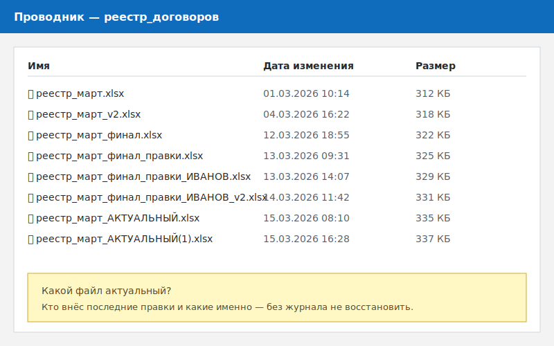
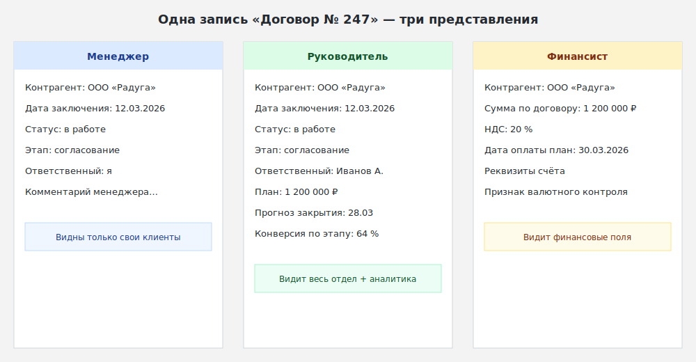
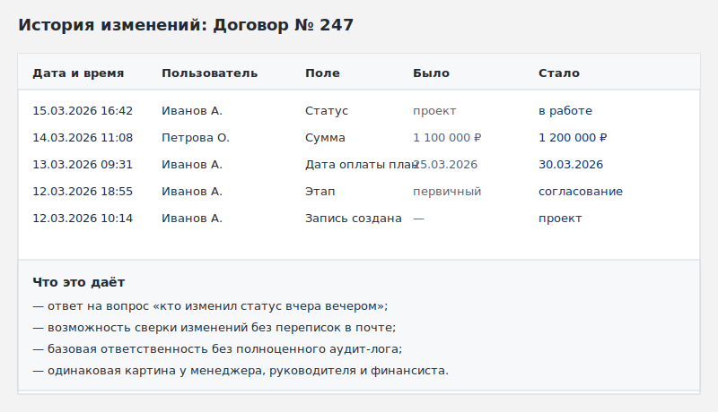
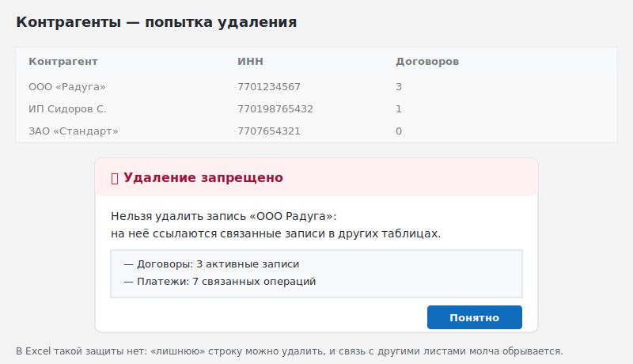
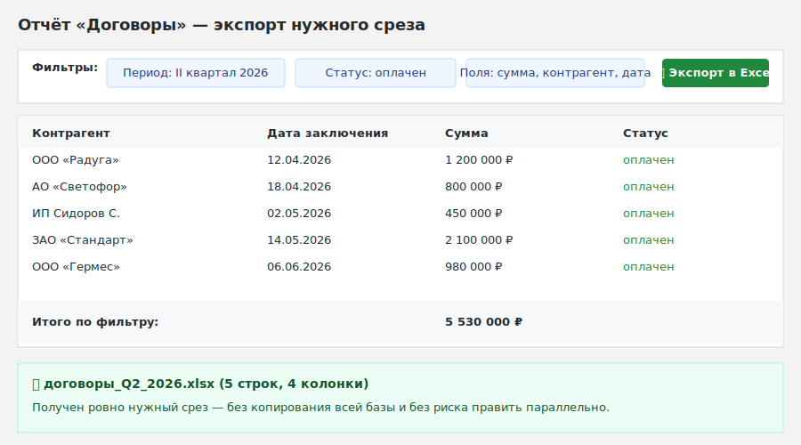

# Единая версия данных вместо десятков файлов: почему Интеграм надежнее Excel-рассылок

**Сравнение:** Excel и локальные файлы

---

## Контекст

Распространённая практика в командах, которые работают с Excel: один сотрудник ведёт «главный» файл, периодически рассылает обновлённую версию коллегам, каждый вносит правки в свою копию, потом правки вручную сводятся обратно. Вариация — общий сетевой диск или папка с именами файлов вида `реестр_март_2_финал_v3.xlsx`.

Такая схема работает до тех пор, пока объём данных невелик и число участников мало. По мере роста команды и данных цена ошибки синхронизации повышается.

---

## Конкретный сценарий

Отдел ведёт реестр договоров. Четыре менеджера, руководитель и финансист. Типичные проблемы:

- менеджер А добавляет новый договор в свою копию; менеджер Б в это время правит статус другого договора в своей копии; к концу дня два файла расходятся, и выяснение, какая версия актуальна, занимает время;
- руководитель видит данные с задержкой: он открывает файл, который был отправлен утром, но не знает, были ли внесены изменения после этого;
- финансист периодически удаляет «лишние» строки, не зная, что они связаны с другими расчётами в смежных листах;
- нет журнала: непонятно, кто и когда изменил статус договора.

Excel допускает совместное редактирование при размещении файла в OneDrive или SharePoint, но это не решает задачу разграничения прав на уровне строк и полей, и не отменяет привычку рассылать «свою копию» по почте.

---

## Что делает Интеграм иначе

**Одна запись для всех ролей.** Все четыре менеджера, руководитель и финансист работают с одной базой данных. Нет «вашего» и «моего» файла — есть одна запись о договоре, которую видят все в соответствии со своими правами. Менеджер видит набор полей под свою задачу, руководитель — расширенный набор с агрегатами, финансист — сумму, дату оплаты и контрагента.

**История изменения процесса через формы и отчёты.** Изменения вносятся через формы и сохраняются в общем отчёте, который видят все роли с соответствующими правами. Журнал базовых изменений записи (кто и когда внёс правку) сохраняется системой. Это не полноценный аудит-лог уровня корпоративных систем, но достаточно, чтобы ответить на вопрос «кто изменил статус договора вчера вечером».

**Запрет удаления связанных данных.** В Интеграме записи связаны между собой через реляционные поля: договор привязан к контрагенту, к менеджеру, к платежам. При попытке удалить запись, на которую ссылаются другие, система блокирует операцию — финансист физически не может «случайно» удалить контрагента, у которого есть незакрытые договоры. Это поведение настраивается на уровне структуры и не зависит от внимательности пользователя.

**Экспорт нужного среза без копирования всей базы.** Финансист запрашивает выгрузку за квартал по нужным полям через готовый отчёт с фильтрами. Результат сохраняется в Excel или JSON. Это разовая выгрузка для дальнейшего анализа, а не «вторая база», которую кто-то начнёт править параллельно.

---

## Ограничения Интеграма в этом сценарии

Интеграм не решает задачу документооборота: формирование и хранение самих договоров как документов (подписанных PDF, скан-копий) — отдельная задача. Интеграм хранит реестр: поля, статусы, ссылки, файлы-вложения. Полноценный электронный документооборот с маршрутами согласования и юридически значимой подписью требует специализированного решения.

Также журнал изменений в Интеграме — базовый. Если процессу нужен подробный аудит-лог с фиксацией каждого поля и возможностью отката, это отдельная задача, которая выходит за рамки штатной функциональности.

---

## Вывод

Когда данные хранятся в одном месте и каждый участник работает с одной системой, исчезает проблема синхронизации версий файлов. Интеграм обеспечивает именно это: единую запись для всех ролей, ограничение прав на уровне строк и полей, запрет удаления связанных данных, экспорт нужного среза без ручного копирования. Excel остаётся для расчётов и разовой аналитики, но не как место хранения оперативного реестра.

---

## Раскадровка 1-минутного видео

**0:00–0:08 — Хук**
Экран: проводник Windows с папкой `реестр_договоров/`, в которой видны файлы `реестр_март.xlsx`, `реестр_март_v2.xlsx`, `реестр_март_финал.xlsx`, `реестр_март_финал_правки.xlsx`, `реестр_март_финал_правки_ИВАНОВ.xlsx`.
Текст за кадром: «Сколько версий одного файла считается нормой в вашей команде?»

**0:08–0:20 — Сцена 1: одна запись, три роли**
Экран: одна и та же карточка договора, показанная последовательно в трёх режимах — глазами менеджера (свой клиент, базовые поля), руководителя (все договоры отдела, аналитика), финансиста (сумма, дата оплаты, контрагент).
Текст за кадром: «Одна запись — три представления. Каждый видит то, что нужно для его работы.»

**0:20–0:32 — Сцена 2: история через формы и отчёт**
Экран: журнал изменений договора — кто и когда менял статус, дату и сумму. Затем — общий отчёт, в котором отфильтрованы все изменения за неделю.
Текст за кадром: «История изменений видна без переписок в почте и звонков.»

**0:32–0:44 — Сцена 3: запрет удаления связанных данных**
Экран: пользователь пытается удалить контрагента, у которого есть открытые договоры. Система показывает сообщение: «Нельзя удалить: есть связанные записи в таблице "Договоры".»
Текст за кадром: «Удалить ‘лишнюю’ строку, на которую ссылаются другие данные, нельзя.»

**0:44–0:54 — Сцена 4: экспорт нужного среза**
Экран: отчёт с фильтром «договоры за II квартал», нажатие на кнопку «Экспорт в Excel», полученный файл — только нужные поля и записи, без выгрузки всей базы.
Текст за кадром: «Нужен срез для анализа — выгрузка одной кнопкой, без копии всей базы.»

**0:54–1:00 — Следующий шаг**
Текст на экране: «Один источник данных. Разные роли. Без папки с версиями файлов.» Ссылка на демо.

---

## Визуальные материалы

Все экранные примеры собраны в папке [`screenshots/03-excel-file-versions/`](screenshots/03-excel-file-versions/). Сейчас это раскадровочные SVG-макеты, которые будут заменены на реальные PNG-скриншоты Интеграма перед публикацией. Состав сцен и порядок замены описаны в [README папки](screenshots/03-excel-file-versions/README.md).
