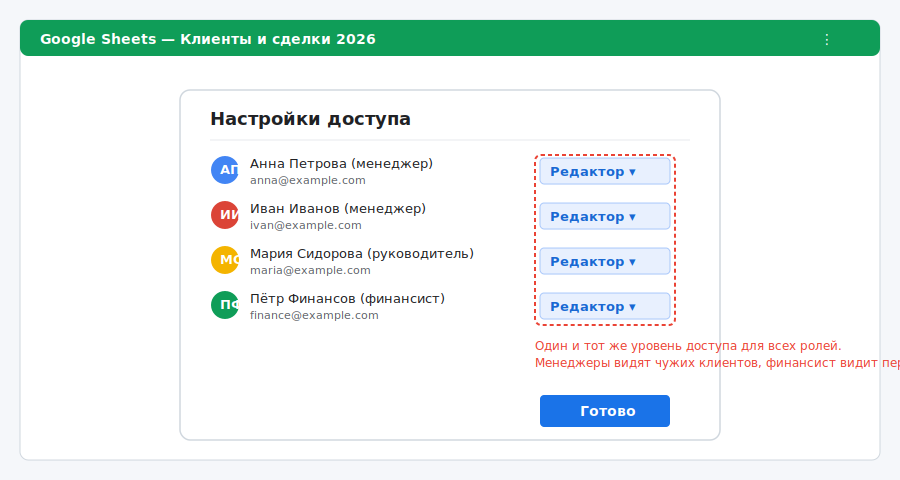
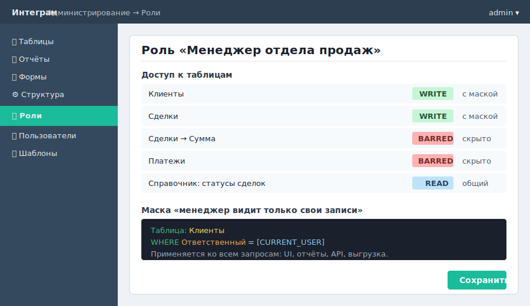
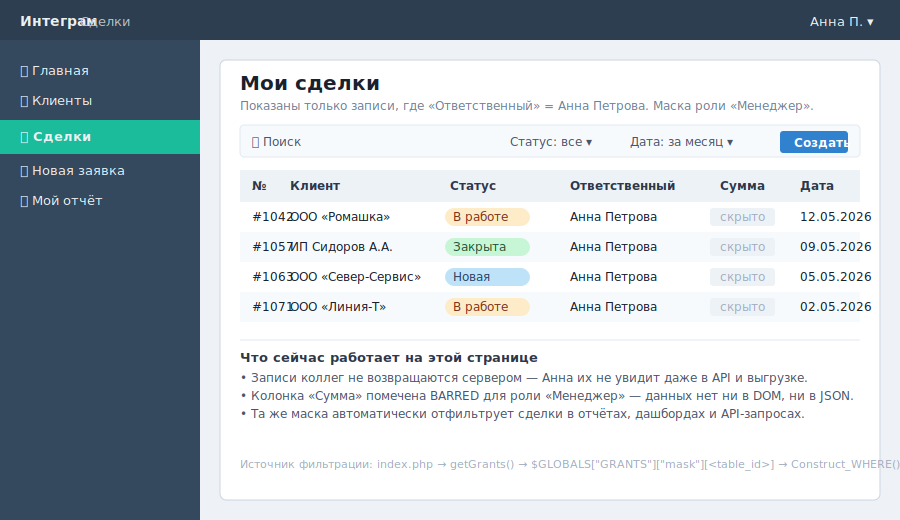
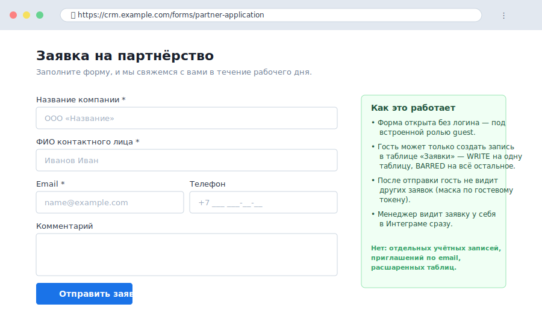

# Права доступа из коробки: почему Интеграм безопаснее общей таблицы

**Сравнение:** Excel, Google Sheets, простые no-code-таблицы

---

## Контекст

Общий доступ к документу — распространённая модель совместной работы. Ссылку на Google Sheet можно отправить коллеге с правами «Редактор», «Комментирующий» или «Читатель». В Excel Online аналогично. Для небольших команд с однородными задачами этого достаточно.

Проблема возникает, когда команда неоднородна: одни сотрудники должны видеть свои данные, другие — все данные, третьи — только читать, четвёртые — только вносить записи через форму. Инструменты типа «общей таблицы» для этого не проектировались: уровень «Редактор» означает доступ ко всему листу, а скрытые листы и защищённые диапазоны легко обходятся при экспорте.

---

## Конкретный сценарий

Отдел продаж: 10 менеджеров, 2 руководителя, 1 администратор CRM, 1 финансист. Требования к доступу:

- менеджер видит только своих клиентов и сделки, не видит данные коллег;
- руководитель видит все данные своего отдела, но не видит финансовые поля стоимости сделки;
- финансист видит финансовые поля, не видит переписку с клиентом;
- администратор управляет структурой (таблицами, ролями), не работает с оперативными данными;
- новый партнёр заполняет форму заявки без учётной записи и не получает доступа к внутренним таблицам.

В Google Sheets эту схему реализовать средствами платформы нельзя. Обходные варианты — скрытые листы, скрипты Apps Script с проверкой email, отдельные файлы для каждой роли, ручная фильтрация перед рассылкой — создают дополнительную сложность и новые точки отказа: скрипт ломается при изменении структуры, скрытые листы видны при выгрузке, отдельные файлы быстро расходятся между собой.

---

## Что делает Интеграм иначе

**Роли и уровни доступа.** В Интеграме на каждый тип пользователя создаётся отдельная роль. Для каждой роли по каждой таблице и полю выставляется один из трёх уровней: `WRITE` (создание, редактирование, удаление), `READ` (только чтение) или `BARRED` (полностью запрещено — поле не возвращается даже в API-ответах). Уровни наследуются от таблицы к её полям, поэтому типовую настройку «менеджер пишет в таблицу клиентов» достаточно указать один раз.

**Маски по значениям.** Менеджер видит только строки, где, например, поле «Ответственный» равно его имени. Маска — это условие фильтрации на уровне роли, поддерживающее подстановки `[ROLE]`, `[ROLE_ID]`, `[CURRENT_USER]`. Маска применяется ко всем запросам — и к таблице, и к отчётам, и к API, поэтому обойти её через экспорт нельзя.

**Скрытые поля.** Поля с уровнем `BARRED` не передаются в интерфейс — пользователь не может «подсмотреть» их в DOM, в JSON-ответе или в выгрузке. Финансист видит сумму сделки, руководитель отдела — нет.

**Гостевой доступ.** В системе предусмотрен встроенный пользователь `guest` с собственной ролью. Публичная форма (например, заявка с лендинга) работает под этим гостевым контекстом: данные попадают в базу с привязкой к гостю, но заявитель не получает доступа к внутренним таблицам и не видит чужих заявок.

**Отдельный флаг экспорта и удаления.** Уровни `EXPORT` и `DELETE` настраиваются независимо от чтения и записи: можно разрешить роли редактировать запись, но запретить массовую выгрузку или удаление.

---

## Ограничения Интеграма в этом сценарии

Гранулярность прав в Интеграме покрывает типовые бизнес-сценарии, но уступает специализированным системам класса ERP или корпоративным LDAP/AD-решениям. Если требуются сложные иерархические права с наследованием по оргструктуре, аудит-лог на уровне отдельных изменений полей, интеграция с корпоративной директорией или сценарии типа «руководитель видит подчинённых только во время своей смены» — это конкретные требования, которые нужно оценивать отдельно: часть решается масками и серверными функциями, часть — потребует доработки.

Маски — это SQL-условия, поэтому слишком сложное выражение замедлит выборку на больших таблицах. На практике это редко становится проблемой, но при разработке роли её стоит тестировать на реальном объёме данных.

---

## Вывод

Разграничение доступа в Интеграме — встроенная возможность, а не обходное решение поверх «общей ссылки». Менеджер видит только своих клиентов, руководитель видит весь отдел без сумм, финансист видит суммы без переписки, внешний партнёр заполняет публичную форму без логина. Эта модель настраивается без программирования и применяется на всех уровнях — UI, API, выгрузка — потому что фильтрация прав идёт на стороне сервера, а не за счёт «скрытия» в интерфейсе.

---

## Раскадровка 1-минутного видео

**0:00–0:10 — Хук**
Экран: Google Sheets с одним уровнем доступа «Редактор» для всех — на экране подсвечен список приглашённых.
Текст за кадром: «Все менеджеры видят данные друг друга. Это редко нужно команде с разными зонами ответственности.»

**0:10–0:35 — Демонстрация**
Экран 1: настройка роли «Менеджер» в Интеграме — маска по значению `Ответственный = [CURRENT_USER]`.
Экран 2: рабочее место менеджера — таблица показывает только его записи, причём то же самое сработает в любом отчёте и в API.
Экран 3: публичная форма заявки, открытая без логина под гостевой ролью.

**0:35–0:55 — Сравнение**
Текст за кадром: «Совместный доступ к документу — это не управление правами доступа к процессу. Это разные задачи.»

**0:55–1:00 — Следующий шаг**
Текст на экране: ссылка на документацию по ролям и маскам, призыв посмотреть демо.
