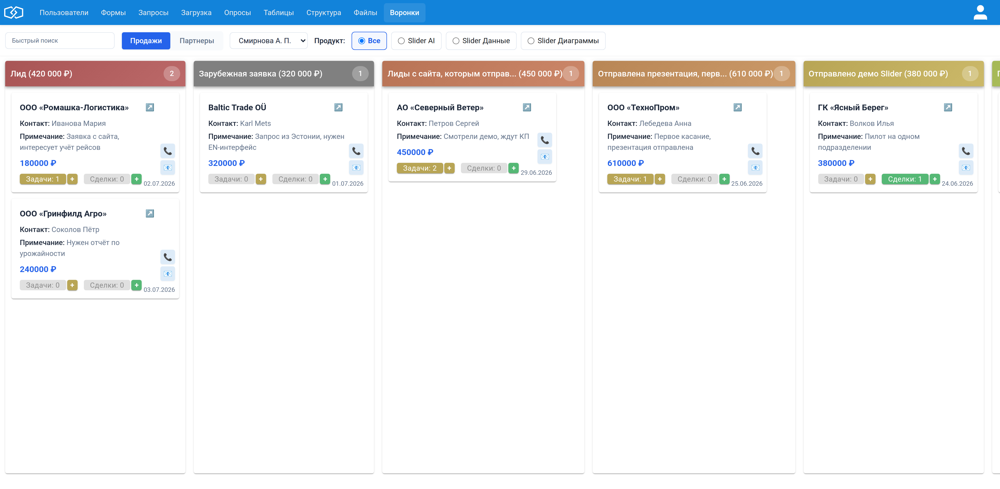
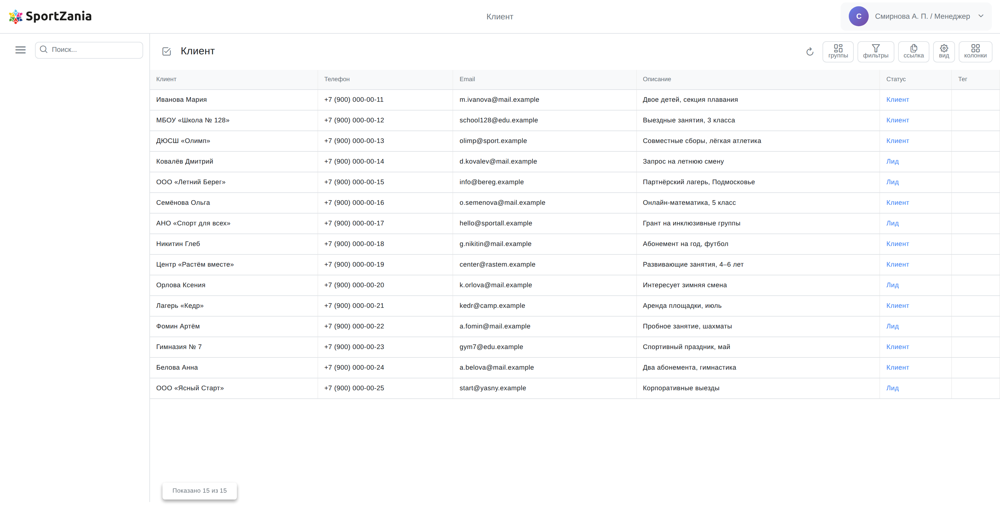
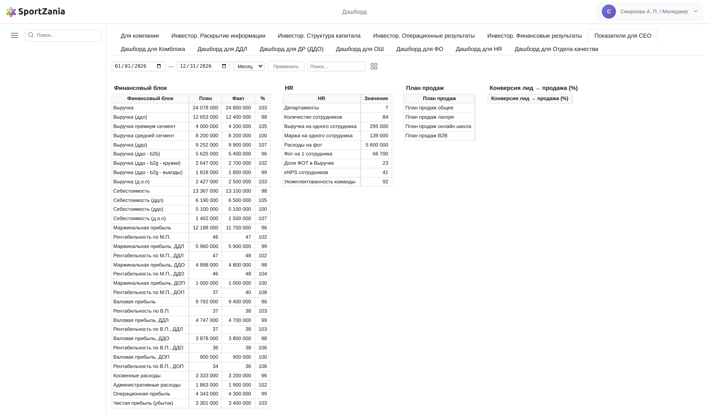
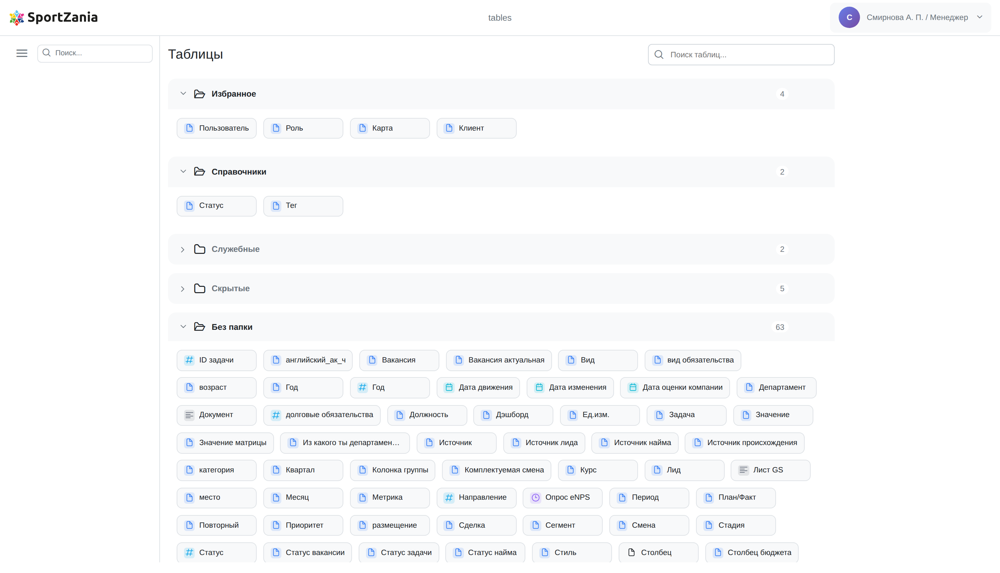
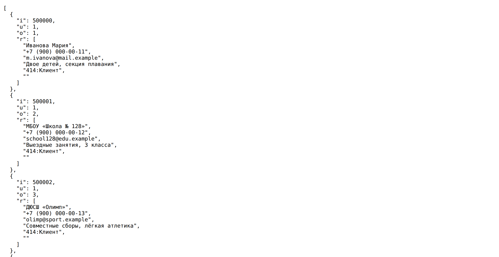
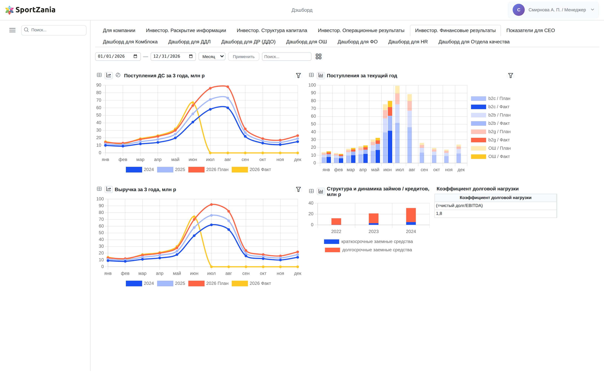

# Скриншоты для обзорных статей (issue #4126)

Демонстрационные экраны двух живых сервисов на Интеграме — для обзорных статей в журнал
для менеджеров. Съёмка велась под **read-only токенами**: ни одна запись в базах не менялась.

## Главное про данные

**На скриншотах нет ни одной реальной записи.** Интерфейс, вёрстка, состав колонок, названия
панелей и стадий воронки — подлинные, из работающих систем. А содержимое (клиенты, контакты,
суммы, показатели) заменено на вымышленное:

- телефоны — из диапазона `+7 (900) 000-00-xx`;
- почты — в зоне `.example` (зарезервирована RFC 2606, не существует в реальности);
- компании и люди — выдуманы;
- финансовые показатели — правдоподобные, но придуманные.

Как это сделано технически: скриншоты снимаются в браузере с настоящих страниц, а ответы
API по пути подменяются демо-данными. Поэтому интерфейс рисует их сам — это тот же самый
экран, что видит пользователь, просто с другим содержимым. Скрипты съёмки лежат в
[`experiments/issue-4126-screenshots/`](../../experiments/issue-4126-screenshots/).

Две правки «для красоты», о которых стоит знать:

1. В воронке исправлена опечатка в названии стадии: было «О**n**правлено демо Slider»
   (латинская `n`), стало «Отправлено демо Slider».
2. Из дашборда убран служебный лист «Секретный HR», а имя технического пользователя
   в шапке заменено на демонстрационное.

---

## 1. Воронка продаж (канбан)



**Файл:** `01-crm-voronka-prodazh.png` · **Источник:** `integram.io/crm`, раздел «Воронки»

Сделки разложены по 14 стадиям — от «Лид» до «Повторная оплата». В заголовке каждой колонки
система сама считает сумму и число карточек. На карточке видно контактное лицо, примечание,
сумму, дату и два счётчика — сколько задач и сделок привязано к лиду; плюс рядом с ними
создаёт новую, не уходя с доски. Сверху — фильтры по менеджеру и продукту и переключатель
«Продажи / Партнёры»: партнёры идут по той же воронке, но отдельным потоком.

**Чем интересно для статьи.** Канбан здесь не отдельный модуль, а представление обычной
таблицы: те же записи можно открыть списком, выгрузить через API или показать в отчёте.
Перетаскивание карточки между колонками меняет статус записи в базе.

**Статьи серии:** 07 (реляционная база вместо доски заметок), 09 (готовое приложение).

---

## 2. Таблица клиентов



**Файл:** `02-sportzania-tablica-klientov.png` · **Источник:** `ideav.ru/sportzania`, таблица «Клиент»

Обычный список записей — и панель инструментов справа сверху: «группы», «фильтры», «ссылка»,
«вид», «колонки». Колонка «Статус» — не текст, а ссылка на справочник: значения «Клиент» и «Лид»
подтягиваются из отдельной таблицы, поэтому их нельзя написать с опечаткой, а переименование
в справочнике меняет их сразу везде.

**Чем интересно для статьи.** Это прямой ответ на боль Google Sheets: вместо ВПР — настоящая
связь между таблицами; вместо общего доступа к файлу — права на уровне ролей; вместо
подтормаживающей прокрутки на больших объёмах — постраничная подгрузка с сервера
(браузер запрашивает записи порциями, а не тянет весь набор).

**Статьи серии:** 01 (150 000 записей), 04 (связанные таблицы), 05 (права доступа).

---

## 3. Дашборд руководителя



**Файл:** `03-sportzania-dashboard-ceo.png` · **Источник:** `ideav.ru/sportzania`, лист «Показатели для CEO»

Финансовый блок с планом, фактом и процентом выполнения; рядом — HR-показатели и план продаж.
Сверху вкладки: у компании 13 листов под разные роли — для инвестора, для коммерческого блока,
для HR, для отдела качества. Слева период (неделя / месяц / год) и диапазон дат: цифры
пересчитываются на лету.

**Чем интересно для статьи.** Дашборд живёт на тех же данных, что и таблицы, — не нужен
внешний BI, выгрузки и отдельная витрина. Листы разграничены ролями: инвестор видит свои
вкладки, HR — свои. Показатели финансового блока («Выручка (ддл)», «Выручка (ддо - b2b)» и др.)
приходят из Google Sheets — как именно, описано ниже.

**Статьи серии:** 14b (дашборды вместо внешнего BI), 05 (права доступа).

---

## 4. Структура: список таблиц



**Файл:** `04-sportzania-struktura-tablic.png` · **Источник:** `ideav.ru/sportzania`, раздел «Таблицы»

Все таблицы базы, разложенные по папкам: «Избранное», «Справочники», «Служебные», «Скрытые».
Одна система разом закрывает CRM (клиенты, лиды, сделки), HR (вакансии, департаменты, eNPS),
бюджетирование (строки и столбцы бюджета) и дашборды.

**Чем интересно для статьи.** Модель данных — не код, а настройка: таблицу, поле или связь
добавляет сам владелец процесса, без релиза и подрядчика. Отсюда и скорость: от идеи
до рабочего прототипа — часы, а не спринты.

**Статьи серии:** 09 (быстрее заказной разработки), 10 (изменения без релиза).

---

## 5. API: те же данные в JSON



**Файл:** `05-sportzania-api-json.png` · **Источник:** `ideav.ru/sportzania`, `/object/415/?JSON_OBJ`

Любая таблица отдаётся как JSON — достаточно дописать к её адресу `?JSON_OBJ`. Никакого
отдельного «модуля интеграции»: адрес таблицы в интерфейсе и адрес в API — один и тот же.
Здесь `i` — идентификатор записи, `r` — значения полей по порядку колонок, а ссылка
на справочник приезжает в виде `414:Клиент` — сразу и код, и подпись.

**Чем интересно для статьи.** Это и есть ответ на «выгрузите нам в Excel»: внешняя система
забирает данные сама, по токену и с учётом прав роли. Тот же адрес принимает фильтры
(`FR_*`) и постраничность (`LIMIT`).

**Статьи серии:** 13 (API и JSON-экспорт вместо копипаста).

---

## 6. Графики: финансовые результаты для инвестора



**Файл:** `06-sportzania-grafiki-investoru.png` · **Источник:** `ideav.ru/sportzania`, лист «Инвестор. Финансовые результаты»

Тот же дашборд, другой лист — и вместо таблиц четыре диаграммы: динамика поступлений
и выручки за три года (линии с планом и фактом на текущий год), поступления текущего года
стеком по сегментам (b2c, b2b, b2g, онлайн-школа), структура займов по годам и коэффициент
долговой нагрузки. Иконки слева от заголовка каждой панели переключают представление:
та же панель показывается таблицей, линией или круговой диаграммой.

**Чем интересно для статьи.** Инвестор открывает свою вкладку и видит готовые графики —
не выгрузку в Excel и не отдельный BI-контур. Данные те же, что в таблицах и отчётах,
а разграничение по ролям решает, кому какой лист виден. Часть цифр на этом листе приезжает
из Google Sheets (колонки отчётов так и называются — «Значение GS»).

**Статьи серии:** 14b (дашборды вместо внешнего BI), 05 (права доступа), 01 (Google Sheets).

---

## Как Интеграм забирает данные из Google Sheets — простыми словами

Финансовые показатели в дашборде выше компания ведёт в Google-таблице. Интеграм забирает
их оттуда сам. Механизм описан в [`include/google_sheets_sync.php`](../../include/google_sheets_sync.php),
настройки — в [`google_sheets_sync.config.php`](../../google_sheets_sync.config.php).

### Идея

Обычно интеграции с таблицами адресуют ячейки координатами: «возьми диапазон `B7:D19`».
Это ломается от любого движения — вставили строку, добавили месяц, и всё поехало.

Интеграм адресует ячейки **по смыслу**: не «где лежит», а «как подписано». В настройке вы
описываете, как выглядит подпись строки и как выглядит шапка колонки. Программа сама находит
их в листе и берёт значение на пересечении.

Выглядит это так:

```php
'sheets' => [[
    'name' => '(План-Факт) (2026)',
    'rows'    => ['Выручка (ддл)', 'Выручка (ддо)', 'Выручка (д.о.п)'],
    'columns' => [
        ['01.**.202*', '3*.**.202*', "'ПЛАН'||'ФАКТ'"],
        ['01.02.202*', "'28.02.202*'||'29.02.202*'", "'ПЛАН'||'ФАКТ'"],
    ],
]],
```

Читается почти по-человечески:

- **строки** — те, что подписаны «Выручка (ддл)», «Выручка (ддо)» и так далее;
- **колонки** — те, у которых в шапке друг под другом стоят: дата начала месяца (`01.**.202*`),
  дата конца месяца (`3*.**.202*`) и слово `ПЛАН` **или** `ФАКТ`.

Здесь `*` — «любые символы», а `||` — «или». Вторая строка правил — отдельный случай февраля:
он кончается то 28-го, то 29-го числа, и правило честно перечисляет оба варианта.

### Почему это изящно

Три вещи мне действительно нравятся:

1. **Устойчивость к перестановкам.** Правило описывает смысл колонки, а не её букву. Бухгалтер
   вставил столбец, сдвинул блок, добавил месяц — синхронизация продолжает находить нужное.
2. **Шапка из нескольких строк — это нормально.** В живых таблицах над колонкой обычно стоят
   и период, и «план/факт». Правило — это список условий, которые должны совпасть все сразу
   в одном столбце. Ровно так, как человек глазами и читает шапку.
3. **`||` для реальности, а не для теории.** Февраль, «ПЛАН» против «ФАКТ», разные написания —
   всё это решается перечислением вариантов прямо в правиле, без ветвлений в коде.

Чего в этом изяществе нет — стоит сказать честно:

- это **самодельный мини-язык шаблонов** в PHP-конфиге: строки без проверки типов, ошибку
  в правиле поймаешь только на запуске;
- семантика «повторяющихся блоков шапки» неочевидна (при повторе строки берётся ближайший
  подходящий блок колонок выше) — без тестов в `experiments/test-issue-24*-google-sheets-*.php`
  разобраться трудно;
- на выходе — не JSON, а наследственный текстовый формат `.bki` со строками через `;`.

### Что происходит по шагам

1. Скрипт логинится в Google под **сервисным аккаунтом** (`credentials.json`): подписывает
   JWT и меняет его на токен доступа. Права запрашиваются минимальные — только чтение таблиц.
2. Забирает лист целиком: `sheets.googleapis.com/v4/spreadsheets/{id}/values/{лист}`, значения —
   в том виде, в каком их видит человек (`FORMATTED_VALUE`). Объединённые ячейки при необходимости
   «размножаются» на все свои клетки, иначе шапка не совпала бы.
3. Проходит по листу и **сопоставляет правила**: находит подходящие строки и колонки, берёт
   значения на пересечениях. Запоминает и номер строки в исходном листе — чтобы потом было
   видно, откуда цифра.
4. Складывает результат в файл `.bki`: одна строка — одно значение, с подписью строки,
   подписью колонки, датой и номером исходной строки.
5. Если включено (`integram.enabled`), загружает файл в Интеграм в таблицу «Значение GS»
   (`/object/443296?JSON&import=1`). Дальше это обычные записи базы — их видят отчёты и дашборд.

Запустить можно из командной строки или прямо из интерфейса: в `index.php` есть авторизованная
точка `gssync`.

**Короткий вывод для статьи.** Google-таблица остаётся там, где людям удобно её вести. Интеграм
забирает из неё цифры по описанию «как подписано», а не «где лежит», и складывает в базу, где
у данных уже есть роли, отчёты, дашборды и API. Таблицу не нужно переносить — достаточно
научиться её читать.

**Статьи серии:** 01 (когда Интеграм удобнее Google Sheets), 14b (дашборды на тех же данных).

---

## Как пересобрать скриншоты

```bash
cd experiments/issue-4126-screenshots
export INTEGRAM_TOKEN=<read-only токен>
node shoot-kanban.js 01-crm-voronka-prodazh.png
node shoot-sz.js clients   02-sportzania-tablica-klientov.png
node shoot-sz.js dashboard 03-sportzania-dashboard-ceo.png
node shoot-sz.js tables    04-sportzania-struktura-tablic.png
node shoot-sz.js api       05-sportzania-api-json.png
node shoot-sz.js invest    06-sportzania-grafiki-investoru.png
```

Токен нужен только на чтение. Все запросы браузера проходят через прокси в `capture.js`,
он же подменяет ответы демо-данными из `demo-data.js`, `demo-sz.js` и `demo-charts.js`.

⚠️ Прокси обязан пропускать `cdn.jsdelivr.net`: `dash.js` подгружает оттуда Chart.js,
и без этого панели-диаграммы остаются пустыми (сами данные при этом приходят нормально).

## Что осталось за кадром

- **Панели вида «Кол-во / Сумма / Конверсия»** на листе «Для компании» показаны пустыми:
  в дашборде предустановленное значение привязано к показателю, а не к колонке, поэтому одно
  значение растеклось бы по всем трём. Заполнены те панели, где это корректно.
- **Лист «Инвестор. Структура капитала»** не снят. Там реальная таблица участников с долями
  и оценкой компании, а график «Доли участников» — стековая область по истории изменений:
  его панель запрашивает отчёт с другим набором дат, и убедительные демо-данные для него
  требуют отдельной работы. Публиковать лист с настоящими данными нельзя.
- **Карточка лида и форма быстрой задачи** из воронки не снята — стоит добавить, если статья
  про напоминания и задачи пойдёт в работу.

## Заметки на будущее

- Серия графика в отчёте `445106` задаётся колонкой **«Год»** (там лежит `2026 План` /
  `2026 Факт`), а не колонкой «Колонка группы» — иначе план и факт складываются в одну линию.
- Панели-диаграммы запрашивают отчёт как `?JSON` и получают **колоночную** структуру
  `{columns, data, header}`, где `data[i]` — все значения i-й колонки. Отчёты для таблиц
  отдают `?JSON_KV` — массив объектов. Это разные формы одного и того же отчёта.
- Панель «Поступления за текущий год» фильтрует «Тип движения», поэтому демо-данные должны
  содержать и `выручка`, и `поступление`.
